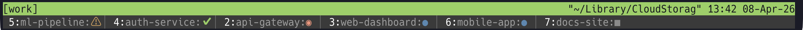

<picture>
  <source media="(prefers-color-scheme: dark)" srcset="assets/logo-dark.png">
  <source media="(prefers-color-scheme: light)" srcset="assets/logo-light.png">
  
</picture>
<br clear="left">
<br>

複数の [Claude Code](https://docs.anthropic.com/en/docs/claude-code) セッションを並行して実行。プロジェクトを瞬時に切り替え、どれが注意を必要としているか一目で把握し、ワークスペースを失うことなく作業を続けられます。

ccmはClaude Codeセッションをtmuxウィンドウとして管理するtmuxプラグインです。ライブダッシュボード、状態検出、スナップショット復元機能を備えています。

**ダッシュボード** (`prefix + Tab`):


**ステータスバー**（モード2）:



## 機能

- **リソース管理** — アイドル状態のClaude Codeセッションを10分後に自動終了し、メモリとCPUを解放。ウィンドウに戻ると `--continue` で自動再起動
- **ダッシュボード** — Claude Codeの状態（BUSY/IDLE/PERMIT/DONE）をリアルタイム表示するインタラクティブポップアップ
- **ツリービュー** — セッション/ウィンドウ/ペインの階層表示とナビゲーション
- **Git連携** — プロジェクトごとのブランチ名とdirty状態（`main*`）の表示
- **ポート検出** — プロジェクトごとのリスニングTCPポートの自動検出（キャッシュ付き）
- **スナップショット** — プロジェクトレイアウトのJSON保存・復元
- **自動起動** — SHELL状態のウィンドウに切り替えるとClaude Codeを自動起動
- **ステータスライン** — アクティブプロジェクトの状態をtmuxステータスバーに表示
- **Agent Teams対応** — Claude Codeの[Agent Teams](https://code.claude.com/docs/en/agent-teams)と併用可能：ccmでプロジェクトを管理しつつ、各プロジェクト内で並行エージェントを実行

## 動作要件

- tmux 3.2+（popup対応）
- Python 3.9+（macOSおよび主要なLinuxディストリビューションに標準搭載）
- [TPM](https://github.com/tmux-plugins/tpm)（プラグインインストール用。手動インストールも可）
- jq
- fzf
- [Claude Code](https://docs.anthropic.com/en/docs/claude-code)

## インストール

### TPM を使う場合（推奨）

`~/.tmux.conf` に追加：

```tmux
set -g @plugin 'yohasebe/tmux-ccm'
```

tmuxをリロードし、`prefix + I` でインストール。

### 手動インストール

```bash
git clone https://github.com/yohasebe/tmux-ccm.git ~/.tmux/plugins/tmux-ccm
```

`~/.tmux.conf` に追加：

```tmux
source-file ~/.tmux/plugins/tmux-ccm/ccm.tmux.conf
```

### PATHに追加

CLI（`ccm add`、`ccm status` 等）を使うには、プラグインディレクトリをPATHに追加：

```bash
# .zshrc または .bashrc に追加
export PATH="$HOME/.tmux/plugins/tmux-ccm:$PATH"
```

### Zsh補完（オプション）

```bash
# .zshrc に追加（compinit の前）
fpath=($HOME/.tmux/plugins/tmux-ccm/completions $fpath)
```

## 初回セットアップ

Claude Codeを初めて使う場合は、先に認証を済ませてください：

```bash
claude
```

対話的なセットアップが始まり、プラン選択（サブスクリプションまたはAPIキー）とブラウザ認証を行います。認証が完了したら、セットアップウィザードを実行してください：

```bash
ccm init
```

フックのインストール、自動復元、ステータスバーの設定をまとめて案内します。

> [!NOTE]
> フックはプラグイン読み込み時（TPM経由）に自動インストールされ、プラグイン更新時にも自動で最新化されます。手動で管理したい場合は `ccm setup-hooks` / `ccm remove-hooks` を使用してください。

## 使い方

### キーバインド

| キー | 動作 | デフォルト |
|------|------|-----------|
| `prefix + Tab` | ダッシュボードをトグル | 有効 |
| `prefix + T` | ツリービューをトグル | 無効（オプトイン） |
| `prefix + C` | ccmメニューを開く | 無効（オプトイン） |

他のプラグインとの競合を避けるため、ダッシュボードのみデフォルトで有効です。ツリービューとメニューはダッシュボード内で `t` または `m` を押してもアクセスできます。

専用キーを追加で設定するには `~/.tmux.conf` に追加してください：

```tmux
set -g @ccm-key-menu "C"        # 任意: prefix + C でメニュー
set -g @ccm-key-tree "T"        # 任意: prefix + T でツリービュー
```

> [!TIP]
> prefixなしの単一キーでダッシュボードをトグルすることもできます。例えば `F1` に割り当てる場合：
>
> ```tmux
> bind-key -T root F1 run-shell 'mkdir -p "${TMPDIR:-/tmp}/ccm-$(id -u)" && printf "#{session_name}" > "${TMPDIR:-/tmp}/ccm-$(id -u)/popup-session"' \; display-popup -E -w 80% -h 60% -T " ccm Dashboard " "~/.tmux/plugins/tmux-ccm/ccm dashboard"
> ```
>
> この行はccmプラグインの読み込みよりも**後に**配置してください。`F1` で開き、もう一度 `F1` で閉じます。手動インストールの場合はパスを調整してください（例: `~/path/to/ccm/ccm dashboard`）。

> [!IMPORTANT]
> すべての `set -g @ccm-*` オプションは、ccmプラグインが読み込まれるよりも**前に** `~/.tmux.conf` で設定する必要があります。`source-file` 行（手動インストール）およびTPMの `run` 行（TPMインストール）よりも前に配置してください。プラグインは読み込み時にこれらのオプションを参照するため、後に配置された設定は反映されません。

### デスクトップ通知

プロジェクトの状態変化時にデスクトップ通知（macOS / Linux対応）を送信できます：

```tmux
set -g @ccm-notify "permit,done"     # PERMITとDONEで通知
```

| 値 | 動作 |
|----|------|
| `permit,done`（デフォルト） | 許可プロンプトとレスポンス完了時に通知 |
| `permit` | 許可が必要な時に通知 |
| `done` | レスポンス完了時に通知 |
| `all` | 全ての状態変化 |
| `off` | 通知なし |

通知音を有効化：

```tmux
set -g @ccm-notify-sound "on"     # デフォルト: off（macOSでは「Glass」サウンドを再生）
set -g @ccm-notify-sound-name "Ping"  # 任意: サウンドをカスタマイズ（macOSのみ）
```

### ステータスバー

tmuxステータスバーにプロジェクト状態を表示します。表示モードを設定：

```tmux
set -g @ccm-status-line 0     # デフォルト
```

| 値 | モード | 説明 |
|----|--------|------|
| `0` | アイコン（デフォルト） | status-rightにウィンドウ番号付きアイコンを追記 |
| `1` | 全表示 | ウィンドウリストをccm形式の色付きエントリに置換 |
| `2` | 専用行 | ブランチ・ポート情報付きで全プロジェクトを専用行に表示 |

#### モード0 — アイコン＋ウィンドウ番号（デフォルト）

既存のstatus-rightにウィンドウ番号付きアイコンを追加。時計やバッテリー表示はそのまま保持。アクティブなプロジェクトがある場合はウィンドウ番号も表示（例: `5: PERMIT ⚠`）。全てIDLEの場合は `≡` アイコンのみ：


| 優先度 | 条件 | アイコン | 色 |
|--------|------|---------|-----|
| 1（最高） | PERMITのプロジェクトあり | `⚠` | 黄 |
| 2 | BUSYのプロジェクトあり | `◉` | オレンジ |
| 3 | DONEのプロジェクトあり | `✔` | 緑 |
| 4（最低） | 全てIDLE | `≡` | グレー |

アイコンをクリックするとダッシュボードが開く。

#### モード1 — 全表示（ccm形式ウィンドウリスト）

tmux標準のウィンドウリストをccm形式の色付きエントリに置換。既存のstatus-right（時計等）は保持。


#### モード2 — 専用ステータス行

メインバーの下に専用ステータス行を追加。IDLEを含む全プロジェクトをgitブランチ・ポート情報付きで表示。メインバーは変更しない。


| 状態 | アイコン | 色 |
|------|---------|-----|
| PERMIT | `⚠` | 黄 |
| BUSY | `◉` | オレンジ |
| DONE | `✔` | 緑 |
| IDLE | `●` | ブルー |
| SHELL | `■` | 暗グレー |

端末幅とプロジェクト数に応じて行数が自動拡張。

> [!NOTE]
> モード2はプロジェクト数に応じて追加の `status-format` 行（最大 `status-format[5]`）を使用します。他のプラグインがこれらのインデックスを使用している場合、衝突が発生する可能性があります。

### ダッシュボード操作

| キー | 動作 |
|------|------|
| `↑↓` / `jk` | プロジェクト間をナビゲート |
| `Enter` | 選択プロジェクトに切替 |
| `s` | スナップショット保存 |
| `p` | プレビュー表示（`c` でクリップボードにコピー） |
| `a` | プロジェクト追加 |
| `n` | 選択プロジェクトの名前変更 |
| `g` | 既存ウィンドウを登録 |
| `r` | 削除 — [u]nregister（ウィンドウ残す）か [d]elete を選択 |
| `x` | アイドル状態のClaude Codeを一括終了 |
| `/` | プロジェクト名で検索 |
| `t` | ツリービューに切替 |
| `m` | メニューに切替 |
| `q` / `Esc` / `F1` | 閉じる |

### CLIコマンド

```
ccm add <dir> [name]              プロジェクト追加（ウィンドウ作成+Claude起動）
ccm open <dir> [name]             現在のペインでClaude起動（split-pane用）
ccm register <window> [name]      既存ウィンドウをccmプロジェクトとして登録
ccm unregister <name>             ccm管理から外す（ウィンドウは残る）
ccm rename <name> <new_name>      プロジェクト名を変更
ccm remove <name>                 プロジェクトウィンドウ削除（ウィンドウを閉じる）
ccm attach <name|number>          プロジェクトウィンドウに切替
ccm list                          管理中プロジェクト一覧
ccm status                        全プロジェクト状態表示（ブランチ・ポート含む）
ccm tree                          セッション/ウィンドウ/ペインの階層表示
ccm ports                         プロジェクトごとのリスニングポート表示
ccm capture [--copy] <name|#id>   ペイン内容をキャプチャ（--copy: クリップボード）
ccm dashboard                     インタラクティブダッシュボードを開く
ccm menu                          インタラクティブメニュー
ccm snapshot save|load|list|delete  スナップショット管理
ccm start <snapshot>              スナップショットから復元
ccm stop [--all|name]             プロジェクト停止（--all時は_autosave自動保存）
ccm init                          対話型セットアップウィザード（フック・復元・ステータスバー）
ccm setup-hooks                   Claude Codeフックをインストール（検出精度向上）
ccm remove-hooks                  Claude Codeフックをアンインストール
ccm setup-claude-md               ~/.claude/CLAUDE.mdにccmセクションを追加
ccm remove-claude-md              ~/.claude/CLAUDE.mdからccmセクションを削除
ccm statusline                    1行ステータス出力（tmuxステータスバー用）
ccm inject-status                 tmuxステータスバー更新（内部使用）
```

> [!TIP]
> 多くのコマンドに短縮エイリアスがあります: `ls` (list), `st` (status), `a` (attach), `rm` (remove), `d` (dashboard), `reg` (register), `unreg` (unregister), `mv` (rename), `cap` (capture), `snap` (snapshot), `sl` (statusline)

### ステータスアイコン

| アイコン | 状態 | 説明 |
|----------|------|------|
| ⚠ | PERMIT | ユーザーの許可待ち |
| ◉ | BUSY | Claude処理中 |
| ✔ | DONE | レスポンス完了（30秒後に自動クリア） |
| ● | IDLE | 入力待ち |
| ■ | SHELL | シェルのみ（Claude未起動） |
| ○ | DOWN | ウィンドウ利用不可 |

### Claude Codeフック（推奨）

より正確な状態検出のために、Claude Codeフックをインストールします：

```bash
ccm setup-hooks
```

`~/.claude/settings.json` にフックが追加され、状態変化を通知します：
- **UserPromptSubmit** → プロンプト送信時にBUSY（テキスト生成を検出）
- **PreToolUse / PostToolUse / PostToolUseFailure** → ツール実行中にBUSY（PostToolUseFailure は Claude Code v2.1.101+ のツール失敗イベント）
- **SubagentStart / SubagentStop** → サブエージェント実行中にBUSY（親エージェントは作業継続中）
- **PreCompact / PostCompact** → コンテキスト圧縮中にBUSY
- **Stop / StopFailure** → Claude応答完了時にDONE
- **PermissionRequest** → ツールの許可が必要な時にPERMIT
- **Notification** → 許可プロンプト表示時にPERMIT（permission_prompt）、アイドル通知時にDONE（idle_prompt）
- **SessionEnd** → セッション終了時にSHELL（/exit、Ctrl+D等）
- **PermissionDenied** → autoモードで拒否時にPERMIT（`/permissions`で再試行）

ccm は Claude Code がセッション途中でフック発火を停止する既知の不具合（[anthropics/claude-code#16047](https://github.com/anthropics/claude-code/issues/16047)、[#25655](https://github.com/anthropics/claude-code/issues/25655)）に備えて、複数のフック非依存フォールバックを実装しています:

- **JSONL セッションログ心拍**: `~/.claude/projects/<slug>/<sessionId>.jsonl` の mtime を監視。Claude Code は会話のターン境界ごとにレコードを追記するため、新鮮な mtime はセッションがアクティブな証拠
- **プロセス孫検出**: `claude` の孫プロセス（例: `claude → bash → xcodebuild`）が存在すれば、入力プロンプトが見えていてもフォアグラウンドツール実行中とみなして BUSY 判定（v2.1+ の「ctrl+b ctrl+b で background」UI 対応）
- **許可ダイアログのフッター検出**: v2.1.101+ の許可フッター（`Esc to cancel · Tab to amend · ctrl+e to explain`）をペインから直接検出
- **`~/.claude/hooks.log` 肥大化カナリア**: このファイルが 100MB を超えるとフック書き込みが silent fail するため、`ccm status` とダッシュボードに警告表示。修復: `: > ~/.claude/hooks.log`

フックの状態はダッシュボードのフッターと `ccm status` の出力に表示されます（Hooks: ON/OFF）。既にインストール済みの場合、`ccm setup-hooks` は再インストールをスキップします。ccmを別のパスに再インストールした場合は、フックのパスが自動的に更新されます。

削除するには: `ccm remove-hooks`

### スナップショット

ワークスペースのレイアウトを保存して後から復元：

```bash
ccm snapshot save my-workspace
ccm snapshot list
ccm start my-workspace
```

`_autosave` スナップショットはプロジェクトがアクティブな間、2分間隔で自動更新されます。`ccm stop --all` 実行時にも保存：

```bash
ccm start _autosave   # 前回のセッションを復元
```

#### tmux起動時の自動復元

tmux起動時に最後の `_autosave` スナップショットを自動復元：

```tmux
set -g @ccm-auto-restore "on"    # デフォルト: off
```

有効にすると、tmux起動時にTPM経由で `_autosave` スナップショットを自動ロードします（既にccmプロジェクトがある場合はスキップ）。

### アイドル自動終了

一定時間IDLEのままのClaude Codeセッションは自動的に終了し、システムリソースを解放します。終了したウィンドウに切り替えると、Claude Codeが `--continue` で自動再起動し、会話を再開します。

```tmux
set -g @ccm-idle-timeout "10"    # 分（デフォルト: 10、0で無効化）
```

### ダッシュボードプレビューパネル

選択中のプロジェクトのターミナル内容をプロジェクトリストの横にライブ表示します：

```tmux
set -g @ccm-preview "on"              # デフォルト: off
set -g @ccm-preview-position "right"  # または "bottom"
```

カーソル移動で即座に更新され、自動リフレッシュもされます。ANSIカラー（256色、RGB）に対応。端末幅80列以上（右配置）または高さ20行以上（下配置）が必要です。ダッシュボードメニュー（`m`）からもトグル可能。

### Claude Code自動起動

SHELL状態（Claude Codeが終了済み）のプロジェクトウィンドウに切り替えると、ccmが自動的に `--continue` 付きでClaude Codeを再起動し、会話を再開します。

```tmux
set -g @ccm-auto-start "on"     # デフォルト: on（"off"で無効化）
```

ダッシュボードメニュー（`m`）からも設定可能です。

### アンチフリッカー

ccmはtmux内でのClaude CodeのUIフリッカーを軽減するため、`CLAUDE_CODE_NO_FLICKER=1` を自動設定します。ユーザー側の設定は不要です。

## Tips

### Claude Codeに他プロジェクトの存在を教える

デフォルトでは、各Claude Codeセッションは他のプロジェクトの存在を知りません。グローバル設定ファイル（`~/.claude/CLAUDE.md`）にccmコマンドの情報を追記することで、これを改善できます：

```markdown
## マルチプロジェクト環境

このユーザーはccm（Claude Code Manager for tmux）で複数プロジェクトを同時管理している。
他プロジェクトの情報が必要な場合は以下のコマンドが利用可能:

- `ccm list` — 管理中の全プロジェクト一覧（名前・ディレクトリ）
- `ccm status` — 全プロジェクトの状態（ブランチ・ポート含む）
- `ccm capture <name>` — 指定プロジェクトのClaude Code画面出力を取得
```

これにより、すべてのClaude Codeセッションがccm配下の他プロジェクトを発見・参照できるようになります。例えば、あるライブラリが別のプロジェクトでどう使われているかを調べたり、別プロジェクトの `CLAUDE.md` を読んだりできます。

自動設定：

```bash
ccm setup-claude-md     # ~/.claude/CLAUDE.md にccmセクションを追加
ccm remove-claude-md    # ccmセクションを削除
```

### tmuxセッションでプロジェクトをカテゴリ分け

tmuxセッションを分けることで、プロジェクトを文脈ごとにグループ化できます（例: 業務、OSS、研究）。ccmはセッションごとに独立して動作し、ダッシュボードとステータスバーはそのセッションのプロジェクトのみを表示します。

```bash
tmux new-session -s work       # 業務プロジェクト
tmux new-session -s oss        # OSSプロジェクト

# 各セッション内で通常通りプロジェクトを追加:
ccm add ~/code/auth-service
ccm add ~/code/dashboard-ui

# セッション間の切り替え:
tmux switch-client -t oss      # tmux標準のセッション切り替え
```

> [!TIP]
> スナップショットとの併用も効果的です。各セッションで `ccm snapshot save` / `ccm start` を使えば、プロジェクトレイアウトの保存・復元をセッション単位で独立して行えます。

## 仕組み

- プロジェクトはtmuxウィンドウの `@ccm_project` / `@ccm_dir` タグで管理
- Claude Codeの状態はフック信号＋プロセスツリー検査で検出（プロンプトパターンマッチも補助的に使用）
- DONE状態はBUSY/PERMIT → IDLE遷移で自動検出（30秒後に自動クリア）
- tmuxテーマとの併用に対応（status-rightの変更を自動検出）
- gitブランチとポート情報は30秒キャッシュで負荷軽減
- ポップアップ内のセッション検出は一時ファイル（`$TMPDIR/ccm-$UID/`）経由

## アンインストール

1. `~/.tmux.conf` から削除：
   ```tmux
   # この行を削除:
   set -g @plugin 'yohasebe/tmux-ccm'
   # または source-file の場合:
   # source-file ~/.tmux/plugins/tmux-ccm/ccm.tmux.conf
   ```

2. tmux状態をクリーンアップ：
   ```bash
   # ccmオプションを削除
   tmux set -g -u @ccm-orig-status-right 2>/dev/null
   tmux set -g -u @ccm-orig-sr-length 2>/dev/null
   tmux set -g -u @ccm-status-line 2>/dev/null
   tmux set -g -u window-status-format 2>/dev/null
   tmux set -g -u window-status-current-format 2>/dev/null

   # 一時ファイルを削除
   rm -rf "${TMPDIR:-/tmp}/ccm-$(id -u)"

   # ランタイムデータを削除（任意 — スナップショットも消えます）
   rm -rf ~/.local/share/ccm
   ```

3. tmuxをリロード: `tmux source-file ~/.tmux.conf`

## ドキュメント

- **[ユーザーガイド](docs/guide.ja.md)**
- **[English README](README.md)** / **[User Guide](docs/guide.md)**

## ライセンス

MIT
