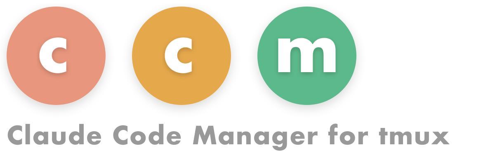
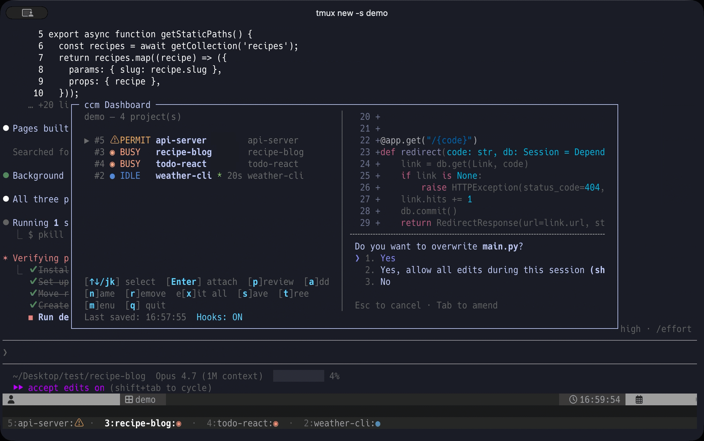

<picture>
  <source media="(prefers-color-scheme: dark)" srcset="assets/logo-dark.png">
  <source media="(prefers-color-scheme: light)" srcset="assets/logo-light.png">
  
</picture>
<br clear="left">
<br>

ccm is a tmux plugin for developers who run [Claude Code](https://docs.anthropic.com/en/docs/claude-code) across several projects at once. Each Claude session becomes a tagged tmux window with live state detection — so you stop tabbing through windows trying to remember which is mid-response, which is waiting for your approval, and which is idle.

It's effectively an **attention manager**: every project gets a state (BUSY / IDLE / waiting for permission), the dashboard sorts them by urgency, and one keystroke takes you to whichever needs you next.

A popup dashboard shows every project's state (busy / idle / waiting for permission), git branch, and listening ports at a glance. Snapshots restore your full layout after a tmux restart. Desktop notifications surface only the projects that need attention.

ccm's value scales with parallelism: useful with 2–3 projects, daily infrastructure with 4+. Best fit for Max-tier users running agents across multiple projects in parallel.

**Dashboard** (`prefix + Tab`) with the mode-2 status bar visible at the bottom:



## Features

- **Resource Management** — Idle Claude Code sessions auto-exit after 10 minutes to free memory and CPU; auto-restart and resume when you switch back
- **Dashboard** — Interactive popup with real-time Claude Code status (BUSY / IDLE / PERMIT)
- **Tree View** — Hierarchical session/window/pane display with navigation
- **Git Integration** — Per-project git branch with dirty-state indicator
- **Port Detection** — Listening ports per project
- **Snapshots** — Save and restore your project layout
- **Cross-Project Messaging** — `ccm send <project> <message>` delivers prompts between projects with state-based safety gating (PERMIT-safe, BUSY-queueable)
- **Auto-start** — Claude Code auto-launches when you attach to a project where it's not yet running
- **Status Line** — Inject active project status into tmux status bar
- **Multi-byte text** — CJK characters and emoji in project names align correctly across dashboard, status bar, and CLI tables
- **Agent Teams Compatible** — Works alongside Claude Code's [Agent Teams](https://code.claude.com/docs/en/agent-teams): manage projects with ccm while running parallel agents within each project

## Requirements

- tmux 3.2+
- Python 3.9+
- [TPM](https://github.com/tmux-plugins/tpm) (or manual install)
- jq
- fzf
- [Claude Code](https://docs.anthropic.com/en/docs/claude-code) **v2.1.107+**

## Installation

### With TPM (recommended)

Add to your `~/.tmux.conf`:

```tmux
set -g @plugin 'yohasebe/tmux-ccm'
```

Reload tmux and press `prefix + I` to install.

### Manual

```bash
git clone https://github.com/yohasebe/tmux-ccm.git ~/.tmux/plugins/tmux-ccm
```

Add to your `~/.tmux.conf`:

```tmux
source-file ~/.tmux/plugins/tmux-ccm/ccm.tmux.conf
```

### Add to PATH

For CLI usage (`ccm add`, `ccm status`, etc.), add the plugin directory to your PATH:

```bash
# In your .zshrc or .bashrc
export PATH="$HOME/.tmux/plugins/tmux-ccm:$PATH"
```

### Zsh Completion (optional)

```bash
# In your .zshrc (before compinit)
fpath=($HOME/.tmux/plugins/tmux-ccm/completions $fpath)
```

## First-Time Setup

If you haven't used Claude Code before, complete the initial authentication first:

```bash
claude
```

This opens an interactive setup where you choose your plan (subscription or API key) and authenticate via browser. Once authenticated, run the setup wizard:

```bash
ccm init
```

This guides you through hooks installation, auto-restore, and status bar configuration in one step.

> [!NOTE]
> Hooks are automatically installed on plugin load (via TPM) and kept up to date on plugin updates. If you prefer manual control, use `ccm setup-hooks` and `ccm remove-hooks`.

## Usage

### Keybindings

| Key | Action | Default |
|-----|--------|---------|
| `prefix + Tab` | Toggle dashboard popup | Enabled |
| `prefix + T` | Toggle tree view popup | Disabled (opt-in) |
| `prefix + C` | Open ccm menu | Disabled (opt-in) |

Only the dashboard keybinding is enabled by default to avoid conflicts with other plugins. Tree view and menu are also accessible from within the dashboard by pressing `t` or `m`.

To override the dashboard keybinding or enable the optional bindings, add to `~/.tmux.conf`:

> [!IMPORTANT]
> All `set -g @ccm-*` options must be placed **before** the ccm plugin loads in `~/.tmux.conf` — that means before both the `source-file` line (manual install) and the TPM `run` line (TPM install). The plugin reads these options at load time, so settings placed after will be silently ignored.

```tmux
set -g @ccm-key-dashboard "Tab"  # default; override to remap (e.g. "F12")
set -g @ccm-key-menu "C"         # optional: enable prefix + C for menu
set -g @ccm-key-tree "T"         # optional: enable prefix + T for tree view
set -g @ccm-key-search "/"       # optional: enable prefix + / to open the dashboard
                                  # directly in live-filter search (Unicode-safe,
                                  # type to narrow, Enter to attach, Esc to cancel)
```

> [!TIP]
> For even quicker access, bind a single key (no prefix) to toggle the dashboard via `@ccm-key-dashboard-noprefix`. For example, to use `F1`:
>
> ```tmux
> # Must come BEFORE the ccm plugin load line (see IMPORTANT above).
> set -g @ccm-key-dashboard-noprefix "F1"
> ```
>
> Press `F1` to open, `F1` again to close. The coloured ccm logo on the popup title is preserved (writing your own `bind-key -n F1 display-popup …` works mechanically but loses the logo unless you replicate the full `-T` format string).

### Desktop Notifications

ccm can send desktop notifications (macOS and Linux) when project states change:

```tmux
set -g @ccm-notify "permit,completed"     # notify on PERMIT and completion
```

| Value | Behavior |
|-------|----------|
| `permit,completed` (default) | Notify on permission prompt and completion |
| `permit` | Notify when permission is needed |
| `completed` | Notify on completion (Claude finished responding) |
| `all` | All state changes |
| `off` | No notifications |

Enable notification sound:

```tmux
set -g @ccm-notify-sound "on"     # default: off (plays "Glass" sound on macOS)
set -g @ccm-notify-sound-name "Ping"  # optional: customize sound (macOS only)
```

#### macOS — install `terminal-notifier` (recommended)

By default ccm uses `osascript` for macOS notifications. Each notification is added to Notification Center and stays there until the user dismisses it. On a long-running multi-project setup this can accumulate hundreds of stale notifications and drive WindowServer / NotificationCenter to high CPU.

Installing `terminal-notifier` resolves this — ccm sends per-project group IDs (`-group ccm-<project>`) so a fresh notification for the same project **replaces** the previous one in Notification Center rather than stacking.

```bash
brew install terminal-notifier
```

ccm auto-detects it on `PATH` and uses it preferentially. No configuration needed.

> [!IMPORTANT]
> The first time `terminal-notifier` sends a notification, macOS may show a permission dialog — accept it. If you don't see ccm notifications afterwards, open `System Settings → Notifications → terminal-notifier` and confirm "Allow Notifications" is on. Notifications are delivered under terminal-notifier's own bundle id (independent of which terminal emulator you use), so the grant is one-time and works the same on Terminal.app / iTerm2 / WezTerm / kitty / ghostty.

To bulk-clear ccm notifications from Notification Center (requires `terminal-notifier`):

```bash
ccm clear-notifications
```

This only removes notifications whose group id is prefixed with `ccm-` — notifications from your other terminal-notifier-using scripts (deploy alerts, monitoring, …) are left intact. The command reports the count it removed.

If you cannot install `terminal-notifier` and notice the accumulation problem, set `@ccm-notify "permit"` to receive only the actionable PERMIT notifications and skip the more-frequent COMPLETED ones.

#### Linux — `notify-send`

ccm uses `notify-send` on Linux. There is no per-project dedup equivalent of macOS's `-group`, so set `@ccm-notify "permit"` to limit volume on long-running sessions.

`ccm clear-notifications` is macOS-only; on Linux there is no command-line API to enumerate or remove existing notifications, so the command reports "terminal-notifier is not installed" and exits.

### Status Bar

ccm shows active project status in the tmux status bar. Configure the display mode:

```tmux
set -g @ccm-status-line 2     # default
```

| Value | Mode | Description |
|-------|------|-------------|
| `0` | Icon | Priority icon with window indices appended to status-right (most conservative — does not change tmux's existing chrome) |
| `1` | Full | Replaces window list with ccm-style colored entries |
| `2` | Dedicated line (default) | Adds dedicated status line(s) below the main bar with branch / port details for all projects |

Mode 2 is the default. Mode 0 is the most conservative choice if you want to leave your existing tmux theme untouched.

#### Mode 0 — Icon with indices

Appends a priority icon with window indices to your existing status-right. Your clock, battery, etc. are preserved. When active projects exist, window numbers are shown (e.g., `5: PERMIT ⚠`). When all are IDLE, a single `≡` icon is shown:

```
 ... your existing status-right ...   5: PERMIT ⚠   14:32
                                      └────────────┘
                                  window# + highest-priority state
```

| Priority | Condition | Icon | Color |
|----------|-----------|------|-------|
| 1 (highest) | Any project has PERMIT | `⚠` | Yellow |
| 2 | Any project has BUSY | `◉` | Orange |
| 3 (lowest) | All projects are IDLE | `≡` | Gray |

Click the icon to open the dashboard for full details.

#### Mode 1 — Full (ccm-style window list)

Replaces the standard tmux window list with ccm-style colored entries showing project name and status icon. Your existing status-right (clock, etc.) is preserved.

```
 2:weather-cli ●   3:recipe-blog ◉   4:todo-react ◉   5:api-server ⚠
```

#### Mode 2 — Dedicated status line

Adds one or more tmux status lines below the main bar. Shows all projects including idle ones, with git branch and port details when available. The main status bar is not modified. (See the dashboard screenshot above — the bottom rows show mode 2 in action.)

```
 ... your normal status row, untouched ...                       14:32
 ────────────────────────────────────────────────────────────────────── (gutter)
 5:api-server (main) ⚠ PERMIT  ·  3:recipe-blog (main) ◉ BUSY
   ·  4:todo-react ◉ BUSY  ·  2:weather-cli ● IDLE * 20s
```

| State | Icon | Color |
|-------|------|-------|
| PERMIT | `⚠` | Yellow |
| BUSY | `◉` | Orange |
| IDLE | `●` | Blue |
| IDLE (recently completed) | `* <elapsed>` after the project name | Green |
| SHELL | `■` | Dark gray |

Lines auto-expand based on terminal width and project count.

Override the default colour palette via tmux options if the dark-grey gutter clashes with your theme:

```tmux
set -g @ccm-status-bg         "#262626"   # entry-row background
set -g @ccm-status-gutter-bg  "#1a1a1a"   # one-row gutter between main bar and entries
set -g @ccm-status-fg         "#9E9E9E"   # default foreground
set -g @ccm-status-fg-dim     "#5a5a5a"   # separators / hints
```

Accepted values: hex (`#RGB` / `#RRGGBB`), `colour123` palette indices, or named colours (`red`, `blue`, `default`, …). Invalid values fall back to the default.

> [!NOTE]
> Mode 2 uses additional `status-format` slots (one gutter row plus one row per layout line, up to slot 16). If other plugins also use those indices, conflicts may occur.

### Dashboard Controls

| Key | Action |
|-----|--------|
| `↑↓` / `jk` | Navigate projects |
| `Enter` | Attach to selected project |
| `s` | Save snapshot |
| `p` | Preview pane content (`c` to copy) |
| `a` | Add new project |
| `n` | Rename selected project |
| `g` | Register existing window |
| `r` | Remove — choose [u]nregister (keep window) or [d]elete |
| `x` | Exit all idle Claude Code sessions |
| `/` | Search projects |
| `t` | Switch to tree view |
| `b` | Toggle [background-sessions section](#background-sessions-section-agent-view-coexistence) |
| `m` | Switch to menu |
| `q` / `Esc` / `F1` | Close |

### CLI Commands

```
ccm add <dir> [name]              Add project (creates window + starts Claude)
ccm open <dir> [name]             Start Claude in current pane (split-pane use)
ccm register <window> [name]      Register existing window as ccm project
ccm unregister <name>             Unregister window from ccm (keep window)
ccm rename <name> <new_name>      Rename a project
ccm remove <name>                 Remove project window (kill window)
ccm attach <name|number>          Switch to project window
ccm list                          List managed projects
ccm status                        Show projects with status, branch, ports
ccm tree                          Show session/window/pane hierarchy
ccm ports                         Show listening ports per project
ccm capture [--copy] <name|#id>   Capture pane content (--copy: clipboard)
ccm dashboard                     Open interactive dashboard popup
ccm menu                          Interactive menu (for keybinding)
ccm snapshot save|load|list|delete  Manage snapshots
ccm start <snapshot>              Restore from snapshot
ccm stop [--all|name]             Stop project (--all saves _autosave snapshot)
ccm send <name> <msg> [flags]     Send a prompt to another project's Claude session
                                  flags: --file --stdin --no-enter --force --start -y --
ccm bg list                       List external Claude Code agent-view sessions (read-only)
ccm init                          Interactive setup wizard (hooks, restore, status bar)
ccm setup-hooks                   Install Claude Code hooks (improved state detection)
ccm remove-hooks                  Uninstall ccm hooks from Claude Code settings
ccm setup-claude-md               Add ccm section to ~/.claude/CLAUDE.md
ccm remove-claude-md              Remove ccm section from ~/.claude/CLAUDE.md
ccm statusline                    Print one-line status (used by tmux status bar)
ccm inject-status                 Update tmux status bar (called internally)
ccm debug trace <name> [interval] Live state-detection trace (read-only; Ctrl-C to stop)
ccm errors [--clear]              View / clear the silent-exception log
ccm reset <name>                  Clear stuck runtime state (last-resort recovery)
ccm doctor                        Self-check (deps, hooks, canaries, projects, errors)
ccm clear-notifications           Remove ccm notifications from macOS Notification Center
```

> [!TIP]
> Most commands have short aliases: `ls` (list), `st` (status), `a` (attach), `rm` (remove), `d` (dashboard), `reg` (register), `unreg` (unregister), `mv` (rename), `cap` (capture), `snap` (snapshot), `sl` (statusline).

### Status Icons

| Icon | State | Description |
|------|-------|-------------|
| ⚠ | PERMIT | Waiting for user permission |
| ◉ | BUSY | Claude is processing |
| ● | IDLE | Waiting for input |
| `* <elapsed>` | IDLE (recently completed) | Transient marker (asterisk green, time dim) shown for 30 s after BUSY/PERMIT → IDLE |
| `[N]` | (any state, multi-pane window) | Pane count marker (brackets dim, digit cyan) when a window has more than one pane |
| ■ | SHELL | Shell active, Claude not running |
| ○ | DOWN | Window not available |

### Claude Code Hooks (Recommended)

For more accurate state detection, install Claude Code hooks:

```bash
ccm setup-hooks
```

This adds hooks to `~/.claude/settings.json` that signal state changes:
- **UserPromptSubmit** → BUSY when you submit a prompt (detects text generation)
- **PreToolUse / PostToolUse / PostToolUseFailure** → BUSY across tool execution
- **SubagentStart / SubagentStop** → BUSY around subagent execution (the parent agent is still working)
- **PreCompact / PostCompact** → BUSY (context compaction is busy work)
- **Stop / StopFailure** → clears BUSY signal when Claude finishes responding
- **PermissionRequest** → PERMIT when a tool requires permission
- **Notification** → PERMIT (permission_prompt / elicitation_dialog) or clears signal (idle_prompt)
- **SessionEnd** → SHELL when Claude Code session ends (/exit, Ctrl+D, etc.)
- **PermissionDenied** → PERMIT when auto mode denies an action (check `/permissions` to retry)

ccm has hook-independent fallbacks so detection keeps working when Claude Code stops firing hooks mid-session:

- **JSONL session-log heartbeat**: a fresh user/assistant record in the project's `~/.claude/projects/.../jsonl` confirms the session is alive (housekeeping records are filtered out).
- **Permission dialog footer match**: the permission footer (`Esc to cancel · Tab to amend`) is detected directly from the visible pane.
- **`~/.claude/hooks.log` size canary**: ccm warns when this file exceeds 100 MB — a known cause of silent hook failure. Clear it with `: > ~/.claude/hooks.log`.

Hook status is shown in the dashboard footer and `ccm status` output (Hooks: ON/OFF). If hooks are already installed, `ccm setup-hooks` will skip re-installation. If you reinstall ccm to a different path, it will automatically update hook paths.

To remove: `ccm remove-hooks`

### Snapshots

Save your workspace layout and restore it later:

```bash
ccm snapshot save my-workspace
ccm snapshot list
ccm start my-workspace
```

The `_autosave` snapshot is also updated automatically every 2 minutes while projects are active. When you run `ccm stop --all`, it is saved as well:

```bash
ccm start _autosave   # restore previous session
```

#### Auto-Restore on tmux Start

Automatically restore the last `_autosave` snapshot when tmux starts:

```tmux
set -g @ccm-auto-restore "on"    # default: off
```

When enabled, ccm loads the `_autosave` snapshot via TPM on tmux startup (only if no ccm projects are already loaded).

### Idle Auto-Exit

Claude Code sessions that remain idle are automatically exited to free system resources. When you switch to an exited window, Claude Code restarts with `--continue` and resumes the conversation.

```tmux
set -g @ccm-idle-timeout "10"    # minutes (default: 10, 0 to disable)
```

### Dashboard Preview Panel

Show a live preview of the selected project's terminal content alongside the project list:

```tmux
set -g @ccm-preview "on"              # default: off
set -g @ccm-preview-position "right"  # or "bottom"
```

The preview updates when you move the cursor and refreshes automatically. ANSI colors (256-color and RGB) are rendered. Requires terminal width ≥ 80 columns (right position) or height ≥ 20 rows (bottom position). Can also be toggled from the dashboard menu (`m`).

### Auto-Start Claude Code

When you switch to a project window where Claude Code has exited (SHELL state), ccm automatically restarts it with `--continue` to resume the conversation.

```tmux
set -g @ccm-auto-start "on"     # default: on (set to "off" to disable)
```

Also configurable from the dashboard menu (`m`).

### Background-Sessions Section (agent-view coexistence)

Claude Code 2.1.139 introduced an agent view (`claude agents`, `claude --bg`, `claude attach`) that runs sessions under a per-user supervisor daemon. ccm can surface these external sessions as a read-only section below the project list, so a single dashboard shows both ccm-managed project windows and out-of-tmux background sessions.

```tmux
set -g @ccm-bg-section "always"   # default: off
```

Off by default — window-as-project workflows are unaffected. Press `b` in the dashboard to toggle on demand without persisting the setting, or set `always` (also reachable from the dashboard menu `m`) to keep it visible across opens. Pressing `Enter` on a bg row opens a fresh tmux window (not a ccm project) and runs `claude attach <short>` — using a non-ccm window prevents the auto-start path from racing your attach. ccm only observes the daemon's `roster.json` and per-session `state.json`; dispatch and stop stay with the `claude` CLI itself. Outside the dashboard, `ccm bg list` prints the same data.

### Anti-Flicker

ccm automatically sets `CLAUDE_CODE_NO_FLICKER=1` to reduce UI flicker when running Claude Code inside tmux. No user configuration needed.

## Tips

### Make Claude Code Aware of Other Projects

By default, each Claude Code session is isolated and unaware of your other projects. You can change this by adding ccm commands to your global Claude Code instructions (`~/.claude/CLAUDE.md`):

```markdown
## Multi-Project Environment

This user manages multiple projects with ccm (Claude Code Manager for tmux).
Use the following commands to discover and inspect other projects:

- `ccm list` — List all managed projects (names and directories)
- `ccm status` — Show all project states (branch, port, Claude status)
- `ccm capture <name>` — Capture visible terminal output from another project
```

This lets every Claude Code session discover sibling projects and inspect their state — for example, checking how a library is used in another project, or reading another project's `CLAUDE.md`.

To set this up automatically:

```bash
ccm setup-claude-md     # add ccm section to ~/.claude/CLAUDE.md
ccm remove-claude-md    # remove it
```

### Organize Projects by Category with tmux Sessions

Use separate tmux sessions to group projects by context (e.g., work, OSS, research). ccm manages each session independently — dashboard and status bar only show that session's projects.

```bash
tmux new-session -s work       # Work projects
tmux new-session -s oss        # Open source projects

# In each session, add projects as usual:
ccm add ~/code/auth-service
ccm add ~/code/dashboard-ui

# Switch between sessions:
tmux switch-client -t oss      # Standard tmux session switching
```

> [!TIP]
> This pairs well with snapshots. Each session can save and restore its own project layout independently with `ccm snapshot save` / `ccm start`.

## How It Works

- Projects are tmux windows tagged with `@ccm_project` and `@ccm_dir`
- Claude Code state is detected via hook signals + process tree inspection (with prompt pattern matching as supplement)
- Completion marker (`* <elapsed>`) is shown for 30s after BUSY/PERMIT → IDLE transitions
- Works with any tmux theme — ccm auto-detects theme changes to status-right

## Uninstall

1. Remove from `~/.tmux.conf`:
   ```tmux
   # Delete this line:
   set -g @plugin 'yohasebe/tmux-ccm'
   # Or if using source-file:
   # source-file ~/.tmux/plugins/tmux-ccm/ccm.tmux.conf
   ```

2. Clean up tmux state:
   ```bash
   # Remove ccm options
   tmux set -g -u @ccm-orig-status-right 2>/dev/null
   tmux set -g -u @ccm-orig-sr-length 2>/dev/null
   tmux set -g -u @ccm-status-line 2>/dev/null
   tmux set -g -u window-status-format 2>/dev/null
   tmux set -g -u window-status-current-format 2>/dev/null

   # Remove temp files
   rm -rf "${TMPDIR:-/tmp}/ccm-$(id -u)"

   # Remove runtime data (optional — keeps snapshots)
   rm -rf ~/.local/share/ccm
   ```

3. Reload tmux: `tmux source-file ~/.tmux.conf`

## Documentation

- [User Guide](docs/guide.md)
- [日本語版 README](README.ja.md) / [ユーザーガイド](docs/guide.ja.md)

## License

MIT
