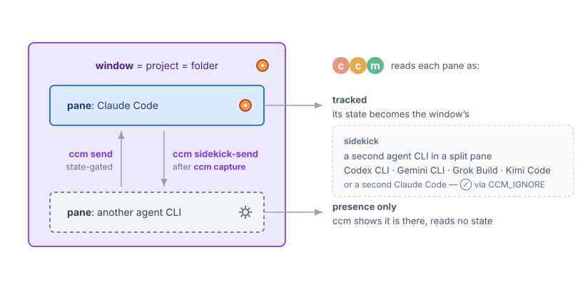

# ccm ユーザーガイド

## ccmとtmuxの関係

tmuxはターミナルを階層的に管理します。ccmはこの構造の中で動作します：

```
ターミナル（Ghostty, iTerm2 等）
 └── tmux サーバー
      └── セッション         ← 作業コンテキスト
           ├── ウィンドウ 0   ← プロジェクトA（ccm管理）
           ├── ウィンドウ 1   ← プロジェクトB（ccm管理）
           ├── ウィンドウ 2   ← プロジェクトC（ccm管理）
           └── ウィンドウ 3   ← 通常のシェル（ccm管理外）
```

**基本概念:** ccmはClaude Codeのセッションを**tmuxウィンドウ**として管理します。各プロジェクトが1つのウィンドウを持ち、ウィンドウを切り替えるだけでプロジェクト間を移動できます。

### ccmがやらないこと

- プロジェクトごとに別のtmuxセッションを作らない
- ターミナルエミュレータの設定を変更しない
- 特定のターミナルエミュレータを要求しない

## はじめかた

### 0. Claude Codeの認証

Claude Codeを初めて使う場合は、最初に一度起動して認証を済ませてください：

```bash
claude
```

対話的なプロンプトに従い、プラン選択（サブスクリプションまたはAPIキー）とブラウザ認証を行います。完了すれば、ccmを使う準備ができます。

### 1. tmuxを起動

```bash
tmux new-session -s work
```

### 2. 最初のプロジェクトを追加

```bash
ccm add ~/code/my-project
```

新しいtmuxウィンドウが作られ、プロジェクトディレクトリに移動して、Claude Codeが `claude --continue` で起動します（そのディレクトリの最新の会話がある場合は自動的に再開します）。

### 3. プロジェクトを追加

```bash
ccm add ~/code/another-project
ccm add ~/code/third-project api-server   # カスタム名
```

### 4. プロジェクト間を切り替え

ダッシュボード（`prefix + Tab`）を使うか：

```bash
ccm attach my-project    # 名前で
ccm attach 2             # 番号で
```

> [!TIP]
> Claude Codeが動いていないウィンドウに切り替えると、`claude --continue` で自動的に前回の会話を再開します。

### 5. 状態を確認

```bash
ccm status
```

```
STATUS       PROJECT              MODE     BRANCH           PORTS        DIRECTORY
------       -------              ----     ------           -----        ---------
◉ BUSY       my-project           manual   main*            3000         ~/code/my-project
● IDLE       another-project      accept   feature-x        -            ~/code/another-project
⚠ PERMIT     api-server           manual   main             8080         ~/code/api-server
```

`MODE` 列は各プロジェクトの Claude Code permission mode（`manual` /
`accept` / `plan` / `auto` / `dontAsk` / `bypass`）を、最新の hook イベント
から表示します。permission ダイアログを自動解決するモード（`auto`、
`dontAsk`、`bypass`、およびファイル操作に関する `accept`）では PERMIT
状態がそもそも発生しないため、マルチプロジェクト管理では重要な情報です —
「このプロジェクトは一度も許可を求めてこない」と感じたら、検出の不具合を
疑う前にモードを確認してください。`bypass` は警告色で表示されます
（すべてのガードレールが無効の状態です）。`-` はモード未取得
（Claude 未起動、フック未インストール、または起動後まだフックが発火して
いない）を意味します。ダッシュボードでは同じ情報がプロジェクト名の後の
`{mode}` バッジとして表示されます（日常のデフォルトである `manual` は
ノイズ削減のため非表示）。セッション中のモード変更（shift+tab）は次の
フック発火時に反映されます。

## ダッシュボード

`prefix + Tab` で開きます。プロジェクト管理のメインインターフェースです。prefixなしの単一キー（例: `F1`）でトグルする設定も可能です — 詳しくは[READMEのキーバインドセクション](../README.ja.md#キーバインド)を参照してください。

> ```
> ── ccm Dashboard ──────────────
>   6 project(s)
>
> ▶ #5  ⚠ PERMIT  ml-pipeline                ~/code/ml-pipeline
>   #4  ● IDLE    auth-service     * 2s      ~/code/auth-service
>   #2  ◉ BUSY    api-gateway                ~/code/api-gateway
>   #3  ● IDLE    web-dashboard {accept}     ~/code/web-dashboard
>   #6  ● IDLE    mobile-app                 ~/code/mobile-app
>   #7  ■ SHELL   docs-site                  ~/code/docs-site
>
> [↑↓/jk] select [Enter] attach [p]review [a]dd [n]ame [r]emove
> e[x]it all [s]ave [t]ree [m]enu [q] quit
> Hooks: ON
> ```

### ダッシュボードの操作

| キー | 動作 | 用途 |
|------|------|------|
| `↑↓` or `jk` | 選択移動 | プロジェクト間をナビゲート |
| `Enter` | 切替 | 選択したプロジェクトのウィンドウに移動 |
| `s` | 保存 | スナップショット保存（名前を入力、デフォルトは `_autosave`） |
| `p` | プレビュー | プロジェクトの画面内容を表示（`c` でコピー） |
| `a` | 追加 | 新しいプロジェクトディレクトリを登録 |
| `n` | 名前変更 | 選択プロジェクトの名前を変更 |
| `g` | 登録 | 既存のtmuxウィンドウをccmプロジェクトとしてタグ付け |
| `r` | 削除 | [u]nregister（ウィンドウ残す）か [d]elete（ウィンドウ閉じる。y/N 確認あり）を選択。メニュー（`m` / `?`）にも項目あり |
| `i` | 無視 | 選択プロジェクトの CCM_IGNORE をトグル（隠す/戻す — 下記「別モデルをサイドキックとして使う」参照）|
| `x` | 一括終了 | アイドル状態のClaude Codeを全て終了してリソースを解放 |
| `/` | フィルタ | ライブインクリメンタル検索: タイプで絞り込み、`↑↓`/`C-p`/`C-n` で候補選択、`Enter` でアタッチ、`C-u` でクリア、`Esc` でキャンセル。Unicode 対応で日本語プロジェクト名も日本語でマッチ |
| `t` | ツリー | ツリービューに切替 |
| `m` | メニュー | インタラクティブメニューに切替 |
| `q` / `Esc` | 閉じる | ダッシュボードを閉じる |

ダッシュボードのリフレッシュはハイブリッド方式です: フル状態検出は 2 秒間隔で走り、その合間に軽量な fast tick（毎秒 4 回）が Claude Code フックの書き込む状態チャネルを監視します。フック起因の変化（許可プロンプトの出現、プロンプト送信など）は、ポーリングを待たず約 0.3 秒で表示に反映されます。ステータスバーも同様に、状態遷移時はフックが即座にバーを再描画し、次の `status-interval` ティックを待ちません。ナビゲーションキー（`↑↓/jk`）はリフレッシュと無関係に即座に反応します。

行の並び順はダッシュボードを開いた時点で決まり（要対応のプロジェクトが上）、開いている間は固定されます。プロジェクトの状態が変わってもアイコンはその場で更新されますが、位置は移動しないため、操作の途中で選択が別のプロジェクトに移ってしまうことがありません。現在の状態で並べ替えたいときは、ダッシュボードを一度閉じて開き直してください。

### フィルタ直行ショートカット

ダッシュボードを開いた直後によく `/` を押すなら、`~/.tmux.conf` で `@ccm-key-search` をバインドするとダッシュボードを最初からライブフィルタモードで開けます:

```tmux
set -g @ccm-key-search "/"   # prefix + / でダッシュボードをフィルタモードで開く
```

取る前にそのキーが空いているか確認してください。たとえば `prefix + /` は tmux-copycat の検索です。

```bash
tmux list-keys -T prefix | grep -w '/'
```

prefix キーは同時に動く全プラグインと共有する名前空間で、後から書いた側が黙って前を置き換えます。症状は「別のプラグインのキーが効かなくなった」で、自分が別の場所に足した 1 行が原因だとは結びつきません。`@ccm-key-tree` / `@ccm-key-menu` / `@ccm-key-dashboard` も同様です。

シェルや別の tmux バインディングから `ccm search`（または `ccm dashboard --search`）を呼んでも同じです。プロジェクト数が多いときに、リストをスクロールせず数文字で目的のプロジェクトに直行できます。

### プレフィックスなしのダッシュボードホットキー

`prefix + Tab` よりファンクションキー一発で開きたい場合、`@ccm-key-dashboard-noprefix` で直接バインドできます:

```tmux
# 必ず ccm プラグインの読み込み行よりも前に配置してください
# (詳細は README.md#キーバインド の IMPORTANT 参照)。
set -g @ccm-key-dashboard-noprefix "F1"   # F1 単独 (prefix 不要) → ダッシュボード
```

prefix 経由の binding と同じ `display-popup` 呼び出しを通るので、popup タイトルの色付き ccm ロゴはそのまま表示されます。自前で `bind-key -n F1 display-popup …` を書くこともできますが、`-T` の format 文字列を完全にコピーしないとロゴは出ません。

## ツリービュー

`prefix + T` で開きます。tmuxの全体構造を階層表示します：

> ```
> work ◀
>   ◉ my-project (main*) ~/code/my-project ◀
>   ● another-project (feature-x) ~/code/another-project
>   ⚠ api-server (main) [:8080] ~/code/api-server
>   ■ bash ~/home
> other-session
>   ■ bash ~/home
>
> [↑↓/jk] select  [Enter] attach  [q/Esc] quit
> ```

- `◀` は現在のセッション/ウィンドウを示す
- ウィンドウのみ選択可能（セッションやペインは選択不可）
- ペインは複数ある場合のみ表示

## プロジェクト間のプロンプト送信

`ccm send` は別プロジェクトの Claude Code セッションに直接プロンプトを投入するコマンドです。`tmux send-keys -l ... Enter` を手動で組み立てる必要がなくなります。

```bash
# 位置引数のシンプルな送信（TTY なら確認プロンプトあり）
ccm send demo "前回のレビュー結果をまとめてください"

# ファイルから
ccm send research --file /tmp/brief.md

# パイプから — MCP サーバー（Gmail, GitHub 等）から直接渡すのに便利
echo "parser リポジトリの Issue #42 の調査をお願いします" | ccm send parser --stdin -y

# 複数行の本文 — \n は Claude の「改行のみ(送信しない)」キーに変換されるので、
# 複数行プロンプトとして 1 つのメッセージで届きます
printf 'context:\nbug: 120 行目で NPE\nplease fix' | ccm send api-server --stdin -y

# 送信せずプロンプトに入力だけ(ユーザーがターゲットペインで続きを書く)
ccm send demo --no-enter "TODO: "
```

### 状態に応じた動作

| ターゲット状態 | デフォルト | `--now` | `--force` | `--start` |
|---|---|---|---|---|
| **IDLE** | 即送信 | 即送信 | — | — |
| **BUSY** | 後送キューに保存 | 拒否 | 入力バッファにキューして即送信(進行中のターンと混線) | — |
| **SHELL**(Claude 未起動) | キューに保存 — Claude が起動して IDLE になってから配送 | 拒否 | — | Claude を起動し、IDLE 到達をポーリング（最大 `CCM_START_WAIT_SEC` 秒、デフォルト10秒）してから送信 |
| **PERMIT**(許可ダイアログ表示中) | キューに保存 — ダイアログが解消されてから配送 | **拒否** | それでもキュー — ダイアログには決して打鍵しない(`--force` でも) | — |
| **IGNORED**(全 Claude ペイン非表示) | **拒否** — キューにも保存しない | 拒否 | 拒否 | 拒否 — ccm が見ていないウィンドウに Claude を起動することはない。拒否メッセージが `ccm unignore <project>` を案内 |

### スプール（store-and-forward）

ターゲットが今メッセージを受け取れないとき、`ccm send` はもはやデフォルトでは失敗しません: メッセージは `$CCM_DATA_DIR/spool/<project>/` に保存され、プロジェクトが再び IDLE になったところで定期ステータス処理が配送します。出力には `Queued for <project>` とキュー長・メッセージ id が明示されます — キューに入った送信は、届いた送信とは別の事実です。

配送は意図的に保守的です:

- **1プロジェクト1パス1件。** 連続して2件送れば、2件目は1件目が始めたターンの入力バッファに乗ってしまうため、IDLE 遷移ごとに1件ずつ drain します。
- **配送直前に再検査。** ペインの raw 状態を打鍵直前に再検出し、下書きの入った composer なら混入せずに保留します。
- **TTL。** キューに置いた指示は陳腐化します — 1時間遅れで届いた指示は、もはや意図した指示ではありません。`CCM_SPOOL_TTL_SEC`（デフォルト60分）を超えたメッセージは `expired/` に移され、配送の代わりに `ccm status` / `ccm doctor` に表示されます。キューが Claude セッションを勝手に起動することはありません。
- **少なくとも1回（at-least-once）。** 配送の途中でクラッシュした場合、メッセージを失うより次のパスで再配送します。封筒行で受け手は重複を見分けられます。

配送されたメッセージは封筒ヘッダ付きで届きます — `[from: <project> · queued 14:03 · delivered 15:02 — reply with `ccm send <project> "…"`]` — 誰が送ったか、どれだけ待ったか、どう返すかが分かります。

滞留件数は `ccm status`、`ccm doctor`、ダッシュボード（プロジェクト名の横に `✉N`）に表示されます。確認と取り下げ:

```bash
ccm spool list                    # 保留中メッセージ一覧（経過時間と冒頭付き）
ccm spool clear-expired           # 未達のまま期限切れになった記録を了解済みにする
ccm spool cancel <id> <project>   # 1件取り下げ（キュー済みの誤送信は取り消せます）
ccm spool cancel --all <project>  # そのプロジェクトのキューを全消去
```

状態チェック以外のゲートもあります。状態検出は送信先 composer の書きかけの下書きを認識できません（テキストの入った `❯` プロンプトも IDLE と読まれます）。そこで `ccm send` は打鍵の直前に composer 行を直接読み、下書きがある間は他の配送不可状態と同様にキューに回します（`--now` なら拒否）。このまま送れば書きかけの文章にメッセージが混入し、Enter が混ざった文を submit してしまうためです。Claude Code 自身がターン終了時に composer へ dim で描く次プロンプトの提案は、capture の SGR 属性で本物の下書きと区別され、送信を妨げません — 提案は最初の打鍵で消えるため、守るべきものが存在しません。

### フラグ一覧

| フラグ | 用途 |
|---|---|
| `--file <path>` | ファイルからメッセージを読む |
| `--stdin`(または単独の `-`) | 標準入力から読む |
| `--no-enter` | 最後の Enter を送らない(プロンプトへの入力のみ) |
| `--now` | 今受け取れないときキューに入れず失敗とする |
| `--force` | BUSY なターゲットへの送信を許可(Claude の入力バッファにキュー) |
| `--start` | SHELL 状態なら Claude を自動起動してから送信 |
| `-y`, `--yes` | 対話的な確認プロンプトをスキップ |
| `--` | 以降をフラグとして解釈しない(`-` で始まるメッセージ用) |

stdin/stdout が TTY でない場合(パイプ経由)、確認プロンプトは自動スキップされます。`echo "..." \| ccm send ...` が `-y` なしでそのまま動きます。

ターゲット指定はプロジェクト名、`#<idx>`、またはウィンドウ番号単独のいずれでも OK です。

### 分割ウィンドウでの配送先ペイン

プロジェクトの状態はウィンドウ内の全ペインを集約して決まりますが、キー入力は特定の1ペインに届ける必要があります。`ccm send` は claude プロセスをホストしているペインを解決し、そこへ直接タイプします — 素のシェルペインがアクティブ（フォーカス中）でも影響を受けません。複数のペインが claude をホストしていて（Agent Teams 分割）アクティブペインがそのいずれでもない場合、配送先が曖昧なため送信を拒否します: メッセージを受け取るべきペインにフォーカスしてから再試行してください。SHELL ウィンドウへの `--start` は、アクティブペインのフォアグラウンドが本当にシェルであることを確認してから Claude を起動します（エディタやページャに打ち込むことはありません）。

## 状態検出

ccmはClaude Codeフック（推奨）とプロセスツリー検査を組み合わせたハイブリッド方式で状態を検出します。

### Claude Codeフック（推奨）

最良の検出精度を得るためにフックをインストールします：

```bash
ccm setup-hooks
```

`~/.claude/settings.json` にフックが追加されます：

| フック | 信号 | 検出内容 |
|--------|------|----------|
| `UserPromptSubmit` | BUSY | プロンプト送信 → Claude処理中（テキスト生成含む） |
| `PreToolUse` | BUSY | ツール実行開始（マルチターンの検出ギャップを解消） |
| `PostToolUse` | BUSY | ツール実行完了 — permission 後のBUSYシグナルを維持 |
| `PostToolUseFailure` | BUSY | ツール実行失敗 |
| `SubagentStart` / `SubagentStop` | BUSY | サブエージェント実行中（親エージェントは作業継続中） |
| `PreCompact` / `PostCompact` | BUSY | コンテキスト圧縮はビジー作業 |
| `Stop` / `StopFailure` | BUSY信号クリア | Claude応答完了（信号ファイルを削除） |
| `PermissionRequest` | PERMIT | ツールがユーザーの許可を要求 |
| `Notification` | PERMIT / 信号クリア | 許可プロンプトまたは MCP elicitation ダイアログ表示 / アイドル通知（matcher: `permission_prompt`, `elicitation_dialog`, `idle_prompt`）|
| `SessionEnd` | SHELL | セッション終了（/exit、Ctrl+D等） |
| `PermissionDenied` | PERMIT | autoモードでの拒否（`/permissions`で再試行） |

> [!NOTE]
> フック信号は `$TMPDIR/ccm-$UID/hooks/` に書き込まれます。BUSY は `Stop`/`SessionEnd` フックまたはプロセス終了でクリアされます。BUSY フックと JSONL の両方が `CCM_BUSY_HOOK_JSONL_WINDOW`（デフォルト10分）を超えて沈黙した場合、ccm は古い信号の信頼を打ち切り IDLE へフォールバックするため、`Stop` の取りこぼしで BUSY に張り付くことはありません。PERMIT も同様に解放されます。permission の解決時に上流はフックを発火しないため、permit イベントが最新で、ペインにモーダルが表示されておらず、セッションログが `CCM_PERMIT_MAX_TIMEOUT`（デフォルト10分）を超えて凍結している場合、ccm はその信頼を打ち切り IDLE へフォールバックします。ダイアログが画面に出ている場合はペインから直接読み取られるため、どれだけ待っていても PERMIT のままです。Esc 中断で残った BUSY（`Stop` フックが発火せず、ログがツール実行中で凍結）はより早く解放されます。画面がアイドルなプロンプトで、ログが `CCM_BUSY_STALE_RELEASE_SEC`（デフォルト60秒）を超えて凍結している場合、ccm は IDLE に委ねます。

フックの状態はダッシュボードのフッターと `ccm status` の出力に表示されます（Hooks: ON/OFF）。既にインストール済みの場合、`ccm setup-hooks` は再インストールをスキップします。ccmを別のパスに再インストールした場合は、フックのパスが自動的に更新されます。

削除するには: `ccm remove-hooks`

### 各状態の検出方法

| 状態 | 検出方法 | 詳細 |
|------|----------|------|
| **SHELL** | プロセスチェック | ウィンドウの子プロセスに `claude` が見つからない |
| **IGNORED** | ペインオプション + プロセスチェック | `claude` をホストするペインが全て `@ccm_ignore` で除外され、可視ペインのどれもホストしていない状態 — ccm は意図的にその Claude を見ていないため、SHELL/DOWN（「Claude は起動していない」）は根拠のない主張になる。PERMIT > BUSY > IDLE > SHELL の梯子の段ではなく、SHELL/DOWN の主張に先立って判定される可視性の結論。`⊘`（dim）で表示。`ccm send` は拒否され `ccm unignore` を案内。auto-exit は反応しない（IDLE にのみ作用） |
| **BUSY** | event-log + JSONL stop_reason | 主経路: BUSY 系フック (`UserPromptSubmit`、`PreToolUse`、`PostToolUse`、`SubagentStart`/`Stop`、`PreCompact`/`PostCompact`) が追記する per-session event log (`hooks/<sessionId>.events.jsonl`、Claude Code の session UUID でキー)。`derive_state_from_events` が tail を純関数で評価し、最新エントリが start-class なら BUSY を返す。フック沈黙時は JSONL `stop_reason` で橋渡し: 直近の `tool_use` ならツールターン境界の Stop を超えて BUSY を維持、`end_turn` / `max_tokens` / `stop_sequence` が最新 event より新しければ数秒以内に IDLE へ release。Claude Code housekeeping レコード（`system/away_summary`、`turn_duration`、`attachment/task_reminder`、`permission-mode`、`file-history-snapshot`、`last-prompt`）は JSONL 活動から除外され、recap や起動時 housekeeping が偽の活動として検出されない |
| **IDLE** | event-log + capture-pane | event log の最新エントリが end-class（`stop` / `notify_idle` / `notify_permit` 解消後）で、入力プロンプト `❯ ` が表示されており、PERMIT フッターにマッチしない状態。フックなし時は legacy fallback がプロセスツリー + プロンプト可視性のみで判定 |
| **PERMIT** | フック + capture-pane フォールバック | 主経路: `PermissionRequest` / `PermissionDenied` / `Notification`（permission_prompt）フック。フォールバック: モーダルフッター（permission ダイアログの `Esc to cancel · Tab to amend`、confirmation modal の `Enter to confirm · Esc to <verb>` — v2.1.144 の `/model` 形式 `Enter to confirm · d to set as default for new sessions · Esc to cancel` のような中間 `· <action key>` セグメントも許容）をペインから直接検出 — フックが途中で停止したセッションでも捕捉可能 |
| **完了（`* elapsed`）** | 表示レイヤー | 一時的マーカー: BUSY/PERMIT → IDLE遷移後に30秒間表示、その後クリア。アスタリスクは緑（直近の完了に視線を誘導）、経過時間は dim |
| **マルチペイン（`[N]`）** | ウィンドウ検査 | tmux ペインを 2 つ以上含むウィンドウに対し、全レンダラー（dashboard / status bar / `ccm status`）でプロジェクト名直後に表示。角括弧 dim、数字 cyan。集約状態が非アクティブペインのものである可能性をユーザーが認識できるようにする。詳細（sliver 保護と PERMIT 自動フォーカス）は下記「Agent Teamsとの併用」を参照 |
| **Permission mode（`{mode}`）** | Hook payload | Claude Code が hook payload に付与する `permission_mode` field 由来の表示専用バッジ。最新値を `ccm status` の MODE 列と、ダッシュボードのプロジェクト名直後の `{mode}` バッジ（`{accept}` / `{plan}` / `{auto}` / `{dontAsk}` / `{bypass}`）として表示。日常デフォルトの `manual` はダッシュボードでは非表示。`{bypass}` は警告色。ダイアログを自動解決するモードでは PERMIT がそもそも発生しないため、その沈黙を検出不具合と誤診しないためのバッジ。状態検出はこの値を一切参照しない |
| **無視（`⊘`）** | ペインオプション | ウィンドウに `CCM_IGNORE` されたペイン（ccm が意図的に追跡しないセッション）があるとき、ダッシュボード / `ccm status` の行に dim `⊘` を表示（下記「別モデルをサイドキックとして使う」参照）。存在するが未追跡、という印であって状態ではない |

### フックなしでの検出

フックなしの場合、ccmはプロセスツリー検査とプロンプトパターンマッチにフォールバックします。この場合：
- テキスト生成中（ツール未使用）はBUSYではなくIDLEと表示される
- 完了検出はBUSY→IDLE遷移のヒューリスティクスに依存する

### 完了追跡

Claude Code が処理を完了すると、ccm は:
1. 完了タイムスタンプを記録 (プロジェクトは IDLE に遷移)
2. ダッシュボード / ステータスバー / `ccm status` のプロジェクト名の右に `* <elapsed>` を「最近完了」マーカーとして表示 (アスタリスクは緑、時間は dim)
3. デスクトップ通知を送信 (設定時)

`* <elapsed>` マーカーは以下の場合にクリアされます:
- 30 秒経過 (自動クリア)
- そのウィンドウに切り替えた時 (ダッシュボード、ツリー、`ccm attach` 経由)
- 新しいプロンプトを送信した時 (Claude が BUSY になりマーカーがクリア)

## ステータスバーモード

`~/.tmux.conf` で `set -g @ccm-status-line` を設定します。設定の詳細とスクリーンショットは[READMEのステータスバーセクション](../README.ja.md#ステータスバー)を参照してください。

### 一覧を絞る・配置を変える

モード 1 と 2 が何を表示するか、モード 1 がそれをどこに置くかを変える 2 つの
オプションがあります。どちらも既定は off で、例つきの説明は
[README のステータスバー節](../README.ja.md#ステータスバー)にあります。

`@ccm-status-line-hide-shell on` は SHELL のプロジェクトを除き、Claude
セッションが動いているウィンドウだけを残します。登録プロジェクトが多いと大半は
常に SHELL で、対応が必要な 1 件が埋もれるためです。IDLE は残ります。セッションは
生きて入力を待っており、ターンが終わったときに `* elapsed` マーカーが出るのも
この状態だからです。

注意点として、アイドルセッションは `CCM_IDLE_EXIT_TIMEOUT` 後に自動終了するので、
放置したプロジェクトはセッション終了とともにバーから消え、アタッチして Claude が
再起動すると戻ります。ダッシュボードと `ccm status` は常に全プロジェクトを表示
します。

`@ccm-status-line-position left` はモード 1 のエントリをバーの左側へ移し、最優先を
先頭にします。ウィンドウリストを消して空いた場所が埋まります。`status-left` には
一切書き込みません——押し出しに使う余白は `status-right` 内にあります。バーが狭い
ときは右寄せの配置を維持します。エントリが `status-left` の下に潜り込むと、tmux が
最優先のものから切り捨てるためです。

### モード0 — アイコン表示

既存の status-right にアイコン 1 つを追加。時計やバッテリー表示はそのまま保持されます。全プロジェクトのうち最優先の状態を表示：

> ```
> 5: PERMIT ⚠   13:30
> ```

優先順: `⚠` PERMIT（黄） > `◉` BUSY（オレンジ） > `≡` 全IDLE（グレー）

- 向いている人: 既存のテーマと最も保守的に共存したい人
- 注意: プロジェクトごとの詳細はダッシュボードで確認

### モード1 — 全表示（ccm形式ウィンドウリスト）

tmux標準のウィンドウリストをccm形式の色付きエントリに置換。既存のstatus-rightは保持。

> ```
> myapp:● | sideproject:◉ | docs:● | 21:30 12-25
> ```

- 向いている人: メインバーに色付きプロジェクト状態を常時表示したい人
- 注意: tmux標準のウィンドウリストが置換される

### モード2 — 専用行表示

メインバーの下に専用ステータス行を追加。IDLEを含む全プロジェクトをgitブランチ・ポート情報付きで表示します。

> ```
> メインバー:  0:bash  1:my-project  2:api-server     21/03  07:30:00
> ccm行:      my-project:◉(main*) | another-project:●(dev) | api-server:⚠(main)[:8080]
> ```

| アイコン | 状態 | 色 |
|----------|------|-----|
| `⚠` | PERMIT | 黄 |
| `◉` | BUSY | オレンジ |
| `●` | IDLE | ブルー |
| `* <elapsed>`（プロジェクト名の後ろ） | IDLE（最近完了） | アスタリスク緑、時間 dim |
| `■` | SHELL | 暗グレー |

- `* <elapsed>` マーカーは完了後30秒間表示され、その後消えます（プロジェクトは `●` IDLE のまま）
- 向いている人: status-rightを維持しつつ全プロジェクトを常時確認したい人
- 注意: 画面が1行狭くなる（プロジェクト数に応じて自動拡張）

## スナップショット

プロジェクトのレイアウトを保存して、後から復元できます。

### 保存

```bash
ccm snapshot save my-workspace
```

### 復元

```bash
ccm start my-workspace
```

### 自動保存

`_autosave` スナップショットは、ccm プロジェクトが存在する間 **2 分ごとに自動更新** されます。加えて `ccm stop --all` 実行時にも書き込まれます:

```bash
# 全プロジェクト停止（自動保存される）
ccm stop --all

# 翌日、前回の構成を復元
ccm start _autosave
```

#### tmux起動時の自動復元

tmux起動時に最後の `_autosave` スナップショットを自動復元するには、`~/.tmux.conf` に以下を追加：

```tmux
set -g @ccm-auto-restore "on"    # デフォルト: off
```

> [!NOTE]
> TPM経由で起動時に `_autosave` をロードします。既にccmプロジェクトがある場合はスキップされます。

### スナップショット管理

```bash
ccm snapshot list          # 一覧表示
ccm snapshot delete old    # 削除
```

## Tips

### 既存ウィンドウの登録

Claude Codeが既に動いているtmuxウィンドウを、再起動せずにccm管理下に置けます：

1. ダッシュボード（`prefix + Tab`）を開く
2. `g`（登録）を押す
3. 未登録のウィンドウを選択
4. 名前を入力

コマンドラインからも可能：

```bash
ccm register 3 my-project    # ウィンドウインデックス3を登録
```

### キャプチャとコピー

プロジェクトに切り替えずに画面内容を確認：

```bash
ccm capture my-project              # ターミナルに出力
ccm capture --copy my-project       # クリップボードにコピー
```

ダッシュボードからは `p` でプレビュー、`c` でコピー。分割ウィンドウでは、ダッシュボードのプレビュー（およびライブプレビューパネル）は、フォーカスされているペインではなく **Claude が走っているペイン**を表示し、`CCM_IGNORE` 済みのサイドキックは表示しません。常に ccm が追跡しているセッションをプレビューできます。

**分割ウィンドウはペインごとにキャプチャされます。** `ccm capture` は各ペインにペインIDと実行中のプロセスのラベルを付けて出力するため、フォーカスされているペイン以外が隠れることはありません：

```
=== ccm capture: my-project ===
--- pane %1 [claude] (active) ---
...
--- pane %7 [other-agent] ---
...
=== end ===
```

単一ペインのウィンドウは従来どおりヘッダなしで出力されます。`CCM_IGNORE` で隠したペインも**含まれ**、`(ignored)` と表示されます。ペインを隠すことは「ccm が追跡・入力しない」という意味であり、明示的に要求したキャプチャから消えるという意味ではないためです。

これにより、Claude 自身からサイドキックペインを読むこともできます。片方のペインで `ccm capture <このプロジェクト>` を実行すると、同じウィンドウ内のもう一方のエージェントが何をしているかが分かります。Claude と並べて別のエージェント CLI を動かしているときに便利です。

> [!IMPORTANT]
> プロジェクトの**状態**は、その Claude ペインを表すものであり、同じウィンドウを共有する別のエージェントの状態ではありません。ccm が追跡するのは Claude セッションであり、別のエージェント CLI が動くペインには claude が存在しないため状態に寄与しません。
>
> したがって Claude セッションは、隣のエージェントが空いているかを判断するために自プロジェクトの状態を読んではいけません。問い合わせている当人が動いている以上、読み取れる状態は自分自身のものであり、コマンドを実行中のセッションは定義上 BUSY です。それを「相手が忙しい」と解釈すると、実際には何も起きていないのに誤判定になります。サイドキックペインの判断は、キャプチャした内容だけを根拠にしてください。
>
> 同じ理由で `ccm send <このプロジェクト>` は明示的に拒否されます。配送先が Claude ペイン＝呼び出し元自身に解決されるためです。

### Git連携

各プロジェクトのgitブランチとdirty状態を表示：

- `main` — クリーンな作業ツリー
- `main*` — 未コミットの変更あり（ステージ済み・未ステージ含む）

ダッシュボード、ツリービュー、`ccm status` で確認できます。

### ポート検出

プロジェクトディレクトリのプロセスがリッスンしているTCPポートを自動検出します：

```
 my-app:◉ [:3000]    api:● [:8080,8443]
```

ポート検出結果は30秒間キャッシュされます。

## トラブルシューティング

### ダッシュボードが開かない

ダッシュボードが表示されてすぐ消える場合：

```bash
# 古いPIDファイルを削除
rm -f "${TMPDIR:-/tmp}/ccm-$(id -u)/dashboard.pid"
```

### ステータスバーに古いデータが表示される

```bash
# キャッシュをクリア
rm -f "${TMPDIR:-/tmp}/ccm-$(id -u)/status-cache"
tmux source-file ~/.tmux/plugins/tmux-ccm/ccm.tmux.conf

# ccm適用前のstatus-rightはtmuxオプションに保持されています（ファイルではありません）:
tmux show-option -gqv @ccm-orig-status-right   # 保存された元の値を確認
```

### セッションのコンテキストがずれる

プロジェクトが間違ったセッションに表示される場合：

```bash
rm -f "${TMPDIR:-/tmp}/ccm-$(id -u)/popup-session"
```

### 状態がBUSYのまま

プロジェクトがBUSY表示だがClaude Codeは実際にはIDLEの場合、子プロセスが残っている可能性があります：

```bash
ccm capture my-project    # 画面の内容を確認
```

子プロセスが終了すれば、次の2秒リフレッシュで状態が修正されます。

`(Nm)` suffix が付いて (例: `BUSY (5m)`) BUSY のまま戻らない場合は、ccm が自分のシグナルが stale であることを検出したが「実は IDLE」を証明できない状態です。通常は upstream の double silent fail (Stop hook 喪失 AND JSONL に完了記録なし) が原因。最終手段として:

```bash
ccm reset my-project      # フックシグナル、event log、キャッシュ済み state option をクリア
```

`ccm reset` は会話履歴・スナップショット・実行中の `claude` プロセスには触りません — 検出が読む ephemeral な runtime artefact だけを wipe します。次のスキャンで一から再解決されます。通常の「Claude が固まった」状況では `/exit` をペイン内で入力するのが筋です。

### 検出が反応しなくなった（hook 沈黙カナリア）

Claude Code はセッションの途中でフックの発火を止めることがあります。ccm の精密な
検出はフックに依存しているため、止まると粗い信号にフォールバックし、状態の反映が
遅れたり固まったりします。原因は upstream 側で ccm ではありませんが、外から見ると
両者は区別がつきません。

opt-in のカナリアがその違いを報告します:

```tmux
set -g @ccm-hook-silence on
```

セッションの transcript には最近の活動があるのに、フックのログがそれを記録して
いない場合——つまりフックが眠っている間に進んだ作業がある場合——に、`ccm status`・
`ccm doctor`・ダッシュボードのフッターで警告します。既定は off です。閾値の調整を
誤っても、監視を自分から選んだ人しか誤解しないためです。

閾値は `CCM_HOOK_SILENCE_FRESH`（transcript の活動がどれだけ新しければよいか、
既定 90 秒）と `CCM_HOOK_SILENCE_GAP`（フックログがどれだけ遅れていれば警告するか、
既定 120 秒）です。発火のたびに `~/.local/share/ccm/state/hook-silence.log` へ
1 行記録され（プロジェクトごとにレート制限）、`ccm doctor` が件数を表示します。

該当セッションの Claude を再起動すればフックは復帰します。

### 全プロジェクトが同じ状態で固まる

**すべて**のプロジェクトが同じ状態（例: 全て BUSY）で固まり、リフレッシュしても更新されない場合、検出サイクル自体が silent な例外を踏んでいる可能性があります。ログを確認:

```bash
ccm errors
```

各行は捕捉された例外（タイムスタンプ、スコープ、トレースバック付き）です。空（`No silent-caught errors logged.`）であれば検出サイクルは正常です。エントリが蓄積している場合、最新のトレースバックが失敗箇所を示します。`ccm errors --clear` でアクティブログとローテートされた `errors.log.1` の両方を削除できます。

## Agent Teamsとの併用

ccmはClaude Codeの[Agent Teams](https://code.claude.com/docs/en/agent-teams)と併用できます。両者は異なるレベルで動作し、補完関係にあります：

- **ccm** はプロジェクトをtmuxの**ウィンドウ**として管理（1プロジェクト = 1 Claude Code）
- **Agent Teams** は1つのウィンドウ内で並行エージェントを**ペイン**として実行

### 連携の仕組み

ccm管理のプロジェクトウィンドウ内でAgent Teamsを実行すると、ccmの状態検出が全ペインを自動的に集約します：

- いずれかのチームメイトがPERMIT状態 → プロジェクトは `⚠ PERMIT` と表示
- いずれかがBUSY → `◉ BUSY` と表示
- 全チームメイトがIDLE → `● IDLE` と表示

ccmのダッシュボードやステータスバーで、追加設定なしにAgent Teamsの活動状況を確認できます。マルチペインのウィンドウには、プロジェクト名直後に `[N]` マーカー（角括弧 dim、数字 cyan）が全レンダラーで付与されるので、並列のチームメイトを抱えるプロジェクトを一目で識別できます。

**Sliver 保護**: `SLIVER_HEIGHT_THRESHOLD`（デフォルト 4 行 — 下記「環境変数」参照）より低いペインは状態集約から除外されます。極端に小さいペイン（過去の split で残った 1 行のストリップなど）では Claude の `❯` プロンプトが描画されず、capture-pane 検出が「子プロセス + プロンプト不可視」を BUSY と誤判定してしまうため、除外することで不可視 sliver がウィンドウ全体の状態を汚染するのを防ぎます。Agent Teams で意図的に小さいペインを使っており除外したくない場合は `CCM_SLIVER_HEIGHT_THRESHOLD` で閾値を上げてください。

**Attach 時の自動フォーカス**: ccm 経由で attach（dashboard / `ccm attach`）した際、いずれかのチームメイトペインが許可待ち（`⚠ PERMIT`）でアクティブペインがそれ以外なら、ccm が自動で PERMIT ペインにフォーカスを切り替えます。許可が必要なプロジェクトに attach するたびに `prefix + 矢印` する手間を省きます。PERMIT 限定 — BUSY のチームメイトは監視対象であってユーザー入力を要求するわけではないので、フォーカスは奪いません。

### 競合なし

| 機能 | Agent Teams | ccm | 競合 |
|------|------------|-----|------|
| キーボードショートカット | `Shift+↓`, `Ctrl+T`（Claude Code内部） | `prefix + Tab`（tmuxレベル。T/Cはopt-in） | なし |
| ペイン管理 | ウィンドウ内でペイン分割 | ウィンドウを管理 | なし |
| ウィンドウ名 | 変更しない | アイコン+名前を設定 | なし |

### 典型的なワークフロー

1. `ccm add` で複数プロジェクトを登録
2. ダッシュボード（`prefix + Tab`）でプロジェクトに切替
3. そのプロジェクト内でClaude Codeに Agent Team を作成させる
4. Agent Teamsがウィンドウを各チームメイト用にペイン分割
5. ccmのダッシュボードに全チームメイトの集約状態が表示される
6. チームが作業中に `prefix + Tab` で別プロジェクトに切替可能

## 別モデルをサイドキックとして使う（CCM_IGNORE）

2つ目の Claude Code セッションを同じウィンドウの分割ペインで走らせることができます（主セッションの隣に相談用のサイドキックを置く）。既定では ccm が両ペインを 1 つのウィンドウ状態に集約してしまい、`ccm send` がどちらに届くべきか判別できないため、`CCM_IGNORE` でサイドキックを ccm から不可視にし、主セッションだけをクリーンに追跡させます:

```bash
# 主ペイン: メインのセッション、ccm が通常どおり追跡
claude --continue

# 分割ペイン（prefix %）: サイドキックのセッション、ccm から隠す
CCM_IGNORE=1 claude
```

無視されたセッションは、ウィンドウ状態の集約・セッション追跡・`ccm send` の配送・アイドル自動終了から除外され、そのフックは signal / event / デスクトップ通知を一切出しません。したがってウィンドウの状態・バッジ・`ccm send` のルーティングは主セッションだけを反映します。ダッシュボード / `ccm status` の行に出る dim `⊘` が、隠れたサイドキックが走っていることを思い出させます。（サイドキックは、`ANTHROPIC_BASE_URL` で別の Anthropic 互換エンドポイントに向ければ別モデルにもできます — ccm の扱いはどちらでも同じです。）

稼働中のセッションをあとからトグルすることもできます:

```bash
ccm ignore              # 今いるペインを隠す
ccm ignore <project>    # プロジェクトのウィンドウの全 claude ペインを隠す
ccm unignore            # 現在のペインを戻す
ccm unignore <project>  # プロジェクトを戻す
```

またはダッシュボードでプロジェクトを選んで `i` キー。

**忘れた場合。** 黙って壊れることはありません。可視の Claude セッションが2つあるウィンドウは両方を集約し、`ccm send` は誤ったほうの会話に打ち込む代わりに推測を拒否します — その拒否メッセージが `CCM_IGNORE` と `i` キーを案内します。`ccm doctor` も該当ウィンドウを *multi-claude windows* として列挙します。どちらも警告としては書かれていません。同じウィンドウ構成は Agent Teams の通常の分割でもあり、その場合はどちらの PERMIT も届くよう両方が可視のままである必要があるからです。両方の読みを示したうえで、判断はあなたに委ねられます。

**ペイン自体に無視を表示する**（任意）: ccm は `⊘ ccm-ignored` というペインタイトルを設定しますが、tmux はペインボーダーを有効にしている場合のみ表示します。`tmux set -g @ccm-ignore-pane-border on` で opt-in すると、セッション無視時に ccm が `pane-border-status` を on にします（グローバルな tmux 変更なので、この明示的 opt-in のときだけ起こります）。opt-in しなければダッシュボードの `⊘` が手がかりになります。

**注意 — 同一ディレクトリ**: 2 つの Claude Code セッションを同じ作業ディレクトリで走らせると upstream バグ（anthropics/claude-code#48112）に当たり、片方のバックグラウンドタスク通知がもう片方のセッションログに漏れ込みます。`CCM_IGNORE` は ccm がサイドキックを**追跡**しないようにしますが、サイドキックがバックグラウンドタスクを並行実行すると主セッションのログが汚染される経路は塞げません。サイドキックはインタラクティブな相談用に留める（並行 `run_in_background` 作業や同一ファイルの同時編集を避ける）か、対等な 2 エージェントが必要なら git worktree で各モデルに別ディレクトリを与えてください。

## 他のエージェント CLI との往復リレー



Claude Code 以外のエージェント CLI を、プロジェクトウィンドウの split ペインで動かし、人間がテキストを仲介することなく 2 つのエージェント間でメッセージを往復させられます。ccm は Claude 中心のままです: 既知の外部エージェント CLI がペインで動いていれば dim の `▸<name>` presence バッジを表示するだけで、その状態は追跡しません。`ccm capture` は全ペインを表示するので、どちら側からも相手の表示内容を読めます。

機能する規約は次のとおりです:

- **他のエージェント → Claude**: 相手側が `ccm send <project> "<message>"` を実行します。state gating が効き（PERMIT には決して送らない）、メッセージは Claude の新しいターンとして着弾します。誰も見張る必要はありません。
- **Claude → 自分のウィンドウのサイドキック**: プロジェクトのウィンドウのペインから `ccm sidekick-send "<message>"` を実行します。ccm は Claude 以外のペインを state-gate できないので、事前に `ccm capture <自分のプロジェクト>` で相手が入力可能かだけ確認してください。あとの手順はコマンドが機械的に行います（かつて手順書が注意力に委ねていた部分です）: tmux のメタデータからサイドキックのペインを特定し（既知の外部エージェント CLI で、作業ディレクトリがこのプロジェクトに属するもの）、0個・2個以上なら拒否し、本文をリテラル（`send-keys -l --`）で打ち込み、0.3秒待ってから `Enter` を別送し、送信後に capture してメッセージの断片が実際に現れたかを確認します。確認できなければ非ゼロ終了になります。

  手で他の TUI に打ち込むことがあれば、コマンドに内蔵された各部の理由は今でも有効です。`-l` はテキストをリテラルに送るもので、付けないと tmux は引数を**キー名**として解決し、`Space` や `Enter` といった語がそのキー入力に化けます。改行キーは CLI ごとに異なり（Claude は `M-Enter`）、複数行の本文は行ごとにリテラル送信して間に相手の改行キーを挟みます。`ccm sidekick-send` は `M-Enter` を使います。

  **`Enter` の前の待ちは必須で、手作業ではここが最も踏みやすい失敗です。** 本文と `Enter` を `&&` で連結すると、挿入されたテキストを相手の TUI がまだ処理している最中に `Enter` が届き、submit ではなく**改行**として解釈されることがあります。本文は composer に残ったまま、送信できたときとまったく同じ見た目になります。Kimi K3 での実測では、間隔なしは毎回失敗し、0.3 秒と 1 秒はどちらも送信されました。Claude Code の composer は間隔なしでも耐えるため、`ccm send` に待ちは不要で、相手が Claude 以外のときだけこの問題が出ます。

  **送信できたことを確認してください。推測しないこと。** `ccm sidekick-send` はこれを自分で行います（上記の送信後 capture）。手で送る場合は `Enter` の後に `ccm capture` して相手の入力欄を見ます。**空なら送信済み**、**自分のテキストが残っていれば未送信**です。見えているテキストは配送の証拠ではなく、未送信の証拠です。
  **相手の入力欄は読まないので、自分で確認してください。** `ccm send` は Claude ペインの入力欄に書きかけの下書きがあると送信を拒否します（確定の `Enter` が混ざったものを送信してしまうため）。こちらには対応するものがありません — 他ベンダーの入力欄を特定するにはそのベンダーの画面に合わせる必要があり、このレーンはまさにその結合を持たないために存在しているからです。送る前に `ccm capture <このプロジェクト>` で相手の入力欄を見てください。手順が元から求めていた確認と同じものです。

- **サイドキックは自分のウィンドウにだけ従う。** `ccm send` が届くのはプロジェクトの **Claude** であって、サイドキックには決して届きません（横取りされないよう配送候補から除外されています）。`ccm sidekick-send` も反対側から同じ境界を守ります: 宛先は常に呼び出し元と同じウィンドウのサイドキックで、打鍵前にペインのディレクトリがプロジェクトに属することを検証します。他プロジェクトのサイドキックに用があるときは、そのプロジェクトの Claude に頼んで中継してもらいます。相手が空いているかも、その TUI がどのキーを受けるかも、知っているのはその Claude であって、外から見るあなたは両方とも推測になります。さらにその Claude は自分のサイドキックが今何をしているかを把握し続けています。外から割り込む（生の `tmux send-keys` でウィンドウを跨ぐ）と、2 人の送信者が 1 つの composer に着弾し、混ざって 1 つの壊れたプロンプトになります。
- **ポーリングせず、完了を申告する**: どちら側も相手の進捗は観測できません。依頼された作業が終わったら、自分から `ccm send` で結果を返してください。返信は相手の新しいターンとして勝手に届きます。
- **長い結果はファイル + ポインタ**: ファイルに書き出して 1 行のポインタだけ送ります。改行キーの差異もこれで回避できます。

`ccm setup-claude-md` はこの規約を `~/.claude/CLAUDE.md` に書き込むので、すべての Claude セッションが知っている状態になります。相手側の CLI の指示ファイル（その CLI 相当のグローバル指示）に同じ規約を書けば、往復が完成します。

**サイドキックは別の Claude Code でも構いません。** 上記のどれも相手が別製品であることに依存していません。split ペインの2つ目の `claude` でも往復の仕方は同じですが、例外が1つあります: `ccm sidekick-send` の宛先は既知の**非 Claude** CLI だけです（2つ目の `claude` は追跡対象本体のバイナリなので、あの集合には意図的に入っていません）。そのため Claude サイドキックへ届けるには、従来どおり `ccm capture` で確認してから手で `tmux send-keys` します。それ以外の、ccm から見た扱いの違いはこうです: 2つ目の Claude Code は ccm が**追跡してしまう**セッションなので、`CCM_IGNORE` で意図的に隠すことになり（上節参照）、印も非 Claude CLI の `▸` ではなく `⊘` になります。実際にはこちらの組み合わせの方が扱いやすく、送信キーと改行キーが共通で、相手も `CLAUDE.md` 経由で規約を既に知っています。

## サイドキックの注意喚起: いつあなたを必要としているかを知る

サイドキックの承認ダイアログは見落としやすいものです。ccm は非 Claude ペインから意図的に状態を読まないので、*「Run this command?」* でブロックされた Kimi も、作業中の Kimi も、見た目は同じ dim の `▸kimi` です。各製品の画面をパースする代わりに（書式は CLI ごとに違い、予告なく変わります）、ccm はサイドキック**自身に報告させます** — そのベンダー自身が出荷している hook 機構を通じて:

```bash
ccm setup-sidekick-hooks kimi     # ~/.kimi-code/config.toml に [[hooks]] エントリを書き込む
ccm remove-sidekick-hooks kimi    # 削除する（どちらもバックアップを残す）
```

反映されるのは**新しい** Kimi セッションからです — Kimi は起動時に config をロードするため、インストール後にサイドキックペインの `kimi` を一度再起動してください。

以後、サイドキックが許可プロンプトに突き当たると、その hook が tmux ペインをキーにした attention marker を書き、ccm は全ての面で同時に反応します: `▸kimi` バッジがダッシュボード・`ccm status`・ステータスバーで PERMIT の黄色に変わり、何のツールについて尋ねているかを載せたデスクトップ通知が飛びます。あなた（または相棒の Claude）がダイアログに答えると、解決側の hook が待ちを閉じ、バッジは dim に戻ります。ウィンドウ自体の状態は一切変わりません — PERMIT は今までどおり *Claude* があなたを必要としている印で、黄色い `▸` は*サイドキック*がそうである印です。

切り替えはダッシュボードの `w` キー、恒久的には `tmux set -g @ccm-sidekick-attention off` で（off でも marker は書かれ続けます — 静かになるのは ccm の表示と通知だけなので、marker ディレクトリを読む他のローカルツールは動き続けます）。

**2つ目の Claude Code にはインストーラすら不要です。** ignore された Claude（`CCM_IGNORE=1 claude`、ガイドで案内している Claude-as-sidekick の形）はもともと ccm のフックを実行していて、ただ黙って抜けていただけです。その許可イベントが同じ attention チャネルに流れるようになりました: 隠れた Claude が待っている間は `⊘` マーカーが PERMIT の黄色になり、ダイアログに答えると dim に戻ります。ignore の契約は不変です — そのセッションはウィンドウ状態にも `ccm send` の配送にも auto-exit にも一切関与しません。正直な注意点が1つ: Claude Code には解決イベントがない（`PermissionResult` の欠落）ため、待ちは*次の* hook 活動で閉じます — 承認されたツールは `PostToolUse` を、拒否のフィードバック往復は `Stop` を発火します。カバーできないのは「Esc で消してそのまま完全に沈黙」だけで、その場合は marker が TTL で消えます。

> [!NOTE]
> Claude 以外のエージェントへの対応は**実験的**で、`ccm setup-sidekick-hooks` は当面 CLI 一覧に載せていません。各ベンダーの hook 契約はまだ若く動いています — 3 つ実測しただけで、未文書のイベント種別、プラットフォーム名付きバイナリ、hook をロードするのに一度も発火しない製品が出てきました。この節は変わる前提でお読みください。上の Claude サイドキックの経路はこれらに一切依存しません。

インストールできるのは **Kimi Code** と **Grok Build** で、どちらも実際に動いているペインで検証済みです。正確なのは Kimi の方です — hook セットに `PermissionRequest` と `PermissionResult` の両方があり、待ちの開始と終了が正確に取れます。Grok にはどちらもありません: 許可待ちは `Notification` の `notificationType: "permission_prompt"` として届き、ツールの詳細を持たず（summary は Grok 自身の「Tool permission requested」にフォールバックします）、次の活動イベントで閉じます。

対応できないエージェントが 2 つあり、いずれも upstream 側の事情です。**Codex CLI** には承認時の hook がなく（[openai/codex#11808](https://github.com/openai/codex/issues/11808)）、**Antigravity CLI**（Gemini CLI の後継）は hook をロードするものの一度も発火しません — 1.1.10 で実測し、実際の承認ダイアログを出しても 6 つのイベントのいずれも呼ばれませんでした。`ccm setup-sidekick-hooks` は未対応のエージェントを名指しで拒否し、どちらに該当するかを表示します。

Grok Build には設定の書き換えではなく専用の hook ファイル（`~/.grok/hooks/ccm-sidekick-attention.json`）を置くので、削除は unlink 一発で、あなたの設定と混ざることは一切ありません。

## agent view（バックグラウンドセッション）との併用

Claude Code 2.1.139 で導入された [agent view](https://claude.com/blog/agent-view-in-claude-code) は、`claude agents`（TUI）/ `claude --bg <prompt>`（バックグラウンドディスパッチ）/ `claude attach <short>`（フォアグラウンドアタッチ）の 3 つの入口を持ちます。これらはすべてユーザーごとの supervisor daemon の下で動作し、tmux の外側にいます。ccm はこの daemon の状態を読んでダッシュボードに読み取り専用セクションとして表示するため、tmux 管理下のプロジェクトと daemon 管理下のバックグラウンドセッションを 1 つのビューで俯瞰できます。

### セクションを有効にする

デフォルトはオフ（agent view を使わないユーザーには余計な表示は出ません）。3 通りの方法で表示できます:

- ダッシュボードで `b` を押す — その popup の間だけトグル、設定は永続化しない。
- `~/.tmux.conf` に `set -g @ccm-bg-section "always"` を追加 — 毎回開くたびに表示。
- ダッシュボードメニュー（`m`）で `Background sessions: …` 行をトグル — 上記オプションを `~/.tmux.conf` に書き込みます。

セクションはプロジェクト一覧の下に表示され、各アクティブワーカーの short ID、正規化された状態（`✽ WORKING` / `✻ NEEDS` / `● IDLE` / `✓ DONE` / `✕ FAILED`）、可読な名前、経過時間、作業ディレクトリを一覧します。

### ダッシュボードから attach する

`↑/↓` で bg 行に選択を移動して（プロジェクト一覧と bg セクション間をシームレスに行き来できます）`Enter` を押すと、ccm が現在の tmux セッションに新規ウィンドウを作成し、その中で `claude attach <short>` を実行します。ウィンドウの作業ディレクトリは bg セッションのものを継承し、ウィンドウ名は `bg-<short>` になるので `prefix + w`（choose-tree）から見つけやすい構成です。

新規ウィンドウは ccm プロジェクトとして登録 **されません** — `@ccm_project` / `@ccm_dir` タグを持たないため、ccm の `auto_start_claude` が `claude --continue` を injection で先回りすることがありません。これが attach と auto-start の競合（Issue 6）に対する構造的回避策です。これなしに ccm 管理ウィンドウから attach すると、`claude attach <short>` がシェルコマンドではなく既存の `claude --continue` への user message として届いてしまいます。claude から detach した後はそのウィンドウを `prefix + &` で閉じてください。

### ライフサイクル操作は `claude` に残す

ccm は daemon を **観察のみ** します — `~/.claude/daemon/` に書き込んだりシグナルを送ったりはしません。Dispatch / 終了は `claude` CLI 側の責務です:

```bash
claude agents                 # インタラクティブTUI
claude --bg "<prompt>"        # fire-and-forget バックグラウンド起動
claude attach <short>         # 既存セッションをフォアグラウンド化
claude stop <short>           # セッションを停止
```

ダッシュボード外では `ccm bg list` でカラー付きテーブルを表示できます。

### データソース

リーダーは daemon が書き出す 2 つのファイルを結合します（ccm 側は read-only）:

- `~/.claude/daemon/roster.json` — 現在アクティブなワーカー（pid / sessionId / cwd / cliVersion / dispatch メタデータ）。idle 1 時間程度で `settled (done)` となり roster から外れるため、ccm が表示する範囲は `claude agents` 自身が表示するものと一致します。
- `~/.claude/jobs/<short>/state.json` — セッションごとのライブ状態（`working` / `needs_input` / `idle` / `done` / `failed`）、tempo、進行中タスク数、自動生成された name。

ファイル欠落・JSON 破損・daemon 未起動はすべて「アクティブなバックグラウンドセッションなし」として安全に解決されるため、agent view の不在がダッシュボードを壊すことはありません。

## 環境変数

ccmはいくつかのチューニング用環境変数を公開しています。デフォルト値は多くのユーザーにとって適切に動作するよう選ばれており、特定の問題が観察された場合にのみ調整してください。tmuxを起動する前にシェルの rc ファイル（例: `~/.zshrc`）で設定します。

### 検出タイミング

| 変数 | デフォルト | 用途 |
|------|-----------|------|
| `CCM_BUSY_HOOK_JSONL_WINDOW` | `600`（秒） | event-log path の combined-stale fallback 窓。最新イベントと JSONL の両方がこの秒数より古い場合、derive は legacy fallback に委ねる（最終的に IDLE に解決される）。abandoned session や上流 silence の長期テールを救う |
| `CCM_JSONL_HOOK_GAP_TOLERANCE` | `60`（秒） | recap phantom 判別（legacy `hook_fresh_busy` ルール）。直前の実会話 activity から秒数以上後に発火した BUSY フックを phantom として拒否（上流 `away_summary` 等）。derive の Esc-release / silent-completion 鮮度チェックも同じ窓を使う |
| `CCM_COMPLETED_AT_TIMEOUT` | `30`（秒） | BUSY/PERMIT → IDLE 遷移後にダッシュボードで `* elapsed` 完了マーカーが表示される時間 |
| `CCM_COMPLETION_GRACE_SEC` | `3`（秒） | Stop hook 発火から COMPLETED デスクトップ通知までの猶予時間。Claude Code は各ターン境界（ツール実行中も含む）で Stop を発火するため、ccm はこの秒数だけ待ってから通知する。その間に次の PreToolUse / UserPromptSubmit が発火すれば通知はキャンセルされる |
| `CCM_PERMIT_MAX_TIMEOUT` | `600`（秒） | stale PERMIT の解放: permit イベントが最新で、かつペインにモーダルが**表示されていない**状態でセッションログがこの秒数以上凍結していたら、その permit の信頼を打ち切り IDLE へフォールバックする。permission の解決時に上流はフックを発火しないため、これがないと数分前に承認（または Esc で解除）した permission が `⚠ PERMIT` を無期限に保持しうる。モーダルが**画面に出ている**場合はペイン自体から検出されるため、どれだけ長く放置しても解放されない |
| `CCM_BUSY_STALE_RELEASE_SEC` | `60`（秒） | stale BUSY の解放: Esc でツール実行を中断したセッション（`Stop` フックが発火せず、セッションログが `tool_use` で凍結し、画面はアイドルなプロンプト）が BUSY のまま残る時間。ちらつき防止の窓であり、ログが凍結する実稼働セッション（長時間の無言 build 等）を誤って殺さない安全網は `CCM_IDLE_EXIT_TIMEOUT`（10分の IDLE 持続が必要）側にある |
| `CCM_SPINNER_STALE_RELEASE_SEC` | `30`（秒） | スピナーの経過時間フッターが静止したまま「稼働中」と信じられ続ける時間。生きたフッターは毎秒 tick するが、凍結フレーム（描画後にハングしたセッション）やトランスクリプト中の引用は静止しており、この窓を超えるとウィンドウを BUSY に保つ主張を降ろす — raw の BUSY には他に解放経路がないため重要 |
| `CCM_IDLE_EXIT_TIMEOUT` | `600`（秒） | Claude Code セッションが IDLE 状態でいられる最大時間（`x` 一括終了の対象となる閾値、自動終了のトリガー） |
| `CCM_IDLE_PROMPT_GUARD_SEC` | `60`（秒） | `on-notification.sh` の idle_prompt ガード。idle_prompt は 10〜60 秒以上遅れて届く（anthropics/claude-code#5186）ため、この秒数より新しい BUSY シグナルは通知の生成「後」に開始された作業によるものである可能性があり、削除すると稼働中セッションが IDLE に落ちる（auto-exit の kill path にも乗る）。ガードより新しいシグナルは保持し、古いものは従来通り削除する。`0` で opt-out して旧挙動（常に削除）に戻る |
| `CCM_IGNORE` | 未設定 | チューニング値ではなく起動時フラグ: `CCM_IGNORE=1 claude` で ccm が完全に無視するセッションを起動（「別モデルをサイドキックとして使う」参照）。稼働中のセッションは `ccm ignore` / `ccm unignore` でトグル |
| `CCM_STARTUP_GRACE_SEC` | `60`（秒） | legacy `startup_transient_raw_busy` ルールが hook signal 未着の raw=BUSY を IDLE に降格させる claude プロセス年齢の窓。`claude --continue` 起動時の MCP ロード (通常 10-30 秒) をカバー |
| `CCM_SLIVER_HEIGHT_THRESHOLD` | `4`（行） | ウィンドウの状態集約に参加する tmux ペインの最小高さ。これより小さいペインは Claude の `❯` プロンプトを描画できず、capture-pane 検出が「子プロセスあり + プロンプト不可視」で BUSY と誤判定するため除外する。Agent Teams で意図的に小さいペインを使っており除外したくない場合は上げる、フィルタを完全無効化したい場合は 1 まで下げる |
| `CCM_HOOK_CMD_TIMEOUT` | `5000`（ms） | Claude Code が ccm の各フック呼び出しに与えるタイムアウト。ccm のフックはシグナルファイル 1 つを書くだけで完結するため、デフォルト値で十分余裕がある。フックのハングを調査する際に下げる用途以外は変更不要 |
| `CCM_SPOOL_TTL_SEC` | `3600`（秒） | `ccm send` がキューした（store-and-forward）メッセージが配送可能でいられる時間。TTL を超えると配送の代わりに `expired/` に移され、`ccm status` / `ccm doctor` に表示される — 遅れて届いた陳腐な指示は文脈から外れた実行になるため。send 節の「スプール」参照 |
| `CCM_START_WAIT_SEC` | `10`（秒） | `ccm send --start` が SHELL 状態のターゲットに `claude --continue` を送った後、IDLE に到達するまでポーリングする最大秒数。実際の 2 ケースに合わせた値: 通常の resume は 1-5 秒で IDLE に到達、長いセッションの auto-`/compact` は 10-60 秒以上 BUSY が続く (どのみち送信は届かない) → 10 秒で refuse する方が操作者に早く制御を返せる。インタラクティブ実行時は 1 秒ごとに進捗を表示するので待ち時間が可視化される。環境的にもっと必要なら上げる |

### ランタイムディレクトリ

| 変数 | デフォルト | 用途 |
|------|-----------|------|
| `CCM_TMP_DIR` | `${TMPDIR:-/tmp}/ccm-$UID` | ユーザー単位のランタイムディレクトリ。フック信号、通知マーカー、ポート/git キャッシュ、ポップアップセッションマーカーを格納。デモやテストセッションを通常運用と分離する場合に上書きする |
| `CCM_DATA_DIR` | `~/.local/share/ccm` | スナップショットなど永続的な状態の格納先。完全に隔離した環境を作る場合は `CCM_TMP_DIR` と組で上書きする |

### カナリア閾値

| 変数 | デフォルト | 用途 |
|------|-----------|------|
| `CCM_HOOKS_LOG_WARN_BYTES` | `104857600`（100 MB） | `~/.claude/hooks.log` 肥大化カナリアのサイズ閾値。Claude Code はこのファイルをローテートせず、肥大化するとフック発火が silent fail する（anthropics/claude-code#16047） |
| `CCM_SHELL_CLUSTER_COUNT` | `3` | silent-exit カナリア (anthropics/claude-code#48069) を発動させる SHELL 遷移回数 |
| `CCM_SHELL_CLUSTER_WINDOW` | `600`（秒） | SHELL 遷移カウントの時間窓 |
| `CCM_ERRORS_BURST_THRESHOLD` | `20` | silent-fail-loop カナリアを発動させる `errors.log` 記録数。poll-cycle バグ (`inject_status` の refresh ごとに例外発生など) は約 30 records/min を記録するため、ランナウェイループと単発ノイズを確実に区別できる閾値 |
| `CCM_HOOK_SILENCE_FRESH` | `90`（秒） | opt-in の hook 沈黙カナリア: セッションの transcript の活動がこれより新しいときに、遅れたフックログを沈黙とみなす |
| `CCM_HOOK_SILENCE_GAP` | `120`（秒） | フックログがその活動からこれ以上遅れていたらカナリアが発火する |
| `CCM_HOOK_SILENCE_LOG_INTERVAL` | `600`（秒） | 1 プロジェクトあたりの記録間隔の下限。長い沈黙が数百行でなく数行として読める |
| `CCM_HOOK_SILENCE_LOG_MAX_BYTES` | `1048576`（1 MB） | 発火ログのローテーション上限 |
| `CCM_ERRORS_BURST_WINDOW` | `300`（秒） | silent-fail 記録カウントの時間窓 |

### デバッグトレース

| 変数 | デフォルト | 用途 |
|------|-----------|------|
| `CCM_DEBUG_TRACE` | (未設定) | JSONL トレースファイルのパス。設定すると slow-path 検出スキャン (`inject-status`、dashboard、`ccm status`) が各スキャンで `DetectionContext` 全体 + マッチルール + 解決された state を 1 行追記する。[状態検出の挙動デバッグ](#状態検出の挙動デバッグ) 参照。tmux 起動後の設定は `tmux set-environment -g CCM_DEBUG_TRACE <path>` で行う（シェルの `export` では tmux サブプロセスに届かない） |
| `CCM_SEND_TRACE` | (未設定) | 真値のとき、`ccm send` / `ccm sidekick-send` が行う `tmux send-keys` を全て `$CCM_TMP_DIR/send-trace.log` に追記する。「届いていない」と言われた配送の切り分け用 |
| `CCM_TRACE_MAX_BYTES` | `104857600`（100 MB） | `CCM_DEBUG_TRACE` ログファイルのサイズ上限。超過時は `{"event":"trace_cap_reached", ...}` の sentinel 行を 1 回だけ書いて以降の追記を停止し、解除忘れでディスクを食い尽くすのを防ぐ |
| `CCM_TRACE_ONLY_DIFF` | (未設定) | truthy 値を設定すると、`CCM_DEBUG_TRACE` の書き込みを「legacy と event-log の判定が食い違った行」のみに絞る。長時間トレースを小さく保てる。`CCM_USE_EVENT_LOG=off` 時は無効（diff 対象がない） |
| `CCM_USE_EVENT_LOG` | `auto` | `auto`（デフォルト）は [`derive_state_from_events`](../lib/ccm_activity.py) が non-`None` を返したらその結果を採用、それ以外は legacy `DETECTION_RULES`（[`lib/ccm_rules.py`](../lib/ccm_rules.py)）にフォールバック。`off`（または `0` / `no` / `false`）は診断用キルスイッチで legacy 単独動作（event log の読み取りも行わない）。それ以外の値は `auto` に解決される |

### キャッシュ TTL

| 変数 | デフォルト | 用途 |
|------|-----------|------|
| `CCM_CACHE_TTL` | `30`（秒） | Git ブランチ / ポート検出キャッシュの寿命 |
| `CCM_JSONL_CACHE_TTL` | `30`（秒） | JSONL パス解決キャッシュの寿命 |

### 表示と可観測性

| 変数 | デフォルト | 用途 |
|------|-----------|------|
| `CCM_ATTENTION_WAITING_TTL_SEC` | `3600`（秒） | サイドキックの未応答マーカーを ccm が破棄するまでの時間。エージェントが解決せずに終了した場合に効く |
| `CCM_ATTENTION_RESOLVED_GC_SEC` | `300`（秒） | 解決済みマーカーを回収するまでの保持時間。読み取りの遅い消費側でも見えるようにする |
| `CCM_AMBIGUOUS_WIDTH` | `1` | East Asian Ambiguous 文字（IDLE アイコン `●`、SHELL アイコン `■` など）のターミナル列幅。CJK locale ターミナルで Ambiguous 文字が 2 列幅でレンダリングされる場合は `2` に設定すると、ダッシュボード / `ccm status` のカラム整列が崩れない。**`@ccm-ambiguous-width` の退避経路**（tmux の外で ccm を実行する場合用）。環境変数はバーを描画する 2 つの親の片方にしか届かないため、tmux オプションを優先すること — [曖昧幅グリフ](#曖昧幅グリフ)参照。プロセスごとに 1 回評価 |
| `CCM_ERRORS_LOG_MAX_BYTES` | `1048576`（1 MB） | `$TMPDIR/ccm-$UID/errors.log`（silent-exception ログ）のサイズ上限。上限到達時はアクティブログを `errors.log.1` にローテーションし、新しいログを開始する（ディスク使用量は上限の約 2 倍）。`ccm errors` で表示、`ccm errors --clear` で削除 |
| `CCM_SESSION_INFO_AGE_DRIFT_SEC` | `10`（秒） | session_info の pid 再利用チェックのドリフト許容秒数。`read_session_info` が `ps` snapshot を渡されたとき、Claude Code が記録した `startedAt` と live プロセスの etime 由来の起動時刻を照合する。許容を超える乖離は「pid が再利用された旧セッションの json」と判断して reject（呼び出し側は legacy fallback へ）。10 秒は通常のクロックドリフト・NTP 補正・fork から session_info 書き込みまでの数秒をカバーする値 |
| `CCM_STATUS_INTERVAL` | `5`（秒） | tmux `status-interval` の目標値 — ステータスバーの再描画間隔。プラグインはロード時に、現在の設定がこの値より大きい場合のみ引き下げる（引き上げはしない）。shell の `export` ではなく `tmux set-environment -g` でプラグインのロード前に設定 — [ステータス更新間隔](#ステータス更新間隔)参照 |
| `CCM_RECONCILE_INTERVAL` | `20`（秒） | 定期ステータス更新が**フル実行**する間隔。tmux は `#(ccm inject-status)` を `status-interval` ごとに起動し（秒表示の時計を出していれば毎秒）、フル実行は約24プロセスを要するため、その間の呼び出しはシェルの fork だけに抑えられる。状態変化はこれを待たない — フックが遷移のたびに即時更新を push する。ここで律速されるのはフックが発火しないもの（git ブランチ切替、新しいリスニングポート、stale-BUSY の窓跨ぎ）のみ。`CCM_BUSY_STALE_RELEASE_SEC` より小さく保つこと（その解放はイベントではなく閾値跨ぎで、reconciliation が走るまで誰も再評価しないため） |
| `CCM_RESIZE_SETTLE` | `0.4`（秒） | 最後の `client-resized` イベントからステータスバーを再配置するまでの待ち時間。バーのレイアウトは描画時の端末幅で焼き込まれるため、リサイズ後は何かが再描画するまで古い幅のままになる。tmux はドラッグの 1 ステップごとにこのイベントを発火するので、この窓でまとめて 1 回だけ、ドラッグが終わったサイズで描画する。ドラッグ途中で再配置されてしまう場合は大きくする |
| `CCM_AUTO_EXIT_LOG` | `$CCM_DATA_DIR/state/auto-exit.log` | ccm 自身が終了させたセッションの記録先。Claude Code は auto-exit を `SessionEnd` の reason `prompt_input_exit` として報告するが、これは人間が `/exit` を打った場合とまったく同じ値なので、両者を事後に区別できるのはこのファイルだけ。1 回の終了につき JSON 1 行（時刻・プロジェクト・session id・idle 秒）。`ccm doctor` が件数を表示 |
| `CCM_AUTO_EXIT_LOG_MAX_BYTES` | `1048576`（1 MB） | auto-exit ログのサイズ上限。到達時は `auto-exit.log.1` にローテーション。1 終了につき 1 行なので上限到達は事実上ありえず、暴走ループがディスクを埋めないための保険 |

**すべての読み手に届けること。** ccm は環境の異なる 3 か所から起動されます — tmux の `#()`、Claude Code が spawn するフック、そしてあなたのシェルです。シェルだけで設定した変数は `ccm status` とダッシュボードには読まれますがステータスバーには届かず、同じウィンドウが 2 通りに説明されることになります。状態の計算や描画に影響する値は、シェルの設定ファイルではなく tmux の環境（`tmux set-environment -g NAME value` のあとバーを再起動）に置いてください。tmux オプションが用意されているものは、そちらを使う方が確実です。

### チューニング例

```bash
# 完了後の "* elapsed" マーカー表示時間を延長
export CCM_COMPLETED_AT_TIMEOUT=60

# hooks.log 肥大化警告を早めに（10 MB）
export CCM_HOOKS_LOG_WARN_BYTES=10485760

# 低速マシンやバッテリー駆動時のポーリングコスト削減 (tmux 環境変数、プラグインのロード時に読まれる)
tmux set-environment -g CCM_STATUS_INTERVAL 10

# 診断用 kill-switch: event-log path をバイパス
export CCM_USE_EVENT_LOG=off
```

### Claude Code 自身の環境変数との相互作用

Claude Code には ccm と機能的に重なる非公開の環境変数がいくつかあります。両方を設定する場合は挙動の重なりに注意してください:

| Claude Code env | ccm との相互作用 |
|-----------------|------------------|
| `CLAUDE_CODE_EXIT_AFTER_STOP_DELAY` | Stop イベントから指定秒後に Claude Code 自身が exit する。`CCM_IDLE_EXIT_TIMEOUT` と機能が重複するので片方に統一すべき。両方設定すると先に発火した方が勝ち、もう一方は SHELL 状態となったウィンドウで no-op になる |
| `CLAUDE_CODE_IDLE_THRESHOLD_MINUTES`, `CLAUDE_CODE_IDLE_TOKEN_THRESHOLD` | Claude Code 独自の idle 判定。発火すると SessionEnd hook が走って ccm はウィンドウを SHELL と認識する（競合はしないが意図せぬ auto-exit 経路が増える） |
| `CLAUDE_CODE_SESSIONEND_HOOKS_TIMEOUT_MS` | Claude Code が SessionEnd hook (ccm の `on-session-end.sh`) に与える実行時間上限。ccm のフックはシグナルファイル 1 つを書くだけなので、どんな値でも余裕で収まる |
| `CLAUDE_CODE_NO_FLICKER` | ccm 対応済。alternate screen buffer を使うペインのプレビューキャプチャで自動的に `tmux capture-pane -a` にフォールバック |
| `CLAUDE_CODE_DISABLE_TERMINAL_TITLE` | 競合なし。Claude Code による tmux ウィンドウタイトル書き換えが嫌な場合はシェル rc で `1` に設定するとよい。ccm 側のウィンドウ名 (state アイコン) の命名はどちらの場合も優先される |
| `DISABLE_UPDATES` | 競合なし。Claude Code のすべての更新経路（手動 `claude update` 含む）をブロックする（`DISABLE_AUTOUPDATER` より厳格）。スナップショットで Claude Code のバージョンを固定したい、セッション途中での予期せぬアップグレードを避けたいユーザー向け |
| `CLAUDE_CODE_HIDE_CWD` | 競合なし。Claude Code 起動時のロゴに表示される作業ディレクトリを非表示にする。ccm は `ccm status` とダッシュボードで各プロジェクトのディレクトリを既に表示しているため、ペイン内のロゴ側は安全に非表示にして視覚的な重複を減らせる |

これらは ccm の動作に必須ではありません。Claude Code をカスタマイズしているユーザーが機能の重なりを事前に把握できるようにするための記載です。

## 既知の制限

### tmux-resurrect / tmux-continuum

ccmのウィンドウオプション（`@ccm_project`、`@ccm_dir`）はセッション復元プラグインでは自動保持されません。tmux復元後は `ccm start _autosave` で最後のautosaveスナップショットからプロジェクトを再登録してください。または `@ccm-auto-restore "on"` を設定すれば、tmux起動時に自動で復元されます。

### ステータス更新間隔

ccmのステータスバー更新はtmuxの `status-interval` に駆動されます。プラグインはロード時に、現在の設定がtmuxデフォルト（15秒）のままなど 5 秒より大きい場合、自動的に 5 秒へ引き下げます（値を下げるだけで、上げることはありません）。別の間隔にしたい場合は、プラグインのロード前にtmux環境変数 `CCM_STATUS_INTERVAL` を設定してください：

```bash
tmux set-environment -g CCM_STATUS_INTERVAL 10   # 10秒ごとのポーリングに変更
```

値を下げるとCPU使用量がわずかに増加します。

### 曖昧幅グリフ

罫線素片、幾何学記号、そして Nerd Font のアイコンは、端末とフォント次第で 1 列にも 2 列にも描かれます。Unicode はこれらを "Ambiguous" と呼ぶだけで、どちらかは規定しません。私用領域の文字にいたっては原理的に規定できません（コードポイントは幅を持たず、フォントだけが知っています）。

分からないことのコストは、モード 1 の左配置で顕在化します。tmux はこれらを 1 列として `status-right` の位置を決めるため、端末が 2 列で描くと `status-left` が tmux の想定を越えて伸び、先頭のエントリを上書きします。左配置がまさに見せようとしている最優先のエントリです。そこで ccm は既定で、広い側を見込んで場所を予約します。

狭く描く端末では、この予約は使われません。そして左配置では、使われなかった列が `status-left` の後の空白としてそのまま画面に残ります。こうしたグリフを多用するテーマで約 12 列です。

端末の挙動が分かっているなら、それを伝えれば予約は止まります。

```bash
tmux set -g @ccm-ambiguous-width 1   # 狭く描く（多くの非 CJK 端末）
tmux set -g @ccm-ambiguous-width 2   # 広く描く（CJK locale の端末）
```

`1` を設定することと未設定のままにすることは、グリフを 1 列として数える点では同じですが、意味が違います。未設定は「不明」で ccm は予約し、`1` は「狭い」で予約をやめます。

反映は次の描画からです。描画のたびに 1 回だけ値を解決して保持するため、既に画面に出ているバーは以前の値で描かれています。効いたかどうかは 1 ティック待ってから判断してください。`source-file` の直後はさらに長く待つ必要があります — reload でバーはいったんテーマ素の `status-right` に戻り、ccm が再注入するまで 最大 `CCM_RECONCILE_INTERVAL` かかります。reload 直後に見えるものは「新しい設定が効いていない」のではなく「ccm がまだ描いていない」状態です。

環境変数 `CCM_AMBIGUOUS_WIDTH` ではなく tmux オプションを使ってください。環境変数は tmux の外で ccm を実行する場合の退避経路としてのみ残しています。ステータスバーは **2 つの異なる親**から描画されます — tmux の `#()` と、Claude Code が spawn するフックです。`tmux set-environment` で設定した値は前者にしか届かず、しかもフック経由の描画は rate-limit されない側なので、宣言はほとんど上書きされ、バーが 2 つのレイアウトの間で点滅します。tmux オプションは誰が尋ねても同じ値を返します。両方設定されている場合はオプションが優先されます。

自分の端末がどちらか調べるには、罫線素片と普通の文字を並べて列が揃うか見てください。あるいは単に `1` を設定してみて、先頭エントリが 1 文字欠けるようなら `2` にしてください。

### デバッグ

ccmの現在の状態を確認するには：

```bash
ccm status                    # 全プロジェクトの状態を表示
ccm tree                      # 全体の階層を表示
tmux show-option -gv status-right   # status-rightの内容を確認
tmux show-option -gqv @ccm-status-line  # 現在のモード（0/1/2）
```

#### 状態検出の挙動デバッグ

プロジェクトが意図せず BUSY / IDLE 表示になるとき、以下のライブトレーサーで原因を切り分けられます。

**プロジェクト単位のライブトレース** (読み取り専用、状態を書き換えない):

```bash
# 別ペインで実行してから、メインペインで問題の操作を再現する
ccm debug trace <project-name>           # デフォルト 0.3 秒間隔
ccm debug trace <project-name> 0.5       # 間隔指定
```

対象には ccm が管理していない tmux のペイン / ウィンドウ / `session:index` も
指定できます。実験用に一時的に立てたセッションを観察するときはこの形を使います:

```bash
ccm debug trace %42                      # ペイン
ccm debug trace @7                       # ウィンドウ
ccm debug trace probe:0                  # session:index
```

フックのイベントログを手作業で読むより、こちらを使ってください。イベントログは
Claude Code の session id をキーにして分かれているため、
`$TMPDIR/ccm-$UID/hooks/*.events.jsonl` のようなグロブで数えると、その時点で
動いている全セッションの分が合算され、別セッションのイベントを調査対象のものと
取り違えます。ペインをトレースすれば観察は 1 セッションに限定されます。登録済み
プロジェクト名は常に tmux ターゲットより優先されるので、既存のコマンドの意味は
変わりません。

1 行につき 1 スキャンで、検出コンテキストとマッチしたルール、解決された状態を表示します:

```
19:48:55  raw=IDLE  prev=IDLE  hook=-,-  pid_age=653  jsonl=6883,end_turn  default[-] → IDLE [WRITE]
```

`rule_name[phase]` カラムはマッチしたルール名とその session-lifecycle phase (`shell` / `startup` / `midturn` / `between_tools` / `idle` / `permit`、真の catch-all passthrough (`default` 等) は `-`)。Ctrl-C で停止。ダッシュボードと並行実行しても干渉しません。

**パイプライン全体のトレース** (環境変数で有効化、全プロジェクトの全スキャンを記録):

```bash
# tmux サーバー側に設定すること。inject-status は tmux のサブプロセス
# として起動し、サーバー起動時の環境を継承するため、シェル側の export
# だけでは届きません。
tmux set-environment -g CCM_DEBUG_TRACE /tmp/ccm-trace.jsonl
# status-interval 1 回分待ってから問題を再現。
# jq で特定ウィンドウや state に絞る：
jq -c 'select(.target=="0:20")' /tmp/ccm-trace.jsonl | tail -50
jq -c 'select(.state=="BUSY")' /tmp/ccm-trace.jsonl | tail -20
# 作業が終わったら必ず解除 (ファイルが肥大化するため)。
# 100 MB で自動的に追記停止します (上限は CCM_TRACE_MAX_BYTES で変更可)。
tmux set-environment -gu CCM_DEBUG_TRACE
```

両方のトレーサーは同じフィールドを記録するため、出力は相互に読み替え可能です。`CCM_DEBUG_TRACE` は slow-path (実際に `@ccm_prev_state` に書き込む判断) のみを記録します。statusline fast-path は read-only で書き込みをしないため記録対象外です。

ccmの状態を完全にリセットするには：

```bash
rm -rf "${TMPDIR:-/tmp}/ccm-$(id -u)"
tmux source-file ~/.tmux.conf
```

## FAQ

### ターミナルアプリを閉じるとプロジェクトは失われますか？

いいえ。tmuxはターミナルエミュレータ（Ghostty、iTerm2など）とは独立したバックグラウンドサーバープロセスとして動作しています。ターミナルを閉じても表示が切断されるだけで、すべてのtmuxセッション、ウィンドウ、ccmプロジェクトは動作し続けます。ターミナルを再度開いて `tmux attach` を実行すれば再接続できます。

> [!TIP]
> 複数のtmuxセッションがある場合は、`tmux attach -t work`（`work` をセッション名に置き換え）で特定のセッションに再接続できます。

### Macがスリープするとプロジェクトは失われますか？

いいえ。スリープはすべてのプロセスを一時停止しますが、終了はしません。Macを起動すると、tmuxとすべてのccmプロジェクトは中断した場所からそのまま再開します。

### スナップショットのロードが必要になるのはいつですか？

tmuxサーバー自体が終了した場合のみです。これは以下の場合に発生します：

- コンピュータの再起動またはシャットダウン
- マシンのクラッシュまたは電源喪失
- `tmux kill-server` を手動で実行

このような場合、`ccm start _autosave` を実行して前回のワークスペースを復元してください。ヒント：`.tmux.conf` で `@ccm-auto-restore on` を設定すると、tmux起動時に自動復元されます。

### `ccm start` と `ccm snapshot load` の違いは何ですか？

同じです。`ccm start <name>` は `ccm snapshot load <name>` の短いエイリアスです。同様に、`ccm stop --all` は対となるコマンドで、`_autosave` スナップショットを保存してからすべてのプロジェクトウィンドウを閉じます。

### ccmを使う前にClaude Codeのセットアップが必要ですか？

はい。通常のターミナルで一度 `claude` を実行して、初回認証（サブスクリプションまたはAPIキーの設定）を済ませてください。認証後は、ccmが各プロジェクトウィンドウでClaude Codeを自動的に起動できるようになります。

### 複数のtmuxセッションでccmを使えますか？

ccmはプロジェクトを単一のtmuxセッション内のウィンドウとして管理します。ダッシュボードとステータスバーは全セッションのプロジェクトを表示しますが、`ccm add` は現在のセッションにウィンドウを作成します。異なるプロジェクトセットが必要な場合は、名前付きスナップショット（`ccm snapshot save work`、`ccm snapshot save personal`）を活用してください。

### 2つのプロジェクトを並べて表示できますか？

ccmはtmuxウィンドウ単位でプロジェクトを管理しているため、tmuxのペイン分割で2つのClaude Codeを同時に起動すると状態検出やフック信号が干渉するため推奨されません。

**推奨される方法:** 別のターミナルウィンドウ（例：Ghosttyの新しいウィンドウ）を**tmuxを使わずに**開き、プロジェクトディレクトリに移動してClaude Codeを直接起動します：

```bash
cd ~/code/other-project
claude --continue
```

これにより、ccm管理下のプロジェクトと並行して、完全に独立したClaude Codeセッションで作業できます。

**ccmとの同期:** 別ウィンドウでの作業後、ccm側のセッションは自動的にキャッチアップします。アイドル自動終了により、10分後に古いセッションが終了し、ウィンドウに切り替えるとClaude Codeが `--continue` で再起動して最新の会話を読み込みます。即座にキャッチアップしたい場合は、ccmウィンドウで `/exit` と入力してから一度離れて戻ってください。

### プロジェクトのClaude Codeを止めるには？

Claude Codeのプロンプトで `/exit` を入力してください。Claude Codeは終了しますが、**tmuxウィンドウとプロジェクト登録は保持**されます。プロジェクトはSHELL状態で表示され、ウィンドウに切り替えると自動的に再起動します。

tmuxウィンドウ自体を直接閉じないでください（`prefix + &` やシェルの `exit` など）。ウィンドウを閉じるとccm登録も消え、次のautosaveからプロジェクトが消えます。

ほとんどの場合、手動でClaude Codeを止める必要はありません。10分後にアイドル自動終了が処理します。

**自動終了は、バックグラウンド作業が生きているウィンドウをスキップします。** 終了前にウィンドウ全体をチェックし、いずれかの分割ペインで自律的な非シェルコマンドが実行中（バッチ処理、開発サーバー、`tail -f` など）、または Claude 自身に実行中の Bash ジョブ（フォアグラウンド／バックグラウンドタスク）が残っている場合は、会話がどれだけアイドルでもそのウィンドウには手を出しません。このトレードオフは意図的です: 開発サーバーを常駐させるウィンドウは実質的に自動終了しなくなりますが、誤って終了すると実作業を中断させる一方、誤って残してもアイドルプロセスが1つ残るだけだからです。ただし、放置されたエディタ・ページャ（vim/nvim/emacs/less/man 等）はこのガードの対象外です: 実際に操作していればアイドルタイマー自体がリセットされ、また Claude を終了しても隣のペインには影響しないため、エディタを並べる分割ワークフローが自動終了を無効化することはありません。自動終了が実際に発火したときはデスクトップ通知でお知らせします（`@ccm-notify off` でのみ抑止）。原因不明のクラッシュに見えることはなく、会話は次回アタッチ時に `claude --continue` で必ず復元されます。

**自動終了は記録を残します。** Claude Code はこれを `SessionEnd` の reason `prompt_input_exit` として報告しますが、これは人間が `/exit` を打った場合とまったく同じ値なので、事後には両者を区別できません。そこで ccm は自動終了 1 回につき 1 行を `$CCM_DATA_DIR/state/auto-exit.log` に書きます（時刻・プロジェクト・session id・idle 秒）。件数は `ccm doctor` に出ます。「何かがセッションを閉じているのでは」と思ったときはこのファイルが答えになり、session id があるので、同じセッションの終了を観測していた別のツールの記録と突き合わせられます。

### `_autosave` と名前付きスナップショットの違いは？

| | `_autosave` | 名前付きスナップショット |
|---|---|---|
| **作成** | 2分ごとに自動 | ダッシュボードの `s` キーで手動 |
| **内容** | 常に現在のプロジェクト一覧を反映 | 保存時点のスナップショット |
| **上書き** | される（2分ごとに更新） | されない（日付ベースのユニークな名前） |
| **auto-restore** | 使用される | されない（`ccm start <名前>` で手動ロード） |

**ヒント:** シャットダウン前に全プロジェクトを確実に保存したい場合は、ダッシュボードの `s` キーで名前付きスナップショットを保存してください。`save-20260331-1230` のようなチェックポイントが作成され、自動上書きされません。後で `ccm start save-20260331-1230` で復元できます。
