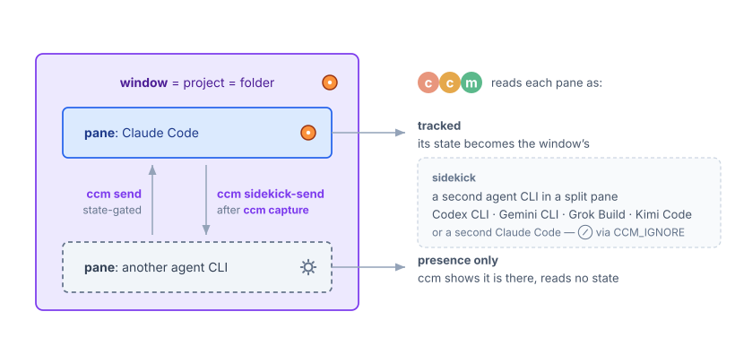

# ccm ユーザーガイド

[はじめかた](#はじめかた) · [困ったとき](#トラブルシューティング) · [診断参照](diagnostics.ja.md)

## ccmとtmuxの関係

tmuxはターミナルを階層的に管理します。ccmはこの構造の中で動作します：

```
ターミナル（Ghostty, iTerm2 等）
 └── tmux サーバー
      └── セッション         ← 作業コンテキスト
           ├── ウィンドウ 0   ← プロジェクトA（ccm管理）
           ├── ウィンドウ 1   ← プロジェクトB（ccm管理）
           ├── ウィンドウ 2   ← プロジェクトC（ccm管理）
           └── ウィンドウ 3   ← 通常のシェル（ccm管理外）
```

**基本概念:** ccmはClaude Codeのセッションを**tmuxウィンドウ**として管理します。各プロジェクトが1つのウィンドウを持ち、ウィンドウを切り替えるだけでプロジェクト間を移動できます。

### ccmがやらないこと

- プロジェクトごとに別のtmuxセッションを作らない
- ターミナルエミュレータの設定を変更しない
- 特定のターミナルエミュレータを要求しない

## はじめかた

### 0. Claude Codeの認証

Claude Codeを初めて使う場合は、最初に一度起動して認証を済ませてください：

```bash
claude
```

対話的なプロンプトに従い、プラン選択（サブスクリプションまたはAPIキー）とブラウザ認証を行います。完了すれば、ccmを使う準備ができます。

### 1. tmuxを起動

```bash
tmux new-session -s work
```

### 2. 最初のプロジェクトを追加

```bash
ccm add ~/code/my-project
```

新しいtmuxウィンドウが作られ、プロジェクトディレクトリに移動して、Claude Codeが起動します — `claude --continue`（そのディレクトリの最新の会話を再開）、またはそのディレクトリにまだ会話が無いと ccm が確認できたときだけ素の `claude` です。確認できたと言えるのは、CLI の設定ホームが既定で、トランスクリプトディレクトリ名のカスタム指定（`CLAUDE_CODE_PROJECT_DIR_NAME`）が ccm の環境にも新しいウィンドウのシェルが継承する tmux の環境にも無く、そのパスに対応するトランスクリプトディレクトリが存在しないか空のときです。ccm が確認できないものはすべて `--continue` になります。確認の範囲は ccm と tmux の環境に見えるものまでで、シェルの起動ファイルがトランスクリプトの保存先を変えている場合は対象外です。その場合、会話が別の保存先にあるディレクトリで `ccm add` が新規会話を開くことがあります。

### 3. プロジェクトを追加

```bash
ccm add ~/code/another-project
ccm add ~/code/third-project api-server   # カスタム名
```

### 4. プロジェクト間を切り替え

ダッシュボード（`prefix + Tab`）を使うか：

```bash
ccm attach my-project    # 名前で
ccm attach 2             # 番号で
```

> [!TIP]
> Claude Codeが動いていないウィンドウに切り替えると、`claude --continue` で自動的に前回の会話を再開します。既にあるシェルへの起動は常に `--continue` です — そのシェルは ccm から見えない場所（シェル自身の export は外からは見えません）にトランスクリプトを置いているかもしれないので、ccm は「再開するものが無い」とは決して主張しません。素の `claude` を打つのは、ccm 自身がウィンドウを作る `ccm add` で、そのディレクトリにまだ会話が無いときだけです。`--continue` の後ろにフォールバックは繋いでいません。再開できないとき（結局再開するものが無かった場合 — auto-start を切って追加したプロジェクトなど — や、最新の会話が生きたバックグラウンドセッションに引き継がれていた場合）は、そのメッセージが画面に残りペインはシェルに戻るので、次に何を開くかはあなたが決めます。

### 5. 状態を確認

```bash
ccm status
```

```
STATUS       PROJECT              MODE     BRANCH           PORTS        DIRECTORY
------       -------              ----     ------           -----        ---------
◉ BUSY       my-project           manual   main*            3000         ~/code/my-project
● IDLE       another-project      accept   feature-x        -            ~/code/another-project
⚠ PERMIT     api-server           manual   main             8080         ~/code/api-server
```

`MODE` 列は各プロジェクトの Claude Code permission mode（`manual` /
`accept` / `plan` / `auto` / `dontAsk` / `bypass`）を、最新の hook イベント
から表示します。permission ダイアログを自動解決するモード（`auto`、
`dontAsk`、`bypass`、およびファイル操作に関する `accept`）では PERMIT
状態がそもそも発生しないため、マルチプロジェクト管理では重要な情報です —
「このプロジェクトは一度も許可を求めてこない」と感じたら、検出の不具合を
疑う前にモードを確認してください。`bypass` は警告色で表示されます
（すべてのガードレールが無効の状態です）。`-` はモード未取得
（Claude 未起動、フック未インストール、または起動後まだフックが発火して
いない）を意味します。ダッシュボードでは同じ情報がプロジェクト名の後の
`{mode}` バッジとして表示されます（日常のデフォルトである `manual` は
ノイズ削減のため非表示）。セッション中のモード変更（shift+tab）は次の
フック発火時に反映されます。

## ダッシュボード

`prefix + Tab` で開きます。プロジェクト管理のメインインターフェースです。prefixなしの単一キー（例: `F1`）でトグルする設定も可能です — 詳しくは[READMEのキーバインドセクション](../README.ja.md#キーバインド)を参照してください。

> ```
> ── ccm Dashboard ──────────────
>   6 project(s)
>
> ▶ #5  ⚠ PERMIT  ml-pipeline                ~/code/ml-pipeline
>   #4  ● IDLE    auth-service     * 2s      ~/code/auth-service
>   #2  ◉ BUSY    api-gateway                ~/code/api-gateway
>   #3  ● IDLE    web-dashboard {accept}     ~/code/web-dashboard
>   #6  ● IDLE    mobile-app                 ~/code/mobile-app
>   #7  ■ SHELL   docs-site                  ~/code/docs-site
>
> [↑↓/jk] select [Enter] attach [p]review [a]dd [n]ame [r]emove
> e[x]it all [s]ave [t]ree [m]enu [q] quit
> Hooks: ON
> ```

### ダッシュボードの操作

| キー | 動作 | 用途 |
|------|------|------|
| `↑↓` or `jk` | 選択移動 | プロジェクト間をナビゲート |
| `Enter` | 切替 | 選択したプロジェクトのウィンドウに移動 |
| `s` | 保存 | スナップショット保存（名前を入力、デフォルトは `_autosave`） |
| `p` | プレビュー | プロジェクトの画面内容を表示（`c` でコピー） |
| `a` | 追加 | 新しいプロジェクトディレクトリを登録 |
| `n` | 名前変更 | 選択プロジェクトの名前を変更 |
| `g` | 登録 | 既存のtmuxウィンドウをccmプロジェクトとしてタグ付け |
| `r` | 削除 | [u]nregister（ウィンドウ残す）か [d]elete（ウィンドウ閉じる。y/N 確認あり）を選択。メニュー（`m` / `?`）にも項目あり |
| `i` | 無視 | 選択プロジェクトの CCM_IGNORE をトグル。隠すときは確認で `y` / `Y` + Enter が必要。Enter のみ・Esc・その他の回答は取り消し。戻すときは確認なし（下記「別モデルをサイドキックとして使う」参照）|
| `x` | 一括終了 | 名前・状態を確認し、画面を検証して Claude を終了。窓は保持 |
| `/` | フィルタ | ライブインクリメンタル検索: タイプで絞り込み、`↑↓`/`C-p`/`C-n` で候補選択、`Enter` でアタッチ、`C-u` でクリア、`Esc` でキャンセル。Unicode 対応で日本語プロジェクト名も日本語でマッチ |
| `t` | ツリー | ツリービューに切替 |
| `m` / `?` | メニュー | ログアウト準備・復元の続行・保存点・reset・Claude 終了など |
| `u` | 未配送の連絡 | expired / held の一覧を開く。メニュー（`m` / `?`）からも開ける |
| `q` / `Esc` | 閉じる | ダッシュボードを閉じる |

ダッシュボードのリフレッシュはハイブリッド方式です: フル状態検出は 2 秒間隔で走り、その合間に軽量な fast tick（毎秒 4 回）が Claude Code フックの書き込む状態チャネルを監視します。フック起因の変化（許可プロンプトの出現、プロンプト送信など）は、ポーリングを待たず約 0.3 秒で表示に反映されます。ステータスバーも同様に、状態遷移時はフックが即座にバーを再描画し、次の `status-interval` ティックを待ちません。ナビゲーションキー（`↑↓/jk`）はリフレッシュと無関係に即座に反応します。

行の並び順はダッシュボードを開いた時点で決まり（要対応のプロジェクトが上）、開いている間は固定されます。プロジェクトの状態が変わってもアイコンはその場で更新されますが、位置は移動しないため、操作の途中で選択が別のプロジェクトに移ってしまうことがありません。現在の状態で並べ替えたいときは、ダッシュボードを一度閉じて開き直してください。

### メニューの説明プレビュー

`m` / `?` のメニューでも、プレビューが on なら選択中の項目の説明が出ます。右配置は幅 80 列以上、下配置は高さ 20 行以上で、プロジェクトのプレビューと同じ寸法を使います。off または枠が収まらない場合はメニューだけを表示します。説明は枠幅で折り返し、選択の移動に追随します。設定項目には現在値も表示します。`~/.tmux.conf` に `set -g @ccm-lang "ja"` を設定すると、メニューの説明本文を日本語にできます（既定は `en`、未対応の値は英語）。設定を再読み込みし、メニューを開き直すと反映されます。項目名や他の画面は英語のままです。一覧画面と同じ操作のキーは右端に控えめな `[key]` 形式で表示し、幅が狭い場合は項目名を優先して省きます。

下記の項目に加え、保存点・ログアウト・復旧の操作は次節に記載しています。

| メニュー項目 | 用途 |
|---|---|
| Add project | 新しいプロジェクトのディレクトリと名前を選ぶ。 |
| Unregister project | 窓を残して ccm の管理から外す。 |
| Delete project | 対象を選び、窓を閉じる前に確認する。 |
| Ignore / unignore project | プロジェクトを追跡から隠す、または戻す。 |
| Undelivered messages | 期限切れ・要確認の連絡を読む。 |
| Save snapshot | 名前を指定して現在の配置を保存する。 |
| Status bar mode | ステータスバーの表示形式を選ぶ。 |
| Auto-restore | tmux 起動時に自動保存点を復元するか選ぶ。 |
| Idle timeout | アイドル状態の Claude を終了するまでの時間を指定する。 |
| Preview panel | プロジェクトのプレビューとメニューの説明を表示・非表示にする。 |
| Preview position | プレビューを一覧の右または下に配置する。 |
| Background sessions | ダッシュボードの背景セッション一覧を表示・非表示にする。 |
| Notifications | 通知する状態変化を選ぶ。 |
| Notification sound | 通知音を有効・無効にする（macOS）。 |
| Sound name | 通知音を選んで試聴する（macOS）。 |
| Auto-start Claude | シェル状態のプロジェクトを開くとき Claude を起動するか選ぶ。 |
| Dashboard | プロジェクト一覧に戻る。 |
| Tree view | セッション・窓・ペインの構造を表示する。 |
| Quit | ダッシュボードを閉じる。 |

### ログアウト・復元・復旧

`m` または `?` でメニューを開きます。次の操作に新しい単独キーは割り当てません。

| メニュー項目 | 動作 |
|--------------|------|
| Prepare for logout | `ccm prepare-logout` で `_autosave` を保存・保護。BUSY／PERMIT のプロジェクトがあれば名前と `[y/N]` を表示し、既定は No |
| Cancel logout protection | 確認後、保存点を残したまま保護を解除 |
| Continue restore | 復元途中の記録にある保存点から続行。特定できない場合は一覧から選択 |
| Saved checkpoints (load / delete) | 名前・作成日時・プロジェクト数・v1/v2・保護状態から選択。Enter で読み込み、`d` は `[y/N]` 確認後に削除、Esc で戻る。`_autosave.prev` は一覧に出ず、保護中の `_autosave` は削除不可 |
| Reset selected project's runtime state | 確認後、`ccm reset` で実行時のシグナルとキャッシュを消去。会話ファイル・実行中のプロセス・窓・保存点は保持 |
| Exit Claude in selected project | 確認後、`ccm exit <name>` を実行。窓・シェル・サイドキックは保持 |

保存準備と復元は curses 画面を一時停止して経過と確認を表示します。戻った後も結果全文・失敗理由・サイドキックの再開案内をスクロールして読めます。`↑↓` / `jk` / `PgUp` / `PgDn` で移動、Enter / Esc / `q` で戻ります。復元途中または保存点の保護中は、プロジェクト一覧の上にも次の操作を示す一行が出ます。小さい端末ではメニューもスクロールします。

確認は `y` または `Y` と Enter で実行し、`N`・Enter のみ・Esc は取り消します。`x` は対象の名前と状態を表示してから一括終了を確認し、単独終了と同じ検証を使います。PERMIT では Escape が保留中のツール呼び出しを拒否することを確認前に示します。IDLE として確認した後に BUSY／PERMIT へ変わった場合は実行を拒否し、再確認できます。

`ccm exit <name>` は窓を残して Claude を終了し、`ccm stop <name>` は窓を閉じます。CLI の exit は BUSY／PERMIT を既定で拒否し、実行には `-y` / `--yes` が必要です。終了時には Claude のペインを特定して ignore を除外し、Claude の下にシェルがあることを確認します。複数の Claude ペインがあって曖昧な場合は主ペインの予約が必要です。agents 画面や画面を読めない場合はキーを送らず、送信後も前面がシェルに戻らなければ失敗を報告します。終了操作で agents 画面へ detach した場合は、それを報告して追加のキーを送りません。この画面確認はアイドル時の自動終了と共通です。

### 未配送の連絡への対応

`u` で、期限切れで未配送の expired と、相手の入力欄に残っていた held の一覧を開けます。各記録に送信元・宛先・経過時間・本文の書き出しを表示します。

| キー | 一覧での操作 |
|------|--------------|
| `↑↓` / `jk` | 記録を選択 |
| `Enter` | 全文を表示。長い行は折り返し、`↑↓` / `jk` / `PgUp` / `PgDn` でスクロール。`q` / `Esc` / `Enter` で一覧へ戻る |
| `r` | expired を新しい送信として送り直す。確認が必要。Claude が停止中なら起動して送るか確認する。成功したときだけ元の記録を削除し、失敗したら理由を表示して記録を残す |
| `d` | 確認して選択した1件だけを削除。held の記録を消しても相手の入力欄は変更しない |
| `o` | 宛先の既存プロジェクトを開く。打鍵や Claude の自動起動はしない。入力欄の確認や手動起動に使う |
| `q` / `Esc` | ダッシュボードへ戻る |

held には再送操作を表示しません。相手の入力欄にある本文を重ねて送らないため、まず `o` で確認してください。再送・削除は既定 No で、確認をキャンセルすれば何もしません。一覧は表示時と操作後に読み込み、既存の順序と残っている選択対象を保ちます。新しい記録は末尾に追加されます。外部の変更を反映したい場合は一覧を開き直してください。

### フィルタ直行ショートカット

ダッシュボードを開いた直後によく `/` を押すなら、`~/.tmux.conf` で `@ccm-key-search` をバインドするとダッシュボードを最初からライブフィルタモードで開けます:

```tmux
set -g @ccm-key-search "/"   # prefix + / でダッシュボードをフィルタモードで開く
```

取る前にそのキーが空いているか確認してください。たとえば `prefix + /` は tmux-copycat の検索です。

```bash
tmux list-keys -T prefix | grep -w '/'
```

prefix キーは同時に動く全プラグインと共有する名前空間で、後から書いた側が黙って前を置き換えます。症状は「別のプラグインのキーが効かなくなった」で、自分が別の場所に足した 1 行が原因だとは結びつきません。`@ccm-key-tree` / `@ccm-key-menu` / `@ccm-key-dashboard` も同様です。

シェルや別の tmux バインディングから `ccm search`（または `ccm dashboard --search`）を呼んでも同じです。プロジェクト数が多いときに、リストをスクロールせず数文字で目的のプロジェクトに直行できます。

### プレフィックスなしのダッシュボードホットキー

`prefix + Tab` よりファンクションキー一発で開きたい場合、`@ccm-key-dashboard-noprefix` で直接バインドできます:

```tmux
# 必ず ccm プラグインの読み込み行よりも前に配置してください
# (詳細は README.md#キーバインド の IMPORTANT 参照)。
set -g @ccm-key-dashboard-noprefix "F1"   # F1 単独 (prefix 不要) → ダッシュボード
```

prefix 経由の binding と同じ `display-popup` 呼び出しを通るので、popup タイトルの色付き ccm ロゴはそのまま表示されます。自前で `bind-key -n F1 display-popup …` を書くこともできますが、`-T` の format 文字列を完全にコピーしないとロゴは出ません。

## ツリービュー

`prefix + T` で開きます。tmuxの全体構造を階層表示します：

> ```
> work ◀
>   ◉ my-project (main*) ~/code/my-project ◀
>   ● another-project (feature-x) ~/code/another-project
>   ⚠ api-server (main) [:8080] ~/code/api-server
>   ■ bash ~/home
> other-session
>   ■ bash ~/home
>
> [↑↓/jk] select  [Enter] attach  [q/Esc] quit
> ```

- `◀` は現在のセッション/ウィンドウを示す
- ウィンドウのみ選択可能（セッションやペインは選択不可）
- ペインは複数ある場合のみ表示

## プロジェクト間のプロンプト送信

`ccm send` は別プロジェクトの Claude Code セッションに直接プロンプトを投入するコマンドです。`tmux send-keys -l ... Enter` を手動で組み立てる必要がなくなります。

サイドキックや sandbox 内のツールから `ccm send` を呼ぶ場合は、tmux の Unix
ソケットに接続できるよう sandbox の外で実行してください。`TMUX` が設定されていても、
ネットワーク制限でソケットへの接続が遮断されることがあります。接続に失敗した場合は
元の tmux エラーと sandbox の外での再実行案内を表示します。プロジェクトがない、
あるいは呼び出し元が tmux の外にいる、という意味ではありません。

予約メッセージは、環境変数が指すペインのプロセスが送信コマンドの祖先にあれば、
そのペインの登録プロジェクトを送信元とします。別プロジェクトへディレクトリを移動しても、
送信元とペインの識別は維持されます。プロセス情報の取得失敗などで祖先関係を確認できない
場合は、そのペインの登録ディレクトリが送信コマンドの作業ディレクトリを含むか照合します。
両方のパスで symlink を解決し、サブディレクトリは一致としますが、名前の先頭が同じだけの
別ディレクトリは一致としません。不一致なら、作業ディレクトリを含む登録窓がちょうど
一つのときだけ補完します。入れ子や重複登録は曖昧とし、同じ tmux 窓をリンクしたものは
一つと数えます。決まらなければ送信元は `unknown` です。配達時のヘッダーは
`ccm send unknown` を勧めず、受信側に返信先の確認を求めます。

一意の登録窓からの補完で分かるのはプロジェクトで、呼び出し元の特定ペインではありません。
自己宛て判定と `--start` のペイン除外には確認できたペインだけを使います。
`sidekick-send` とプロジェクト名を省略した `ignore` / `unignore` は未確認のペイン情報を
拒否するので、登録プロジェクトのペインから実行してください。祖先関係を確認できない場合、
同じディレクトリに登録されたペイン同士で環境変数が古い場合までは区別できません。

```bash
# 位置引数のシンプルな送信（TTY なら確認プロンプトあり）
ccm send demo "前回のレビュー結果をまとめてください"

# ファイルから
ccm send research --file /tmp/brief.md

# パイプから — MCP サーバー（Gmail, GitHub 等）から直接渡すのに便利
echo "parser リポジトリの Issue #42 の調査をお願いします" | ccm send parser --stdin -y

# 複数行の本文 — \n は Claude の「改行のみ(送信しない)」キーに変換されるので、
# 複数行プロンプトとして 1 つのメッセージで届きます
printf 'context:\nbug: 120 行目で NPE\nplease fix' | ccm send api-server --stdin -y

# 送信せずプロンプトに入力だけ(ユーザーがターゲットペインで続きを書く)
ccm send demo --no-enter "TODO: "
```

### 状態に応じた動作

| ターゲット状態 | デフォルト | `--now` | `--force` | `--start` |
|---|---|---|---|---|
| **IDLE** | 即送信 | 即送信 | — | — |
| **BUSY** | 後送キューに保存 | 拒否 | 入力バッファにキューして即送信(進行中のターンと混線) | — |
| **SHELL**(Claude 未起動) | キューに保存 — Claude が起動して IDLE になってから配送 | 拒否 | — | Claude を起動し、IDLE と空の入力欄の準備を確認（`CCM_START_WAIT_SEC` 秒、デフォルト10秒を期限にポーリング）してから送信 |
| **PERMIT**(許可ダイアログ表示中) | キューに保存 — ダイアログが解消されてから配送 | **拒否** | それでもキュー — ダイアログには決して打鍵しない(`--force` でも) | — |
| **IGNORED**(全 Claude ペイン非表示) | **拒否** — キューにも保存しない | 拒否 | 拒否 | 拒否 — ccm が見ていないウィンドウに Claude を起動することはない。拒否メッセージが `ccm unignore <project>` を案内 |

`--start` は起動先ペインに空の入力欄が現れ、IDLE とその状態が1秒間続くのを待ってから本文を打ちます。待機期限までに準備ができなければ、本文と送信用 Enter は打たず終了コード1で失敗を報告します。起動コマンドがすぐ終了してシェルへ戻る場合も同様です。状態検出や画面取得の所要時間は、設定したポーリング期限を超えることがあります。

起動後は本文を一度だけ打ち、入力欄に全文が見える場合だけ送信用 Enter を送ります。入力直後に確認し、全文が見えるまで最大2秒、0.1秒間隔で読み取りだけを繰り返します。待機中にキーは送りません。画面取得の所要時間はこのポーリング期限を超えることがあります。期限までに一部しか見えない、何も見えない、入力欄を読めない場合は、消去・打ち直し・送信をせず終了コード1で停止します。相手の入力欄を確認し、残った文字があれば消してから、送り直すか判断してください。短い本文や `--no-enter` でも同じ確認を行います。長文が入力欄から一部はみ出して見えない場合も、確認のため停止します。空の入力欄と IDLE は、起動直後のアプリがすべての打鍵を受け付ける保証にはなりません。また、画面での確認はモデルの受領を証明するものではありません。

送信用 Enter の後も入力欄を確認します。保留通知が出る場合や、送った本文の先頭が確認中ずっと入力欄の先頭に残る場合は、`Sent` ではなく未送信として終了コード1を返します。Enter を自動で押し直しません。相手の入力欄を確認してから対処してください。これは画面に基づく確認なので、画面が読めない場合や、受理直後に同じ書き出しの下書きが入力された場合などを完全に区別できるものではありません。

### スプール（store-and-forward）

ターゲットが今メッセージを受け取れないとき、`ccm send` はもはやデフォルトでは失敗しません: メッセージは `$CCM_DATA_DIR/spool/<project>/` に保存され、プロジェクトが再び IDLE になったところで定期ステータス処理が配送します。出力には `Queued for <project>` とキュー長・メッセージ id が明示されます — キューに入った送信は、届いた送信とは別の事実です。

配送は意図的に保守的です:

- **1プロジェクト1パス1件。** 連続して2件送れば、2件目は1件目が始めたターンの入力バッファに乗ってしまうため、IDLE 遷移ごとに1件ずつ drain します。
- **配送直前に再検査。** ペインの raw 状態を打鍵直前に再検出し、下書きの入った composer なら混入せずに保留します。
- **TTL。** キューに置いた指示は陳腐化します — 1時間遅れで届いた指示は、もはや意図した指示ではありません。`CCM_SPOOL_TTL_SEC`（デフォルト60分）を超えたメッセージは `expired/` に移され、配送の代わりに `ccm status` / `ccm doctor` に表示されます。キューが Claude セッションを勝手に起動することはありません。
- **少なくとも1回（at-least-once）。** 配送の途中でクラッシュした場合、メッセージを失うより次のパスで再配送します。封筒行で受け手は重複を見分けられます。

配送されたメッセージは封筒ヘッダ付きで届きます — `[from: <project> · queued 14:03 · delivered 15:02 — reply with `ccm send <project> "…"`]` — 誰が送ったか、どれだけ待ったか、どう返すかが分かります。

滞留件数は `ccm status`、`ccm doctor`、ダッシュボード（プロジェクト名の横に `✉N`）に表示されます。確認と取り下げ:

```bash
ccm spool list                    # 配送待ち・保持・期限切れの一覧（本文冒頭付き）
ccm spool clear-expired           # 未達のまま期限切れになった記録を了解済みにする
ccm spool clear-held [project]    # 相手が保持したままの記録を了解済みにする
ccm spool cancel <id> <project>   # 1件取り下げ（キュー済みの誤送信は取り消せます）
ccm spool cancel --all <project>  # そのプロジェクトのキューを全消去
ccm spool show <expired|held> <id> <project>
ccm spool discard <expired|held> <id> <project> [--yes]
ccm spool resend expired <id> <project> [--start] [--yes]
```

期限切れのメッセージは未配達です。`ccm spool list [project]` は各記録の id、保存された送信元ラベル、キューに入ってからの経過時間、最初の空でない行（60文字まで）を表示します。規約外のファイル名は送信元・時刻を unknown とし、本文が読めない場合も `(unreadable)` として記録を表示します。各期限切れ記録には全文を読むコマンドと、**今も必要な依頼か確認した場合にだけ使う** `ccm send --file …` コマンドを添えます。修正が必要なら更新した本文を送ってください。表示されたコマンドが自動実行されることはありません。

一覧に表示された `ccm send --file …` で送り直す操作は**新しい送信**です。キューされる場合は新しい id と送信時刻になり、配達時の envelope には現在の送信者が記載されます。受信可能な相手には通常の send と同じ経路で直接送信します。SHELL の相手にはキューされ、提示するコマンドは `--start` を使いません。元の期限切れ記録は通常の7日間の保存期限または了解操作まで残ります。プロジェクトの**全期限切れ記録**を確認した後、`ccm spool clear-expired <project>` でその記録だけを削除できます。送信は行いません。プロジェクト省略時は全プロジェクトの期限切れ記録を消します。一覧表示も記録の削除も配送を再試行しません。

1件を直接扱うには `show` で全文を読み、`discard` でその記録だけを削除できます。`resend expired` は保存した本文を**新しい送信**として今送り直し、送信確認に成功したときだけ元の記録を削除します。BUSY などで今送れない場合は新たにキューせず失敗し、元の記録を残します。Claude が停止中なら `--start` で起動してからの送信を指定できます。本文を修正したいときは別途 `ccm send` で更新した内容を送ってください。

`discard` と `resend` は確認を求めます。内容を確認済みなら `--yes`（`-y`）で確認を省略できます。非対話環境ではこの明示指定が必要です。held は `resend` で送り直せません。`discard held` は記録だけを消し、相手の入力欄には触れません。dashboard の `u` も同じ処理を使います。

送信先のセッションが「受け取っていない」と表示したメッセージ（Claude Code は書き換えたプロンプトを利用者が確認するまで入力欄に保持し、その旨を入力欄の上に表示します）は、キューに戻しません。相手がそこで Enter を押しても消しても入力欄は同じ見た目になり、区別できないため、再送すると本文をもう一度打ち込むことになるからです。保留通知がなくても送った本文の先頭が入力欄に残り続ける場合は同じ扱いです。これらは「保持された」として記録され、`ccm spool list` に表示されます。対処はそのセッションの画面で行い、済んだら `ccm spool clear-held` で記録を了解済みにします。このコマンドは送信も取り下げも行いません。

状態チェック以外のゲートもあります。状態検出は送信先 composer の書きかけの下書きを認識できません（テキストの入った `❯` プロンプトも IDLE と読まれます）。そこで `ccm send` は打鍵の直前に composer 行を直接読み、下書きがある間は他の配送不可状態と同様にキューに回します（`--now` なら拒否）。このまま送れば書きかけの文章にメッセージが混入し、Enter が混ざった文を submit してしまうためです。Claude Code 自身がターン終了時に composer へ dim で描く次プロンプトの提案は、capture の SGR 属性で本物の下書きと区別され、送信を妨げません — 提案は最初の打鍵で消えるため、守るべきものが存在しません。

ダッシュボードの `u` 一覧と全文タイトルは **Message**（通常メッセージ）と
**Completion notice**（自動完了通知）を区別します。`ccm doctor` の非ゼロの未配達件数も
同じラベルを使います。保存 kind・ID・CLI の選択子は変わりません。

| ラベル | 意味・次の操作 |
|---|---|
| `Expired before delivery` | 記録を読みます。確認後に新たに送れるのは通常の期限切れメッセージだけです。 |
| `Waiting in input box` | 相手の入力欄を確認し、同じものを重ねて送りません。 |
| `Delivery unconfirmed` | 会話と入力欄を確認します。自動通知は再送しません。 |
| `Not sent: hourly limit` | サイドキックの結果を読みます。通知は届いていません。 |
| `Cancelled before delivery` | まだ必要ならサイドキックの結果を確認します。 |
| `Queued; not delivered yet` | 配達待ちです。配達済みの確認ではありません。 |

配達待ちの自動通知は doctor の詳細表示だけに出ます。未知の種類は `u` で
`Unrecognized record; review diagnostic details.` と表示し、記録の操作を案内せず、
そのまま保持します。既知の記録を破棄しても会話と入力欄は変わりません。
`u` からプロジェクトを開いても、文字の入力や再送はしません。

### フラグ一覧

| フラグ | 用途 |
|---|---|
| `--file <path>` | ファイルからメッセージを読む |
| `--stdin`(または単独の `-`) | 標準入力から読む |
| `--no-enter` | 最後の Enter を送らない(プロンプトへの入力のみ) |
| `--now` | 今受け取れないときキューに入れず失敗とする |
| `--force` | BUSY なターゲットへの送信を許可(Claude の入力バッファにキュー) |
| `--start` | SHELL 状態なら Claude を自動起動してから送信。起動の直前に窓を読み直し、既に Claude を載せたペインがあれば何も打たずそこへ配送し、シェルプロンプトと確認できるペインが無ければ理由を示して送信を拒否する |
| `-y`, `--yes` | 対話的な確認プロンプトをスキップ |
| `--` | 以降をフラグとして解釈しない(`-` で始まるメッセージ用) |

stdin/stdout が TTY でない場合(パイプ経由)、確認プロンプトは自動スキップされます。`echo "..." \| ccm send ...` が `-y` なしでそのまま動きます。

ターゲット指定はプロジェクト名、`#<idx>`、またはウィンドウ番号単独のいずれでも OK です。

### 分割ウィンドウでの配送先ペイン

プロジェクトの状態はウィンドウ内の全ペインを集約して決まりますが、キー入力は特定の1ペインに届ける必要があります。`ccm send` は claude プロセスをホストしているペインを解決し、そこへ直接タイプします — 素のシェルペインがアクティブ（フォーカス中）でも影響を受けません。複数のペインが claude をホストしていて（Agent Teams 分割）アクティブペインがそのいずれでもない場合、配送先が曖昧なため送信を拒否します: メッセージを受け取るべきペインにフォーカスしてから再試行してください。SHELL ウィンドウへの `--start` は、アクティブペインのフォアグラウンドが本当にシェルであることを確認してから Claude を起動します（エディタやページャに打ち込むことはありません）。

## 状態検出

ccmはClaude Codeフック（推奨）とプロセスツリー検査を組み合わせたハイブリッド方式で状態を検出します。

### Claude Codeフック（推奨）

最良の検出精度を得るためにフックをインストールします：

```bash
ccm setup-hooks
```

フックのイベント、信号の有効期間、設定の診断は[診断参照](diagnostics.ja.md#claude-codeフック推奨)にあります。

フックの状態はダッシュボードのフッターに表示されます（Hooks: ON/OFF）。`ccm status` はフックが利用できない場合の Hooks: OFF と診断上の警告を表示し、正常時の Hooks: ON 行は省きます。既にインストール済みの場合、`ccm setup-hooks` は再インストールせず、ccm 自身のフックの timeout を `CCM_HOOK_CMD_TIMEOUT` に揃えるだけです。ccm を別のパスに再インストールした場合、`ccm setup-hooks` は新しいパスからフックをインストールし、古いパスのフックは名前を挙げるので手で削除してください（[診断参照](diagnostics.ja.md#claude-codeフック推奨)を参照）。

`ccm doctor` で問題と次の対処を確認できます。

削除するには: `ccm remove-hooks`（ccm 自身のフックだけを削除）

### 各状態の検出方法

詳細は[診断参照](diagnostics.ja.md#各状態の検出方法)。

### フックなしでの検出

フックなしの場合、ccmはプロセスツリー検査とプロンプトパターンマッチにフォールバックします。この場合：
- テキスト生成中（ツール未使用）はBUSYではなくIDLEと表示される
- 完了検出はBUSY→IDLE遷移のヒューリスティクスに依存する

### どのペインが最後に返事をしたか（未読の印）

複数のエージェントをペインに並べていると、どれが最後に返事をしたのか分からなくなります。次で有効にします。

```bash
set -g @ccm-pane-labels on     # ~/.tmux.conf の、ccm を読み込むより前に書く
```

有効にすると、あなたが別の場所を見ている間に返事が完了したペインの枠に `◆ new` が付き、そのペインを数秒見続けるか、次のプロンプトを送ると消えます。この数秒は `@ccm-unread-linger`（既定 `5`）です。tmux は、ウィンドウを切り替えたりターミナルを前面に戻したりした瞬間に、そのペインへフォーカスを通知します。それは見に行く操作そのものなので、その通知で消すと、見る前に印が消えてしまいます。通り過ぎただけのペインの印は残ります。「見ている」とは、フォーカスのあるターミナルがそのペインをアクティブなペインとして表示している状態です。フォーカスは `set -g focus-events on` のときだけ tmux が報告します。ccm のダッシュボードのポップアップが開いている間は、その下のペインは見ているものとして扱いません。他のツールのポップアップは ccm から分からないので、その下で完了した返事には印が付きません。ccm にとって「読んだ」の代わりになるのは、その時間だけ保たれたフォーカスです。

印は完了通知と同じ条件で付きます。返事が `CCM_COMPLETION_GRACE_SEC` の間完了したままのときに付き（複数ステップの途中にあるツール境界は数えません）、バックグラウンドのタスクが残っている間は付きません。フックが必要なので、対象は Claude Code のセッションです。フックを持たないサイドキックには付きません。

この設定は tmux のペイン枠（`pane-border-status top`）を有効にし、`pane-border-format` の先頭に印を足します。ご自分の設定で ccm の読み込みより後に `pane-border-format` を設定している場合は、そちらが優先されるので、次をご自分の書式に足してください。

```
#{?@ccm_unread,#[fg=colour209]◆ new#[default] ,}
```

オプションをオフにすると新しい印はすぐ付かなくなりますが、オンの間に設定されたもの（ペイン枠、書式、フォーカス時のフック）は、tmux を再起動するかご自分で戻すまで残ります。

### 完了追跡

Claude Code が処理を完了すると、ccm は:
1. 完了タイムスタンプを記録 (プロジェクトは IDLE に遷移)
2. ダッシュボード / ステータスバー / `ccm status` のプロジェクト名の右に `* <elapsed>` を「最近完了」マーカーとして表示 (アスタリスクは緑、時間は dim)
3. デスクトップ通知を送信 (設定時)

`* <elapsed>` マーカーは以下の場合にクリアされます:
- 30 秒経過 (自動クリア)
- そのウィンドウに切り替えた時 (ダッシュボード、ツリー、`ccm attach` 経由)
- 新しいプロンプトを送信した時 (Claude が BUSY になりマーカーがクリア)

## ステータスバーモード

`~/.tmux.conf` で `set -g @ccm-status-line` を設定します。設定の詳細とスクリーンショットは[READMEのステータスバーセクション](../README.ja.md#ステータスバー)を参照してください。

### 一覧を絞る・配置を変える

モード 1 と 2 が何を表示するか、モード 1 がそれをどこに置くかを変える 2 つの
オプションがあります。どちらも既定は off で、例つきの説明は
[README のステータスバー節](../README.ja.md#ステータスバー)にあります。

`@ccm-status-line-hide-shell on` は SHELL のプロジェクトを除き、Claude
セッションが動いているウィンドウだけを残します。登録プロジェクトが多いと大半は
常に SHELL で、対応が必要な 1 件が埋もれるためです。IDLE は残ります。セッションは
生きて入力を待っており、ターンが終わったときに `* elapsed` マーカーが出るのも
この状態だからです。

注意点として、アイドルセッションは `CCM_IDLE_EXIT_TIMEOUT` 後に自動終了するので、
放置したプロジェクトはセッション終了とともにバーから消え、アタッチして Claude が
再起動すると戻ります。ダッシュボードと `ccm status` は常に全プロジェクトを表示
します。

`@ccm-status-line-position left` はモード 1 のエントリをバーの左側へ移し、最優先を
先頭にします。ウィンドウリストを消して空いた場所が埋まります。`status-left` には
一切書き込みません——押し出しに使う余白は `status-right` 内にあります。バーが狭い
ときは右寄せの配置を維持します。エントリが `status-left` の下に潜り込むと、tmux が
最優先のものから切り捨てるためです。

### モード0 — アイコン表示

既存の status-right にアイコン 1 つを追加。時計やバッテリー表示はそのまま保持されます。全プロジェクトのうち最優先の状態を表示：

> ```
> 5: PERMIT ⚠   13:30
> ```

優先順: `⚠` PERMIT（黄） > `◉` BUSY（オレンジ） > `≡` 全IDLE（グレー）

- 向いている人: 既存のテーマと最も保守的に共存したい人
- 注意: プロジェクトごとの詳細はダッシュボードで確認

### モード1 — 全表示（ccm形式ウィンドウリスト）

tmux標準のウィンドウリストをccm形式の色付きエントリに置換。既存のstatus-rightは保持。

> ```
> myapp:● | sideproject:◉ | docs:● | 21:30 12-25
> ```

- 向いている人: メインバーに色付きプロジェクト状態を常時表示したい人
- 注意: tmux標準のウィンドウリストが置換される

### モード2 — 専用行表示

メインバーの下に専用ステータス行を追加。IDLEを含む全プロジェクトをgitブランチ・ポート情報付きで表示します。

> ```
> メインバー:  0:bash  1:my-project  2:api-server     21/03  07:30:00
> ccm行:      my-project:◉(main*) | another-project:●(dev) | api-server:⚠(main)[:8080]
> ```

| アイコン | 状態 | 色 |
|----------|------|-----|
| `⚠` | PERMIT | 黄 |
| `◉` | BUSY | オレンジ |
| `●` | IDLE | ブルー |
| `* <elapsed>`（プロジェクト名の後ろ） | IDLE（最近完了） | アスタリスク緑、時間 dim |
| `■` | SHELL | 暗グレー |

- `* <elapsed>` マーカーは完了後30秒間表示され、その後消えます（プロジェクトは `●` IDLE のまま）
- 向いている人: status-rightを維持しつつ全プロジェクトを常時確認したい人
- 注意: 画面が1行狭くなる（プロジェクト数に応じて自動拡張）

## スナップショット

ログアウトをまたいで窓・分割・作業ディレクトリ・ペインの役割を戻す手順です。

1. ログアウト前に `ccm prepare-logout` を実行します。承認待ち（PERMIT）や作業中（BUSY）のプロジェクトがある場合は名前を確認し、保存するなら `y` と Enter を押します。
2. ログイン後に tmux を開き、`ccm start _autosave` を実行します。窓とペインは非アクティブなシェルとして戻ります。
3. 必要な窓を `ccm attach <名前>` またはダッシュボードから開くと、保存した主 Claude 用ペインで Claude が再開します（`@ccm-auto-start` が on の場合）。主ペインが不明なら起動しません。
4. サイドキックは復元結果または `ccm roles` の案内に従って手で再開します。Codex はその cwd で `codex resume` から会話を選びます。特定の会話への自動復帰は行いません。

会話の実行中の状態・承認待ち・エージェントのプロセスは戻りません。保護した保存点に中断一覧がある場合は復元後に表示します。通常の自動保存の BUSY 一覧は表示しません。同じ環境に tmux-resurrect の復元を重ねないでください。

### 保存

```bash
ccm snapshot save my-workspace
```

保存は単一の管理セッションに対応します。v2 は窓・縦横の分割・cwd・役割・ignore 意図・選択ペイン・ズームを保持します。

### 復元

```bash
ccm start my-workspace
ccm roles                    # 現在のペインの役割と案内
ccm roles @7                 # 指定した窓の全ペイン
ccm roles %12 --clear        # 用途を変えたペインの役割予約を解除
ccm unignore                 # 現在のペインの ignore 意図と実行中の印を解除
```

画面が小さい場合は比率に沿って縮小し、ペインを収められなければ未完了として止まります。主 Claude 用ペインの予約がない窓では Claude を自動起動しません。役割予約の解除後もそのペインに自動で Claude を起動せず、手動起動を使います。`roles --clear` は実行中の ignore 印を変えません。ignore も解除する場合は `unignore` を使います。

既存の登録窓は名前と基準 cwd が一致する場合に保持し、再分割や役割の書き換えはしません。未登録窓の名前や cwd が重なる場合、または保存したディレクトリがない場合は作成前に止まります。窓を確認し、明示的に登録するか重複を解消して再実行してください。未登録の操作窓を保存対象と同じ cwd に置いている場合も競合します。

途中失敗では復元済み／未完了の件数を表示し、自動保存を抑止します。原因を解消して同じ `ccm start <名前>` を再実行すると、その復元の印がある窓で続行します。利用者が途中の窓を変更して照合できなくなった場合は、それ以上変更せず停止します。

復元はログインシェルを起動します。tmux の `default-shell`、`$SHELL`、`/bin/sh` の順に、既知のシェル名を持つ実行可能な絶対パスを選び、`default-command` は迂回します。シェルの起動ファイルは通常どおり実行します。配置操作の各段階で、前面がシェルに落ち着くまで最大 10 秒待ちます。rc がエージェントなどの常駐する前面プロセスを起動した場合は、それを終了・再起動せず復元を中断します。ペインを確認し、シェルに戻った後で再試行してください。完了済みのペインは再試行でも再起動しません。

### 自動保存

`_autosave` は 2 分ごとの確認とプロジェクト操作時に更新されます。同内容・空の状態・保護中・復元途中は上書きしません。復元直後のシェルでも役割と ignore 意図は次の保存に残ります。

### 保存点を保護する

```bash
ccm prepare-logout
ccm prepare-logout -y          # --yes: PERMIT/BUSY の確認を省略
ccm doctor --verbose
ccm prepare-logout --cancel    # 保存点を残して保護を解除
```

確認は `Save anyway? [y/N]` です。`y` と Enter で保存し、N・Enter のみ・Esc・EOF・Ctrl-C は保存せず非ゼロ終了します。非対話で PERMIT/BUSY がある場合は `-y` が必要です。確認中に構成や状態が変わった場合も保存せず、再実行を求めます。

保護後も窓やエージェントは動き続けます。構成を変えた場合は prepare を再実行してください。保護はログアウトをまたいで残り、全件の復元成功時にだけ自動解除します。途中失敗中の prepare／cancel は拒否し、同じ snapshot の復元を先に完了させます。`ccm stop --all` は保存に失敗しても窓を閉じるため、保存の保証が必要な場合は先に prepare の成功を確認してください。

#### tmux起動時の自動復元

```tmux
set -g @ccm-auto-restore "on"    # デフォルト: off
```

TPM 起動時に `_autosave` をロードします。既に管理窓がある場合はスキップします。復元途中なら手動で同じ snapshot を再実行してください。保存先は `CCM_SNAPSHOT_DIR`、または `CCM_DATA_DIR` 配下です。

### スナップショット管理

```bash
ccm snapshot list
ccm snapshot delete old
```

固定予備 `_autosave.prev` は一覧に出ません。予備を使うときは保存ディレクトリで未使用の `recovery.json` にコピーし、モードを 0600 にして `ccm start recovery` を実行します。復元途中の記録がある場合は、先に元の復元の状態を確認してください。[形式・保護・予備・競合の詳細](diagnostics.ja.md#スナップショットの保存点)を参照してください。

## Tips

### 既存ウィンドウの登録

Claude Codeが既に動いているtmuxウィンドウを、再起動せずにccm管理下に置けます：

1. ダッシュボード（`prefix + Tab`）を開く
2. `g`（登録）を押す
3. 未登録のウィンドウを選択
4. 名前を入力

コマンドラインからも可能：

```bash
ccm register 3 my-project    # ウィンドウインデックス3を登録
```

### キャプチャとコピー

プロジェクトに切り替えずに画面内容を確認：

```bash
ccm capture my-project              # ターミナルに出力
ccm capture --copy my-project       # クリップボードにコピー
```

ダッシュボードからは `p` でプレビュー、`c` でコピー。分割ウィンドウでは、ダッシュボードのプレビュー（およびライブプレビューパネル）は、フォーカスされているペインではなく **Claude が走っているペイン**を表示し、`CCM_IGNORE` 済みのサイドキックは表示しません。常に ccm が追跡しているセッションをプレビューできます。

**分割ウィンドウはペインごとにキャプチャされます。** `ccm capture` は各ペインにペインIDと実行中のプロセスのラベルを付けて出力するため、フォーカスされているペイン以外が隠れることはありません：

```
=== ccm capture: my-project ===
--- pane %1 [claude] (active) ---
...
--- pane %7 [other-agent] ---
...
=== end ===
```

単一ペインのウィンドウは従来どおりヘッダなしで出力されます。`CCM_IGNORE` で隠したペインも**含まれ**、`(ignored)` と表示されます。ペインを隠すことは「ccm が追跡・入力しない」という意味であり、明示的に要求したキャプチャから消えるという意味ではないためです。

これにより、Claude 自身からサイドキックペインを読むこともできます。片方のペインで `ccm capture <このプロジェクト>` を実行すると、同じウィンドウ内のもう一方のエージェントが何をしているかが分かります。Claude と並べて別のエージェント CLI を動かしているときに便利です。

> [!IMPORTANT]
> プロジェクトの**状態**は、その Claude ペインを表すものであり、同じウィンドウを共有する別のエージェントの状態ではありません。ccm が追跡するのは Claude セッションであり、別のエージェント CLI が動くペインには claude が存在しないため状態に寄与しません。
>
> したがって Claude セッションは、隣のエージェントが空いているかを判断するために自プロジェクトの状態を読んではいけません。問い合わせている当人が動いている以上、読み取れる状態は自分自身のものであり、コマンドを実行中のセッションは定義上 BUSY です。それを「相手が忙しい」と解釈すると、実際には何も起きていないのに誤判定になります。サイドキックペインの判断は、キャプチャした内容だけを根拠にしてください。
>
> 同じ理由で `ccm send <このプロジェクト>` は明示的に拒否されます。配送先が Claude ペイン＝呼び出し元自身に解決されるためです。

### Git連携

各プロジェクトのgitブランチとdirty状態を表示：

- `main` — クリーンな作業ツリー
- `main*` — 未コミットの変更あり（ステージ済み・未ステージ含む）

ダッシュボード、ツリービュー、`ccm status` で確認できます。

### ポート検出

プロジェクトディレクトリのプロセスがリッスンしているTCPポートを自動検出します：

```
 my-app:◉ [:3000]    api:● [:8080,8443]
```

ポート検出結果は30秒間キャッシュされます。

## トラブルシューティング

まず `ccm doctor` で問題と対処を確認してください。詳しい調査は[診断参照](diagnostics.ja.md)へ進んでください。

### ダッシュボードが開かない

ダッシュボードが表示されてすぐ消える場合：

```bash
# 古いPIDファイルを削除
rm -f "${TMPDIR:-/tmp}/ccm-$(id -u)/dashboard.pid"
```

### ステータスバーに古いデータが表示される

```bash
# キャッシュをクリア
rm -f "${TMPDIR:-/tmp}/ccm-$(id -u)/status-cache"
tmux source-file ~/.tmux/plugins/tmux-ccm/ccm.tmux.conf

# ccm適用前のstatus-rightはtmuxオプションに保持されています（ファイルではありません）:
tmux show-option -gqv @ccm-orig-status-right   # 保存された元の値を確認
```

### セッションのコンテキストがずれる

プロジェクトが間違ったセッションに表示される場合：

```bash
rm -f "${TMPDIR:-/tmp}/ccm-$(id -u)/popup-session"
```

### 状態がBUSYのまま

プロジェクトがBUSY表示だがClaude Codeは実際にはIDLEの場合、子プロセスが残っている可能性があります：

```bash
ccm capture my-project    # 画面の内容を確認
```

子プロセスが終了すれば、次の2秒リフレッシュで状態が修正されます。

`(Nm)` suffix が付いて (例: `BUSY (5m)`) BUSY のまま戻らない場合は、ccm が自分のシグナルが stale であることを検出したが「実は IDLE」を証明できない状態です。通常は upstream の double silent fail (Stop hook 喪失 AND JSONL に完了記録なし) が原因。最終手段として:

```bash
ccm reset my-project      # フックシグナル、event log、キャッシュ済み state option をクリア
```

`ccm reset` は会話履歴・スナップショット・実行中の `claude` プロセスには触りません — 検出が読む ephemeral な runtime artefact だけを wipe します。次のスキャンで一から再解決されます。通常の「Claude が固まった」状況では `/exit` をペイン内で入力するのが筋です。

### フックを停止する設定

まず `ccm doctor` と Claude Code の `/status` を確認し、管理設定の修正は管理者に依頼してください。

詳細は[診断参照](diagnostics.ja.md#フックを停止する設定)。

### 検出が反応しなくなった（hook 沈黙カナリア）

hook が止まった場合は、該当する Claude セッションの再起動で復旧します。

詳細は[診断参照](diagnostics.ja.md#検出が反応しなくなったhook-沈黙カナリア)。

### 全プロジェクトが同じ状態で固まる

まず `ccm errors` で記録を確認してください。

詳細は[診断参照](diagnostics.ja.md#全プロジェクトが同じ状態で固まる)。

## Agent Teamsとの併用

ccmはClaude Codeの[Agent Teams](https://code.claude.com/docs/en/agent-teams)と併用できます。両者は異なるレベルで動作し、補完関係にあります：

- **ccm** はプロジェクトをtmuxの**ウィンドウ**として管理（1プロジェクト = 1 Claude Code）
- **Agent Teams** は1つのウィンドウ内で並行エージェントを**ペイン**として実行

### 連携の仕組み

ccm管理のプロジェクトウィンドウ内でAgent Teamsを実行すると、ccmの状態検出が全ペインを自動的に集約します：

- いずれかのチームメイトがPERMIT状態 → プロジェクトは `⚠ PERMIT` と表示
- いずれかがBUSY → `◉ BUSY` と表示
- 全チームメイトがIDLE → `● IDLE` と表示

ccmのダッシュボードやステータスバーで、追加設定なしにAgent Teamsの活動状況を確認できます。マルチペインのウィンドウには、プロジェクト名直後に `[N]` マーカー（角括弧 dim、数字 cyan）が全レンダラーで付与されるので、並列のチームメイトを抱えるプロジェクトを一目で識別できます。

**Sliver 保護**: `SLIVER_HEIGHT_THRESHOLD`（デフォルト 4 行 — 下記「環境変数」参照）より低いペインは状態集約から除外されます。極端に小さいペイン（過去の split で残った 1 行のストリップなど）では Claude の `❯` プロンプトが描画されず、capture-pane 検出が「子プロセス + プロンプト不可視」を BUSY と誤判定してしまうため、除外することで不可視 sliver がウィンドウ全体の状態を汚染するのを防ぎます。Agent Teams で意図的に小さいペインを使っており除外したくない場合は `CCM_SLIVER_HEIGHT_THRESHOLD` で閾値を上げてください。

**Attach 時の自動フォーカス**: ccm 経由で attach（dashboard / `ccm attach`）した際、いずれかのチームメイトペインが許可待ち（`⚠ PERMIT`）でアクティブペインがそれ以外なら、ccm が自動で PERMIT ペインにフォーカスを切り替えます。許可が必要なプロジェクトに attach するたびに `prefix + 矢印` する手間を省きます。PERMIT 限定 — BUSY のチームメイトは監視対象であってユーザー入力を要求するわけではないので、フォーカスは奪いません。

### 競合なし

| 機能 | Agent Teams | ccm | 競合 |
|------|------------|-----|------|
| キーボードショートカット | `Shift+↓`, `Ctrl+T`（Claude Code内部） | `prefix + Tab`（tmuxレベル。T/Cはopt-in） | なし |
| ペイン管理 | ウィンドウ内でペイン分割 | ウィンドウを管理 | なし |
| ウィンドウ名 | 変更しない | アイコン+名前を設定 | なし |

### 典型的なワークフロー

1. `ccm add` で複数プロジェクトを登録
2. ダッシュボード（`prefix + Tab`）でプロジェクトに切替
3. そのプロジェクト内でClaude Codeに Agent Team を作成させる
4. Agent Teamsがウィンドウを各チームメイト用にペイン分割
5. ccmのダッシュボードに全チームメイトの集約状態が表示される
6. チームが作業中に `prefix + Tab` で別プロジェクトに切替可能

## 別モデルをサイドキックとして使う（CCM_IGNORE）

2つ目の Claude Code セッションを同じウィンドウの分割ペインで走らせることができます（主セッションの隣に相談用のサイドキックを置く）。既定では ccm が両ペインを 1 つのウィンドウ状態に集約してしまい、`ccm send` がどちらに届くべきか判別できないため、`CCM_IGNORE` でサイドキックを ccm から不可視にし、主セッションだけをクリーンに追跡させます:

```bash
# 主ペイン: メインのセッション、ccm が通常どおり追跡
claude --continue

# 分割ペイン（prefix %）: サイドキックのセッション、ccm から隠す
CCM_IGNORE=1 claude
```

無視されたセッションは、ウィンドウ状態の集約・セッション追跡・`ccm send` の配送・アイドル自動終了から除外され、そのフックは signal / event / デスクトップ通知を一切出しません。したがってウィンドウの状態・バッジ・`ccm send` のルーティングは主セッションだけを反映します。ダッシュボード / `ccm status` の行に出る dim `⊘` が、隠れたサイドキックが走っていることを思い出させます。（サイドキックは、`ANTHROPIC_BASE_URL` で別の Anthropic 互換エンドポイントに向ければ別モデルにもできます — ccm の扱いはどちらでも同じです。）

稼働中のセッションをあとからトグルすることもできます:

```bash
ccm ignore              # 今いるペインを隠す
ccm ignore <project>    # プロジェクトのウィンドウの全 claude ペインを隠す
ccm unignore            # 現在のペインを戻す
ccm unignore <project>  # プロジェクトを戻す
```

またはダッシュボードでプロジェクトを選んで `i` キー。

**忘れた場合。** 黙って壊れることはありません。可視の Claude セッションが2つあるウィンドウは両方を集約し、`ccm send` は誤ったほうの会話に打ち込む代わりに推測を拒否します — その拒否メッセージが `CCM_IGNORE` と `i` キーを案内します。`ccm doctor --verbose` も該当ウィンドウを *multi-claude windows* として列挙します。どちらも警告としては書かれていません。同じウィンドウ構成は Agent Teams の通常の分割でもあり、その場合はどちらの PERMIT も届くよう両方が可視のままである必要があるからです。両方の読みを示したうえで、判断はあなたに委ねられます。

**ペイン自体に無視を表示する**（任意）: ccm は `⊘ ccm-ignored` というペインタイトルを設定しますが、tmux はペインボーダーを有効にしている場合のみ表示します。`tmux set -g @ccm-ignore-pane-border on` で opt-in すると、セッション無視時に ccm が `pane-border-status` を on にします（グローバルな tmux 変更なので、この明示的 opt-in のときだけ起こります）。opt-in しなければダッシュボードの `⊘` が手がかりになります。

**注意 — 同一ディレクトリ**: 2 つの Claude Code セッションを同じ作業ディレクトリで走らせると upstream バグ（anthropics/claude-code#48112）に当たり、片方のバックグラウンドタスク通知がもう片方のセッションログに漏れ込みます。`CCM_IGNORE` は ccm がサイドキックを**追跡**しないようにしますが、サイドキックがバックグラウンドタスクを並行実行すると主セッションのログが汚染される経路は塞げません。サイドキックはインタラクティブな相談用に留める（並行 `run_in_background` 作業や同一ファイルの同時編集を避ける）か、対等な 2 エージェントが必要なら git worktree で各モデルに別ディレクトリを与えてください。

## 他のエージェント CLI との往復リレー



Claude Code 以外のエージェント CLI を、プロジェクトウィンドウの split ペインで動かし、人間がテキストを仲介することなく 2 つのエージェント間でメッセージを往復させられます。ccm は Claude 中心のままです: 既知の外部エージェント CLI がペインで動いていれば dim の `▸<name>` presence バッジを表示するだけで、その状態は追跡しません。`ccm capture` は全ペインを表示するので、どちら側からも相手の表示内容を読めます。

機能する規約は次のとおりです:

- **他のエージェント → Claude**: 相手側が `ccm send <project> "<message>"` を実行します。state gating が効き（PERMIT には決して送らない）、メッセージは Claude の新しいターンとして着弾します。誰も見張る必要はありません。
- **Claude → 自分のウィンドウのサイドキック**: プロジェクトのウィンドウのペインから `ccm sidekick-send "<message>"` を実行します。ccm は Claude 以外のペインを state-gate できないので、事前に `ccm capture <自分のプロジェクト>` で相手が入力可能かだけ確認してください。あとの手順はコマンドが機械的に行います（かつて手順書が注意力に委ねていた部分です）: tmux のメタデータからサイドキックのペインを特定し（既知の外部エージェント CLI で、作業ディレクトリがこのプロジェクトに属するもの）、0個・2個以上なら拒否し、本文をリテラル（`send-keys -l --`）で打ち込み、0.3秒待ってから `Enter` を別送し、送信後に capture してメッセージの断片が実際に現れたかを確認します。確認できなければ非ゼロ終了になります。

  手で他の TUI に打ち込むことがあれば、コマンドに内蔵された各部の理由は今でも有効です。`-l` はテキストをリテラルに送るもので、付けないと tmux は引数を**キー名**として解決し、`Space` や `Enter` といった語がそのキー入力に化けます。改行キーは CLI ごとに異なり（Claude は `M-Enter`）、複数行の本文は行ごとにリテラル送信して間に相手の改行キーを挟みます。`ccm sidekick-send` は `M-Enter` を使います。

  **`Enter` の前の待ちは必須で、手作業ではここが最も踏みやすい失敗です。** 本文と `Enter` を `&&` で連結すると、挿入されたテキストを相手の TUI がまだ処理している最中に `Enter` が届き、submit ではなく**改行**として解釈されることがあります。本文は composer に残ったまま、送信できたときとまったく同じ見た目になります。Kimi K3 での実測では、間隔なしは毎回失敗し、0.3 秒と 1 秒はどちらも送信されました。Claude Code の composer は間隔なしでも耐えるため、`ccm send` に待ちは不要で、相手が Claude 以外のときだけこの問題が出ます。

  **会話と入力欄を確認してください。** `sidekick-send` が確認するのは画面内のメッセージ断片で、受付済みとは断定できません。短文は配達確認不能と表示します。`--no-enter` は送信用 Enter を送っていないと表示します（`ccm send` も同様）。それ以外のサイドキック送信では Enter の送信操作を行ったと表示します。配達確認不能と表示されたときや、返事を当てにする前には `ccm capture` で確認し、届いていれば再送せず、残った文字を処理してから再送の要否を判断してください。入力欄が空であることだけでは受領を証明できません。
  **相手の入力欄は読まないので、自分で確認してください。** `ccm send` は Claude ペインの入力欄に書きかけの下書きがあると送信を拒否します（確定の `Enter` が混ざったものを送信してしまうため）。こちらには対応するものがありません — 他ベンダーの入力欄を特定するにはそのベンダーの画面に合わせる必要があり、このレーンはまさにその結合を持たないために存在しているからです。送る前に `ccm capture <このプロジェクト>` で相手の入力欄を見てください。手順が元から求めていた確認と同じものです。

- **サイドキックは自分のウィンドウにだけ従う。** `ccm send` が届くのはプロジェクトの **Claude** であって、サイドキックには決して届きません（横取りされないよう配送候補から除外されています）。`ccm sidekick-send` も反対側から同じ境界を守ります: 宛先は常に呼び出し元と同じウィンドウのサイドキックで、打鍵前にペインのディレクトリがプロジェクトに属することを検証します。他プロジェクトのサイドキックに用があるときは、そのプロジェクトの Claude に頼んで中継してもらいます。相手が空いているかも、その TUI がどのキーを受けるかも、知っているのはその Claude であって、外から見るあなたは両方とも推測になります。さらにその Claude は自分のサイドキックが今何をしているかを把握し続けています。外から割り込む（生の `tmux send-keys` でウィンドウを跨ぐ）と、2 人の送信者が 1 つの composer に着弾し、混ざって 1 つの壊れたプロンプトになります。
- **ポーリングせず、完了を申告する**: どちら側も相手の進捗は観測できません。依頼された作業が終わったら、自分から `ccm send` で結果を返してください。返信は相手の新しいターンとして勝手に届きます。
- **長い結果はファイル + ポインタ**: ファイルに書き出して 1 行のポインタだけ送ります。改行キーの差異もこれで回避できます。

`ccm setup-claude-md` はこの規約を `~/.claude/CLAUDE.md` に書き込むので、すべての Claude セッションが知っている状態になります。相手側の CLI の指示ファイル（その CLI 相当のグローバル指示）に同じ規約を書けば、往復が完成します。

**サイドキックは別の Claude Code でも構いません。** 上記のどれも相手が別製品であることに依存していません。split ペインの2つ目の `claude` でも往復の仕方は同じですが、例外が1つあります: `ccm sidekick-send` の宛先は既知の**非 Claude** CLI だけです（2つ目の `claude` は追跡対象本体のバイナリなので、あの集合には意図的に入っていません）。そのため Claude サイドキックへ届けるには、従来どおり `ccm capture` で確認してから手で `tmux send-keys` します。それ以外の、ccm から見た扱いの違いはこうです: 2つ目の Claude Code は ccm が**追跡してしまう**セッションなので、`CCM_IGNORE` で意図的に隠すことになり（上節参照）、印も非 Claude CLI の `▸` ではなく `⊘` になります。実際にはこちらの組み合わせの方が扱いやすく、送信キーと改行キーが共通で、相手も `CLAUDE.md` 経由で規約を既に知っています。

## サイドキックの注意喚起: いつあなたを必要としているかを知る

サイドキックの承認ダイアログは見落としやすいものです。ccm は非 Claude ペインから意図的に状態を読まないので、*「Run this command?」* でブロックされた Kimi も、作業中の Kimi も、見た目は同じ dim の `▸kimi` です。各製品の画面をパースする代わりに（書式は CLI ごとに違い、予告なく変わります）、ccm はサイドキック**自身に報告させます** — そのベンダー自身が出荷している hook 機構を通じて:

```bash
ccm setup-sidekick-hooks kimi     # ~/.kimi-code/config.toml に [[hooks]] エントリを書き込む
ccm remove-sidekick-hooks kimi    # 削除する（どちらもバックアップを残す）
```

反映されるのは**新しい** Kimi セッションからです — Kimi は起動時に config をロードするため、インストール後にサイドキックペインの `kimi` を一度再起動してください。

以後、サイドキックが許可プロンプトに突き当たると、その hook が tmux ペインをキーにした attention marker を書き、ccm は全ての面で同時に反応します: `▸kimi` バッジがダッシュボード・`ccm status`・ステータスバーで PERMIT の黄色に変わり、何のツールについて尋ねているかを載せたデスクトップ通知が飛びます。承認ダイアログには、元のサイドキックのペインであなた自身が答えてください。Claude に代理承認をさせないでください。あなたがダイアログに答えると、解決側の hook が待ちを閉じ、バッジは dim に戻ります。ウィンドウ自体の状態は一切変わりません — PERMIT は今までどおり *Claude* があなたを必要としている印で、黄色い `▸` は*サイドキック*がそうである印です。

切り替えはダッシュボードの `w` キー、恒久的には `tmux set -g @ccm-sidekick-attention off` で（off でも marker は書かれ続けます — 静かになるのは ccm の表示と通知だけなので、marker ディレクトリを読む他のローカルツールは動き続けます）。

**2つ目の Claude Code にはインストーラすら不要です。** ignore された Claude（`CCM_IGNORE=1 claude`、ガイドで案内している Claude-as-sidekick の形）はもともと ccm のフックを実行していて、ただ黙って抜けていただけです。その許可イベントが同じ attention チャネルに流れるようになりました: 隠れた Claude が待っている間は `⊘` マーカーが PERMIT の黄色になり、ダイアログに答えると dim に戻ります。ignore の契約は不変です — そのセッションはウィンドウ状態にも `ccm send` の配送にも auto-exit にも一切関与しません。正直な注意点が1つ: Claude Code には解決イベントがない（`PermissionResult` の欠落）ため、待ちは*次の* hook 活動で閉じます — 承認されたツールは `PostToolUse` を、拒否のフィードバック往復は `Stop` を発火します。カバーできないのは「Esc で消してそのまま完全に沈黙」だけで、その場合は marker が TTL で消えます。

> [!NOTE]
> Claude 以外のエージェントへの対応は**実験的**で、`ccm setup-sidekick-hooks` は当面 CLI 一覧に載せていません。各ベンダーの hook 契約はまだ若く動いています — 3 つ実測しただけで、未文書のイベント種別、プラットフォーム名付きバイナリ、hook をロードするのに一度も発火しない製品が出てきました。この節は変わる前提でお読みください。上の Claude サイドキックの経路はこれらに一切依存しません。

インストールできるのは **Kimi Code** と **Grok Build**（どちらも実際に動いているペインで検証済み）、それに **Codex**（後述）です。正確なのは Kimi の方です — hook セットに `PermissionRequest` と `PermissionResult` の両方があり、待ちの開始と終了が正確に取れます。Grok にはどちらもありません: 許可待ちは `Notification` の `notificationType: "permission_prompt"` として届き、ツールの詳細を持たず（summary は Grok 自身の「Tool permission requested」にフォールバックします）、次の活動イベントで閉じます。

**Antigravity CLI**（Gemini CLI の後継）は hook をロードするものの一度も発火しません — 1.1.10 で実測し、実際の承認ダイアログを出しても 6 つのイベントのいずれも呼ばれませんでした。`ccm setup-sidekick-hooks` は未対応のエージェントを名指しで拒否し、どちらに該当するかを表示します。

**Codex の attention と完了通知。** hook の導入と Claude への通知の有効化は別々です。

```bash
ccm setup-sidekick-hooks codex
# Codex の /hooks で導入された hook を確認して信頼する。
# 窓ごとの上書き用。通常は後述の全体設定を設定ファイルに保存します。
tmux set-option -w -t <window> @ccm-sidekick-notify on
# 任意設定（既定: 1時間20通、抜粋 on）:
tmux set-option -w -t <window> @ccm-sidekick-notify-limit 20
tmux set-option -w -t <window> @ccm-sidekick-notify-excerpt off
# 完了通知を停止:
tmux set-option -w -t <window> @ccm-sidekick-notify off
ccm remove-sidekick-hooks codex
```

全サイドキック窓で使う場合は、`~/.tmux.conf` に `set -g @ccm-sidekick-notify on` を書き、設定を再読み込みする方法を推奨します。実行中のサーバーにコマンドを打つだけでは再起動後に残りません。対応する Codex hook がインストール・信頼済みなら配達が有効になります。この設定だけでは hook の導入や信頼は行いません。

通知の 3 オプションは、窓の明示値（`set -w`）→全体の窓設定（`set -gw`）→全体のセッション設定（`set -g`）→組み込みの既定値の順で読みます。窓の `off` は全体の `on` より優先します。全体の両方に書いた場合は `-gw` が優先するため、設定ファイルでは `-g` に統一してください。空の値は未設定扱いです。窓の上書きを消すには `tmux set -wu -t <window> @ccm-sidekick-notify` を使います。問い合わせに失敗した場合は下位の設定へ進まず、その読み取りでは通知・抜粋の配達を無効にします。

`ccm doctor --verbose` は通知・時間当たり上限・抜粋の有効値と出所（`window`、`global (-gw)`、`global (-g)`、`default`、問い合わせ失敗時は `unavailable`）を表示します。通知が有効な窓で Codex hook の受信記録がない場合の警告も残ります。hook の通知作成、配達、診断、ダッシュボードの通知プレビューは同じ関数で設定を読みます。

保存点 v1/v2 の形式は変更せず、通知の窓別上書きは保存しません。復元で新しく作った窓には全体設定が適用されます。窓だけに設定した例外は窓の再作成で失われるため、サイドキック起動前に設定し直してください。再起動後も通知や抜粋を無効に保つ必要がある場合は、対応する全体設定を `~/.tmux.conf` で `off` にしてください。


導入は Codex の `hooks.json`（`CODEX_HOME` 配下、既定は `~/.codex`）に、現在の
ccm が所有する hook だけをマージし、`.ccm-bak` を残して他の hook を保ちます。
壊れた JSON と空白を含むインストールパスは拒否します。信頼記録や `config.toml` は
編集しません。新規・変更 hook はユーザーの信頼確認が必要で、導入成功だけでは稼働を
証明しません。撤去するとロード済みの ccm hook も無効になり、未配達通知は取り消します。
必要に応じて Codex を再起動・確認してください。再導入でアダプターが戻り、窓の設定は
保持されます。受信側の約束事は `ccm setup-claude-md` で更新できます。

宛先は hook payload の cwd だけから求めます。それを含む登録窓がちょうど一つ、
その窓内の Codex ペインがちょうど一つの場合だけ進みます。同じ窓のリンクは一つと数え、
入れ子や重複登録は曖昧として扱います。ignore された Codex も物理的なサイドキックとして
数えます。その Codex プロセスについて最初に観測した session を自動で結び付けます。
新しい session のイベント、またはプロセスの生存識別の変更で、SessionStart の有無に
かかわらず張り直します。そのプロセスが既に離れた session の遅着イベントは無視します。
内部用の窓オプション `@ccm-sidekick-binding` に対応を保存します。手で編集しないでください。
同じ cwd を使う別の session（tmux の外で動く Codex など）は区別できず、イベントを送ると
結び付けを引き継ぎます。推定なので、行動の前に示されたペインを読んでください。SessionStart は最初のターンまで届かない場合があります。
hook 自身のペイン環境変数やプロセス祖先は宛先判定に使いません。

承認待ちは既存の attention marker・バッジ・デスクトップ通知に載せ、
`@ccm-sidekick-attention` に従います。デスクトップ通知は次の全体更新で行い、
既に解除された待ちは通知しません。Claude へはメッセージを送りません。
一意に対応するツール完了、または対応するターンの割込・終了だけで待ちを解除し、
無関係なツールでは解除しません。ccm も Claude も承認ダイアログに代理回答せず、
hook の承認返答・権限変更・信頼確認の迂回もしません。ユーザーが元の UI で操作します。

完了通知が有効なら、Stop で同じ窓の非 ignore な Claude ペイン一つへ短い自動通知を
予約します。IDLE・下書きなし・capture 成功を待ち、通常の予約メッセージを優先します。
自動起動や強制配達はしません。抜粋 off でなければ、各イベントの最終メッセージ全文に
伏せ字を適用してから、先頭行を最大400文字で引用します。切った行は省略ありと明示します。
全文や完全な所在は元のペインで確認してください。terminal・制御文字・双方向制御は除去しますが、秘密情報や悪意ある指示を
すべて除去できる保証はありません。抜粋はデータであって権限ではありません。
通知には `ccm send` での返信案内を付けません。確認だけの返信や、新しい仕事の自動委任は
しないでください。

同じ session と結び付けの期限切れでない pending 通知を集約し、各イベントの ID と先頭行を
順序付きで保持します。1通知は最大8件、JSON引用と固定文を含めUTF-8で4 KiBまでです。
上限を超える分は別の pending 通知に残します。件数は複数件をまとめた場合だけ表示します。
期限は通常 spool と同じで、既定60分（`CCM_SPOOL_TTL_SEC`）です。集約後は最も早い期限を
使うため、新しいイベントで期限が延びることはありません。期限切れも表示に残ります。
窓ごとの直近1時間の上限を超えた通知は、配達せず記録します。以前の試行が1時間の範囲から
外れると枠が戻ります。最短間隔・永続的な停止・累計上限はありません。
通知一件で Claude の一ターンを消費し得ます。明示的な `ccm send` があっても自動完了通知は
省略しません。

発生元・受信先の変更、opt-out、session 終了で未配達通知を取り消します。
配達が始まった可能性がある場合は不明として記録し、自動再送しません。そのため入力直前の
クラッシュでは通知を失う可能性があります。入力欄に保留されたものも再送しません。
dashboard の `u` と `ccm doctor` で、期限切れ・上限超過・取消・保留・配達不明を確認でき、
読むか破棄できます。自動通知は再送できません。`ccm doctor --verbose` は導入状態、受信の有無、窓ごとの
設定と結び付けも示します。受信は現在の信頼状態の証明ではありません。
証跡と重複識別用 ID は7日間保持します。

通知を有効にすると、抜粋は Claude の会話記録に入り、手元の外へ送られます。伏せ字は best-effort です。`tmux set -w @ccm-sidekick-notify-excerpt off` で抜粋を無効にできますが、Claude が発生元のペインを読む場合、その内容も会話記録に入り、手元の外へ送られます。

この完了通知経路は現在 Codex のみ対応です。Kimi・Grok・ignore された Claude は既存の
attention 動作を維持します。承認待ちや解除の Claude 宛て通知、`codex queue` による配送は
含みません。


Grok Build には設定の書き換えではなく専用の hook ファイル（`~/.grok/hooks/ccm-sidekick-attention.json`）を置くので、削除は unlink 一発で、あなたの設定と混ざることは一切ありません。

<a id="sidekick-completion-v1"></a>
### 完了連絡の規約（`sidekick-completion v1`）

サイドキックに仕事を頼む依頼元が、完了連絡の経路（自動通知／明示送信）と結果の
置き場所を指定します。自動通知が指定されたら、完了を知らせるための `ccm send` を
追加せず、最終メッセージの先頭に「依頼番号・完了・結果の所在」を一行で書きます。
明示送信が指定されたら従来どおり指定の相手へ報告し、最終メッセージにも結果の所在を
残します。指示が不明なら依頼元に確かめ、推測で連絡を省かないでください。
承認ダイアログは常に利用者本人が元の UI で操作します。

集約しても各イベントの先頭行と以前の結果の所在を保持し、上限を超える分は別の通知として
待機します。既存記録で失われた抜粋は復元できません。hook が動かない場合、通知の期限切れ・
配達不能、伏せ字や先頭行の400文字制限によって、所在が届かないことはあります。
省略された所在は元のペインで確認してください。抜粋 off では所在は含まれません。
通知 off・未対応 CLI・経路に確信が持てない場合は
明示送信を指定してください。ccm に完了連絡の確認待ちを管理する機能はありません。
報告が見当たらなければサイドキックの結果を確認してください。expired / limited /
held / uncertain の通知を見て、自動で別経路から送り直してはいけません。

## agent view（バックグラウンドセッション）との併用

Claude Code 2.1.139 で導入された [agent view](https://claude.com/blog/agent-view-in-claude-code) は、`claude agents`（TUI）/ `claude --bg <prompt>`（バックグラウンドディスパッチ）/ `claude attach <short>`（フォアグラウンドアタッチ）の 3 つの入口を持ちます。これらはすべてユーザーごとの supervisor daemon の下で動作し、tmux の外側にいます。ccm はこの daemon の状態を読んでダッシュボードに読み取り専用セクションとして表示するため、tmux 管理下のプロジェクトと daemon 管理下のバックグラウンドセッションを 1 つのビューで俯瞰できます。

### セクションを有効にする

デフォルトはオフ（agent view を使わないユーザーには余計な表示は出ません）。3 通りの方法で表示できます:

- ダッシュボードで `b` を押す — その popup の間だけトグル、設定は永続化しない。
- `~/.tmux.conf` に `set -g @ccm-bg-section "always"` を追加 — 毎回開くたびに表示。
- ダッシュボードメニュー（`m`）で `Background sessions: …` 行をトグル — 上記オプションを `~/.tmux.conf` に書き込みます。

セクションはプロジェクト一覧の下に表示され、各アクティブワーカーの short ID、正規化された状態（`✽ WORKING` / `✻ NEEDS` / `● IDLE` / `✓ DONE` / `✕ FAILED` / `■ STOPPED`）、可読な名前、経過時間、作業ディレクトリを一覧します。blocked のセッション — CLI の用語で「次の一手があなたの側にある」もの: 返答や承認の待ち、あるいは対処か待機後の再試行が必要な状態（ログイン、利用上限、レート制限） — は `✻ NEEDS` と表示され、作業ディレクトリの代わりに何を待っているかが表示されます。`claude stop` で終了したセッションは `■ STOPPED` で、完了でも失敗でもありません。

### ダッシュボードから attach する

`↑/↓` で bg 行に選択を移動して（プロジェクト一覧と bg セクション間をシームレスに行き来できます）`Enter` を押すと、ccm が現在の tmux セッションに新規ウィンドウを作成し、その中で `claude attach <short>` を実行します。ウィンドウの作業ディレクトリは bg セッションのものを継承し、ウィンドウ名は `bg-<short>` になるので `prefix + w`（choose-tree）から見つけやすい構成です。ウィンドウにはセッションの短縮 id がタグ（`@ccm_bg_short`）として付くので、同じ行でもう一度 `Enter` を押すと新しいウィンドウを開かずにそのウィンドウへ切り替わります — `claude attach` を重ねるたびに同じ会話を描くクライアントが増え、数が増えると表示が乱れるためです。照合するのは名前ではなくタグで、そのウィンドウにまだ claude がいる間だけです。attach が終わった後は、次の `Enter` で新しいウィンドウを開きます。そのようなウィンドウが 2 つ生きている場合や、ccm が判断できない場合（ウィンドウ一覧・プロセス表・ペイン一覧のいずれかが読めない）は、ウィンドウを開かずに理由をメッセージで表示します。探すのは現在の tmux セッション内だけです。

新規ウィンドウは ccm プロジェクトとして登録 **されません** — `@ccm_project` / `@ccm_dir` タグを持たないため、ccm の `auto_start_claude` が `claude --continue` を injection で先回りすることがありません。これが attach と auto-start の競合（Issue 6）に対する構造的回避策です。これなしに ccm 管理ウィンドウから attach すると、`claude attach <short>` がシェルコマンドではなく既存の `claude --continue` への user message として届いてしまいます。claude から detach した後はそのウィンドウを `prefix + &` で閉じてください。

### ライフサイクル操作は `claude` に残す

ccm は daemon を **観察のみ** します — `~/.claude/daemon/` に書き込んだりシグナルを送ったりはしません。Dispatch / 終了は `claude` CLI 側の責務です:

```bash
claude agents                 # インタラクティブTUI
claude --bg "<prompt>"        # fire-and-forget バックグラウンド起動
claude attach <short>         # 既存セッションをフォアグラウンド化
claude stop <short>           # セッションを停止
```

ダッシュボード外では `ccm bg list` でカラー付きテーブルを表示できます。

### `claude --continue` が新規セッションになるとき

`/bg` でセッションをバックグラウンドに送ると、そのトランスクリプトの末尾に引き継ぎ（hand-off）レコードが書かれます。`claude --continue` はディレクトリのトランスクリプトを新しい順に辿り、最新のものが CLI がまだ生きていると判断するセッションへ引き継いでいる場合、何も復元しません — 通知でバックグラウンドセッションを名指しして、新規セッションが始まります。タスクが `done` になった後も、CLI はワーカーを「生きている」と判断することがあります。そのため ccm が attach 時に打つ起動コマンドが、会話はディスクに残っているのに空のセッションを開くことがあります（`claude --resume` のピッカーも引き継ぎ済みトランスクリプトを隠しますが、`claude --resume <完全なセッション id>` なら開けます）。

ccm は 3 つを安い順に確かめます。daemon の roster にそのプロジェクトの worker が載っていること（必要条件であって十分条件ではありません — roster は daemon より長生きするので、クラッシュや再起動の後も全 worker が死んだ pid のまま載っています）、最新トランスクリプトの末尾がその worker のセッションへ引き継いでいること、そして CLI 自身のセッション登録簿（`~/.claude/sessions/<pid>.json`、動作中プロセスごとに 1 レコード — `claude --continue` が参照する一覧）に、そのセッションの生きた非 interactive レコードがあることです。「生きている」は CLI 自身の基準で判定します: プロセスが存在し、起動時刻がレコードの `procStart` と一致すること。CLI が集合を確定しない状況（読めないレコード、kind や session id を欠く生きたレコード）では `claude --continue` は引き継ぎを素通りするので通知も出しません。ccm が CLI と同じ検証をできない場合（起動時刻が読めない、別の pid domain のレコード）や、`CLAUDE_CONFIG_DIR` で CLI のホームが `~/.claude`（ccm がトランスクリプトと登録簿を読む場所）から移されている場合も出しません。通知は起動が起きる場所・起きた直後に出ます:

- ダッシュボードと `ccm status` の `⚠` 行（プロジェクト名、バックグラウンドセッション、その状態、出口）— SHELL 状態のプロジェクトに限ります。既に Claude が動いているウィンドウ（多くはそのバックグラウンドセッション自身を attach したもの）には起動が来ないためです
- `ccm doctor` の `bg hand-off` 行
- `ccm attach` やダッシュボードからの attach が起動コマンドを打った直後の tmux メッセージ行、および `ccm attach` / `ccm send --start` の出力

出口は CLI 自身のものです: `claude attach <short>` はバックグラウンド側の会話（引き継ぎ後の作業が入っている方）を開き、`claude stop <short>` は引き継ぎを解放して `--continue` / `--resume` が先へ進めるようにし、`claude rm <short>` は完了済みセッションを roster から外します。この通知はどれも代行しません — 検査は読み取り専用です（ダッシュボードの bg 行で `Enter` を押すと `claude attach` が打たれますが、それは別の明示的な操作です）。ディレクトリに新しい対話セッションができれば、次の更新で通知は消えます。

### データソース

詳細は[診断参照](diagnostics.ja.md#データソース)。

## 環境変数

詳細は[診断参照](diagnostics.ja.md#環境変数)。

### 検出タイミング

詳細は[診断参照](diagnostics.ja.md#検出タイミング)。

### ランタイムディレクトリ

詳細は[診断参照](diagnostics.ja.md#ランタイムディレクトリ)。

### カナリア閾値

詳細は[診断参照](diagnostics.ja.md#カナリア閾値)。

### デバッグトレース

詳細は[診断参照](diagnostics.ja.md#デバッグトレース)。

### キャッシュ TTL

詳細は[診断参照](diagnostics.ja.md#キャッシュ-ttl)。

### 表示と可観測性

詳細は[診断参照](diagnostics.ja.md#表示と可観測性)。

### チューニング例

詳細は[診断参照](diagnostics.ja.md#チューニング例)。

### Claude Code 自身の環境変数との相互作用

詳細は[診断参照](diagnostics.ja.md#claude-code-自身の環境変数との相互作用)。

## 既知の制限

### tmux-resurrect / tmux-continuum

ccmのウィンドウオプション（`@ccm_project`、`@ccm_dir`）はセッション復元プラグインでは自動保持されません。同じ環境に tmux-resurrect と ccm の復元を重ねないでください。ccm が管理していない窓とプロジェクトの名前やディレクトリが重なる場合、`ccm start` は何も作らずに止まります。その窓を閉じるか `ccm register` で登録してから、もう一度実行してください。

### ステータス更新間隔

詳細は[診断参照](diagnostics.ja.md#ステータス更新間隔)。

### 狭いペイン・長い思考・アニメーション低減

狭いペインやアニメーション低減では、動作中でも IDLE と判定され自動終了されることがあります。フックを導入し、`@ccm-idle-timeout` を長くするか `0` で自動終了を無効にしてください。

詳細は[診断参照](diagnostics.ja.md#狭いペイン長い思考アニメーション低減)。

### 曖昧幅グリフ

詳細は[診断参照](diagnostics.ja.md#曖昧幅グリフ)。

### デバッグ

詳細は[診断参照](diagnostics.ja.md#デバッグ)。

#### 状態検出の挙動デバッグ

詳細は[診断参照](diagnostics.ja.md#状態検出の挙動デバッグ)。

## FAQ

### ターミナルアプリを閉じるとプロジェクトは失われますか？

いいえ。tmuxはターミナルエミュレータ（Ghostty、iTerm2など）とは独立したバックグラウンドサーバープロセスとして動作しています。ターミナルを閉じても表示が切断されるだけで、すべてのtmuxセッション、ウィンドウ、ccmプロジェクトは動作し続けます。ターミナルを再度開いて `tmux attach` を実行すれば再接続できます。

> [!TIP]
> 複数のtmuxセッションがある場合は、`tmux attach -t work`（`work` をセッション名に置き換え）で特定のセッションに再接続できます。

### Macがスリープするとプロジェクトは失われますか？

いいえ。スリープはすべてのプロセスを一時停止しますが、終了はしません。Macを起動すると、tmuxとすべてのccmプロジェクトは中断した場所からそのまま再開します。

### スナップショットのロードが必要になるのはいつですか？

tmuxサーバー自体が終了した場合のみです。これは以下の場合に発生します：

- コンピュータの再起動またはシャットダウン
- マシンのクラッシュまたは電源喪失
- `tmux kill-server` を手動で実行

このような場合、`ccm start _autosave` を実行して前回のワークスペースを復元してください。ヒント：`.tmux.conf` で `@ccm-auto-restore on` を設定すると、tmux起動時に自動復元されます。

### `ccm start` と `ccm snapshot load` の違いは何ですか？

同じです。`ccm start <name>` は `ccm snapshot load <name>` の短いエイリアスです。同様に、`ccm stop --all` は対となるコマンドで、`_autosave` スナップショットを保存してからすべてのプロジェクトウィンドウを閉じます。

### ccmを使う前にClaude Codeのセットアップが必要ですか？

はい。通常のターミナルで一度 `claude` を実行して、初回認証（サブスクリプションまたはAPIキーの設定）を済ませてください。認証後は、ccmが各プロジェクトウィンドウでClaude Codeを自動的に起動できるようになります。

### 複数のtmuxセッションでccmを使えますか？

ccmはプロジェクトを単一のtmuxセッション内のウィンドウとして管理します。ダッシュボードとステータスバーは全セッションのプロジェクトを表示しますが、`ccm add` は現在のセッションにウィンドウを作成します。スナップショット保存は管理プロジェクトが単一セッションにある場合に対応し、複数セッションの場合は拒否します。

### 2つのプロジェクトを並べて表示できますか？

ccmはtmuxウィンドウ単位でプロジェクトを管理しているため、tmuxのペイン分割で2つのClaude Codeを同時に起動すると状態検出やフック信号が干渉するため推奨されません。

**推奨される方法:** 別のターミナルウィンドウ（例：Ghosttyの新しいウィンドウ）を**tmuxを使わずに**開き、プロジェクトディレクトリに移動してClaude Codeを直接起動します：

```bash
cd ~/code/other-project
claude --continue
```

これにより、ccm管理下のプロジェクトと並行して、完全に独立したClaude Codeセッションで作業できます。

**ccmとの同期:** 別ウィンドウでの作業後、ccm側のセッションは自動的にキャッチアップします。アイドル自動終了により、10分後に古いセッションが終了し、ウィンドウに切り替えるとClaude Codeが `--continue` で再起動して最新の会話を読み込みます。即座にキャッチアップしたい場合は、ccmウィンドウで `/exit` と入力してから一度離れて戻ってください。

### プロジェクトのClaude Codeを止めるには？

Claude Codeのプロンプトで `/exit` を入力してください。Claude Codeは終了しますが、**tmuxウィンドウとプロジェクト登録は保持**されます。プロジェクトはSHELL状態で表示され、ウィンドウに切り替えると自動的に再起動します。

tmuxウィンドウ自体を直接閉じないでください（`prefix + &` やシェルの `exit` など）。ウィンドウを閉じるとccm登録も消え、次のautosaveからプロジェクトが消えます。

ほとんどの場合、手動でClaude Codeを止める必要はありません。10分後にアイドル自動終了が処理します。

**自動終了は、バックグラウンド作業が生きているウィンドウをスキップします。** 終了前にウィンドウ全体をチェックし、いずれかの分割ペインで自律的な非シェルコマンドが実行中（バッチ処理、開発サーバー、`tail -f` など）、または Claude 自身に実行中の Bash ジョブ（フォアグラウンド／バックグラウンドタスク）が残っている場合は、会話がどれだけアイドルでもそのウィンドウには手を出しません。このトレードオフは意図的です: 開発サーバーを常駐させるウィンドウは実質的に自動終了しなくなりますが、誤って終了すると実作業を中断させる一方、誤って残してもアイドルプロセスが1つ残るだけだからです。ただし、放置されたエディタ・ページャ（vim/nvim/emacs/less/man 等）はこのガードの対象外です: 実際に操作していればアイドルタイマー自体がリセットされ、また Claude を終了しても隣のペインには影響しないため、エディタを並べる分割ワークフローが自動終了を無効化することはありません。自動終了が実際に発火したときはデスクトップ通知でお知らせします（`@ccm-notify off` でのみ抑止）。原因不明のクラッシュに見えることはなく、会話は次回アタッチ時に `claude --continue` で必ず復元されます。

**自動終了は記録を残します。** Claude Code はこれを `SessionEnd` の reason `prompt_input_exit` として報告しますが、これは人間が `/exit` を打った場合とまったく同じ値なので、事後には両者を区別できません。そこで ccm は自動終了 1 回につき 1 行を `$CCM_DATA_DIR/state/auto-exit.log` に書きます（時刻・プロジェクト・session id・idle 秒）。件数は `ccm doctor --verbose` に出ます。「何かがセッションを閉じているのでは」と思ったときはこのファイルが答えになり、session id があるので、同じセッションの終了を観測していた別のツールの記録と突き合わせられます。

**自動終了は打つ前に画面を見ます。** IDLE は「会話が止まっている」ことを言うだけで、「その画面にスラッシュコマンドを打ってよい」ことは言いません。バックグラウンドに送られたセッション（`/background`、空プロンプトで `←` 2 回、attach 中のバックグラウンドセッションでの `/exit` — これは終了ではなく detach です）はペインを agent view のまま残します。そこでは入力欄に打たれた文字が新しいセッションを始めることがあり、Escape は入力の取り消しではなく画面の切り替えです。そこで auto-exit は対象ペインを先に capture し、agent view が表示されているか読めないときは何も打ちません。また `/exit` の後にペインが agent view になった場合 — attach 中のバックグラウンドセッションに exit を指示したときの挙動で、detach して worker は動き続けます — は終了として扱わず、SHELL 状態の書き込み・autosave・完了通知・追加のキー送信をいずれも行いません。観測しているのは画面だけなので、記録には「何が見えたか」を書き、原因は断定しません。どちらも `$CCM_DATA_DIR/state/auto-exit-declined.log` に記録します（結果種別と識別子のみ、プロジェクト × 結果種別ごとにレート制限）。`auto-exit.log` とは分けてあり、あちらは本当の終了だけを数え続けます。`ccm doctor --verbose` は両方の件数を出します。要するに attach 中のバックグラウンドセッションは auto-exit が終わらせるものではありません — worker はどのみち動き続け、止めるのは `claude stop <short>` の仕事です。

### `_autosave` と名前付きスナップショットの違いは？

| | `_autosave` | 名前付きスナップショット |
|---|---|---|
| **作成** | 2分ごとに自動 | ダッシュボードの `s` キーで手動 |
| **内容** | 最後に正常収集した構成 | 保存した時点の構成 |
| **上書き** | 内容が変わった場合。保護中は更新しない | 同じ名前で再保存した場合 |
| **auto-restore** | 使用される | されない（`ccm start <名前>` で手動ロード） |

**ヒント:** 終了前の保存点を保護するには `ccm prepare-logout` を使います。保護解除には `ccm prepare-logout --cancel` を使います。
